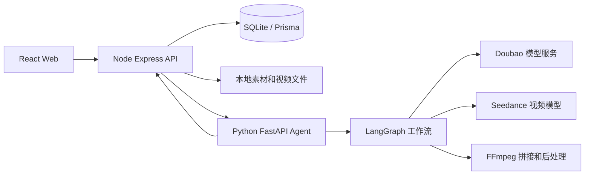
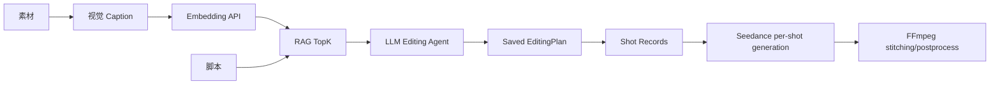

# 电商场景 AIGC 带货视频生成系统

> 当前版本：`p1-python-agent-v0.5`
>
> 面向 TikTok Shop / 电商带货场景的 AIGC 视频生成系统。系统已经从 P0 的“一键生成基础视频”升级到 P1 Agent 增强版：加入 Python FastAPI Agent、LangGraph 工作流、素材分析、RAG 智能分镜、参考视频库、参考视频拆解报告、参考视频模板驱动剧本生成、失败重试、分镜编辑、字幕/BGM 后处理、生成 trace 和数据看板。

## 评委快速提报信息

| 字段 | 内容 |
| ---- | ---- |
| 项目名称 / 课题 | 电商场景 AIGC 带货视频生成系统 |
| 当前版本 | `p1-python-agent-v0.5` |
| 项目完成度 | 可用 Demo 版本：P0 必做链路已跑通，P1 Agent/RAG/参考视频拆解/分镜编辑/trace/数据看板已完成；P2 的真实投放归因、CI/CD、生产级部署仍作为后续扩展。 |
| 一句话核心业务价值 | 面向商家，把商品素材、参考爆款模板和商品卖点自动转化为可预览、可追溯、可局部重生成的电商带货短视频。 |
| 团队成员与分工 | 待填写：建议写“王子男：产品设计、前端页面、Node API、Python Agent、LangGraph/RAG、视频生成链路、文档与演示”。如果还有队友，在这里补充姓名、学校、专业和负责模块。 |
| 在线 Demo 链接 | 待填写：本地演示为 `http://localhost:5173`；临时公网演示可使用 Cloudflare Tunnel / ngrok 暴露前端 5173，并把生成的公网地址填到这里。 |
| 演示视频链接 | 待填写：建议录制 3-8 分钟，展示“参考视频拆解 -> 素材分析 -> 剧本生成 -> 智能分镜方案 -> 视频任务 -> trace/预览/分镜重生成”。 |
| 源代码仓库链接 | [https://github.com/xiaoyugangg/tiktok_shop](https://github.com/xiaoyugangg/tiktok_shop)，推荐评审分支：`p1-python-agent-v0.5`，当前最后提交：`a72eb4e feat: add P1 Python agent reference workflow`。 |
| README / 运行说明 | 当前文件即为评委运行说明，包含依赖环境、环境变量、数据库初始化、启动命令、页面路径、API 清单和验证命令。 |

### 核心功能清单

1. 素材库：支持商品图片/视频素材上传、管理、视觉 caption、标签、摘要、embedding 和相似度检索。
2. 参考视频库：支持上传自有参考视频或录入站外链接，生成 Hook、卖点、分镜、风格、字幕、BGM、CTA 等结构化拆解报告。
3. 剧本生成：基于商品信息，可选择参考视频模板，生成中文电商带货脚本和基础分镜。
4. LangGraph 智能分镜：结合商品、脚本和 RAG 候选素材，生成可落库的 `EditingPlan`，包含每个分镜的 prompt、字幕、BGM、时长、素材选择和 reason。
5. 视频创作：调用 Seedance 逐分镜生成视频，Python 负责失败重试、单分镜重生成、FFmpeg 拼接、音频保留、字幕后处理和静态资源输出。
6. 前端追溯与看板：支持任务进度 SSE、任务详情、Agent Trace、历史任务、视频预览下载、mock 数据看板和中文优化建议。

### 端到端使用流程

1. 进入 `/references`，上传自有参考视频或录入站外爆款视频链接，生成结构化拆解报告。
2. 进入 `/materials`，上传商品素材并执行素材分析，系统生成 caption、tags、summary 和 embedding。
3. 进入 `/new`，填写商品标题、卖点、目标人群、使用场景和画幅，可选择一个参考视频模板。
4. 点击生成脚本，系统基于商品信息和参考模板生成中文带货脚本。
5. 点击生成智能分镜方案，Python LangGraph Agent 通过 RAG 检索候选素材，并调用 LLM 输出 `EditingPlan`。
6. 用户确认分镜方案后启动视频任务，Node 创建任务和 Shot，Python 按分镜调用 Seedance 生成片段。
7. 生成过程中前端通过 SSE 展示进度，失败时 Retry Agent 会根据错误类型修正参数或提示词。
8. 视频完成后进入预览页查看成片，也可以在任务详情页修改单个分镜并局部重生成。

### 技术亮点与创新点

- **Agent/RAG 可追溯链路**：素材分析生成 embedding，Editing Agent 只把 TopK 候选素材的 caption/summary/tags/score 交给 LLM，最后将 `EditingPlan` 落库并绑定到视频任务，方便复核“为什么这样生成”。
- **参考视频方法论复用**：对参考视频做结构化拆解，脚本生成时复用 Hook、分镜结构、字幕风格和 CTA，对应比赛要求中的“找参考 -> 提炼方法论 -> 生产剧本”链路。
- **Node + Python 分层架构**：Node 负责业务 API、Prisma/SQLite、文件、SSE 和回调；Python 作为唯一 AI runtime 负责 LangGraph、大模型、RAG、视频生成、Retry 和 FFmpeg，既保留 P0 稳定性，也体现 AI Agent 深度。

### 关键工程难点与解决方案

| 难点 | 解决方案 |
| ---- | -------- |
| 长耗时视频任务容易阻塞前端 | 使用 Node 任务表 + SSE 推送进度，Python Pipeline 异步回调 Node 更新 Shot/Task/Trace 状态。 |
| LLM 输出不稳定，可能出现非法素材 ID、时长不符合视频模型限制 | LangGraph 中加入结构化 schema、素材 ID 校验、去重、时长修正和 fallback；Retry Agent 对 400 参数错误、网络断连等场景做重试策略。 |
| 素材库如何真正参与生成 | 素材分析阶段保存 caption/summary/tags/embedding；生成 EditingPlan 时做向量 TopK 检索，只把候选素材元信息交给 LLM，由 LLM 输出 `sourceMaterialId` 和选择原因。 |
| Node 和 Python 双后端容易割裂 | 统一由前端访问 Node API；Node 作为 API Gateway 和数据 owner，Python 只通过内部接口提供 AI 能力，任务结果回写 Node 后由 Node 通过 Prisma 写入 SQLite。 |
| 本地 Demo 需要可复核 | README 提供完整环境变量、数据库初始化、启动命令、冒烟测试、页面路径和 API 清单；真实 `.env` 与 `storage/` 不提交，避免泄露密钥和生成资产。 |

### 部署与访问说明

当前项目以本地可运行 Demo 为主。评委可以按 README 启动三个服务后访问 `http://localhost:5173`。如果需要临时公网演示，推荐只暴露前端：

```text
评委浏览器 -> Cloudflare Tunnel/ngrok 公网地址 -> 本机 Vite 5173
                                              -> Vite proxy /api /static
                                              -> 本机 Node API 8787
                                              -> 本机 Python Agent 8790
```

公网演示时需要把 `apps/api/.env` 中的 `PUBLIC_BASE_URL` 改成临时公网地址，并重启 `pnpm dev:api`。不要单独暴露 Python Agent 8790，也不要提交真实 `.env`。

## 当前完成度

### P0 已完成

- 素材上传、素材列表、素材删除与本地静态资源访问。
- 商品建模：标题、卖点、目标人群、使用场景、画幅等。
- 大模型生成结构化带货脚本。
- 根据脚本分镜调用 Seedance 生成视频片段。
- 使用 FFmpeg 拼接分镜视频，并保留音频。
- 任务进度、SSE 实时推送、任务详情、预览和下载。

### P1 已完成

- Python Agent 服务：`FastAPI + LangGraph`。
- 素材分析：为素材生成标签、摘要、embedding 向量，并支持相似度检索。
- 智能剪辑 Agent：根据商品、脚本和素材生成分镜级剪辑计划。
- 参考视频库：支持上传自有参考视频、录入站外参考链接，并保存为 `ReferenceVideo`。
- 参考视频拆解 Agent：对参考视频抽关键帧、生成 caption，并输出 Hook、痛点、卖点、分镜结构、视觉风格、字幕风格、BGM 节奏、CTA 和可复用模板。
- 参考视频模板驱动剧本生成：新建视频时可选择已拆解的参考视频报告，脚本生成会复用其 Hook / 分镜结构 / CTA，但改写为当前商品。
- 分镜级编辑：支持修改单个分镜、重新生成单个分镜并重新拼接。
- 失败重试 Agent：对生成失败原因做决策，例如 prompt 简化、时长修正、重试次数限制。
- 字幕/BGM 后处理：支持拼接后字幕渲染，保留视频原音，预留 BGM/TTS 扩展点。
- 生成过程 trace：记录脚本、剪辑、重试、拼接、后处理等关键事件。
- 数据看板：展示生成因子与转化效果的 mock 分析，并给出中文 Agent 优化建议。
- Python Pipeline 模式：脚本生成、视频生成、重试、拼接、后处理可以交给 Python 执行，Node 作为主 API 网关保留。

## 系统架构

当前采用“Node 主后端 + Python AI Agent 服务”的组合：

```text
React 前端 -> Node.js Express API -> Python FastAPI Agent/LangGraph
                         |
                         -> Prisma + SQLite
                         -> 静态文件 / SSE / 任务状态
```



这样设计的原因是：

- Node 继续负责前端接口、数据库、上传文件、任务状态、SSE、静态资源，避免 P0 已有框架大改。
- Python 负责 AI Agent、LangGraph 编排、大模型调用、视频工作流、失败重试和媒体后处理，更符合 Agent 开发习惯。
- 前端只调用 Node API，不直接面对两个后端，整体结构不割裂。

### P1 Agent 增强架构

P1 Agent 增强版中，Node 不再承担 AI 模型 runtime。Node 的职责是 API 网关、Prisma/SQLite 数据库 owner、素材上传、静态资源、任务状态、SSE 和 Python 回调入口；Python 是唯一 AI runtime，负责视觉 caption、外部 embedding、RAG 检索、LangGraph Agent 规划、Seedance 分镜生成、Retry、拼接和后处理。



这里的“智能分镜/剪辑计划”是生成前规划，不是专业 NLE 时间线剪辑。Agent 负责决定每个分镜的 prompt、字幕、时长、素材选择和生成策略；视频片段仍由 Seedance 逐分镜生成，最终由 FFmpeg 拼接和后处理。

Embedding 向量不会直接发送给豆包文本模型。素材分析阶段会把 caption、summary、tags 生成向量并保存在数据库；生成分镜方案时，系统用查询向量和素材向量做相似度检索，只把候选素材的 caption、summary、tags、score 和素材 ID 放进 LLM 上下文。

### P1 Agent 增强的核心架构与算法改动

| 改动 | 当前实现 |
| ---- | -------- |
| Node 职责收敛 | Node 保留为 API Gateway、Prisma 数据库 owner、文件上传/静态资源、任务状态、SSE、Python 回调入口；旧 Node AI runtime 已删除，不再负责模型编排和视频生成。 |
| Python 唯一 AI runtime | Python FastAPI 负责素材理解、视觉 caption、embedding、RAG、LangGraph LLM planning、Seedance 调用、Retry、单分镜重生成、重新拼接和后处理。 |
| 素材理解升级 | `Material` 增加 `caption` 和 `embeddingModel` 字段；素材分析会生成 `caption / summary / tags / embeddingText / embeddingVectorJson`。 |
| 参考视频方法论 | 新增 `ReferenceVideo` 和 `ReferenceVideoAnalysis`，支持参考视频上传/录入、关键帧理解、结构化拆解报告和参考模板复用。 |
| 参考驱动脚本 | `Script` 记录 `referenceAnalysisId`，剧本生成可接收参考拆解报告，复用 Hook、分镜结构、字幕风格和 CTA。 |
| embedding 升级 | P1 早期是 16 维 hash mock；当前改成 provider 结构：mock 模式使用 64 维 fallback，live 模式优先调用通义千问 embedding API，也保留 Ark 兼容配置。 |
| RAG 检索 | 生成智能分镜方案时，系统构造全局查询 embedding，与素材库已保存的素材 embedding 做余弦相似度 TopK，得到候选素材。 |
| LLM Editing Agent | Editing Agent 从规则函数升级为 `LangGraph + RAG + LLM planning`：LLM 只接收候选素材的 caption/summary/tags/score，不直接接收向量。 |
| EditingPlan 持久化 | 新增 `EditingPlan` 表，保存智能分镜方案、策略文本、payload 和 trace，便于复用、回看和答辩展示。 |
| 任务生成强约束 | 创建视频任务时必须带 `editingPlanId`；Shot 从智能分镜方案写入 `prompt/subtitle/bgmHint/sourceMaterialId/durationSec`。 |
| Python 视频闭环 | 单分镜重生成和重新拼接已迁到 Python，Node 只触发接口并保存状态。 |

## 技术栈

| 模块         | 技术                                                                                   |
| ------------ | -------------------------------------------------------------------------------------- |
| 前端         | React 18、Vite、TypeScript、Ant Design、TanStack Query、Zustand、React Router、ECharts |
| Node 主后端  | Node.js、Express、TypeScript、Prisma、SQLite、SSE、Multer                              |
| Python Agent | Python 3.11、FastAPI、Uvicorn、Pydantic、LangGraph、LangChain Core、httpx、numpy       |
| 大模型文本/视觉理解 | 火山方舟 Doubao OpenAI 兼容接口；当前视觉 caption 和文本拆解可使用同一个 Doubao 模型 endpoint，mock 模式使用 fallback |
| 语义向量     | 通义千问 Embedding API，mock 模式使用 64 维 fallback embedding                         |
| 视频生成     | 火山方舟 Doubao Seedance 视频模型                                                      |
| 媒体处理     | FFmpeg                                                                                 |
| 工程化       | pnpm workspace、ESLint、Prettier、Ruff、pytest                                         |

## 目录结构

```text
tiktop_shop/
├─ apps/
│  ├─ web/                 # React 前端，端口 5173
│  ├─ api/                 # Node Express 主后端，端口 8787
│  │  ├─ prisma/           # Prisma schema 和 SQLite
│  │  └─ src/
│  │     ├─ modules/       # material/product/reference/script/task/trace/analytics/internal
│  │     ├─ providers/     # 已无 Node AI runtime，保留非 AI 基础模块
│  │     └─ lib/           # prisma/storage/ffmpeg/agentClient/logger
│  └─ agent/               # Python FastAPI Agent，端口 8790
│     ├─ src/agent_app/
│     │  ├─ agents/        # material/reference/editing/retry/analytics/pipeline graph
│     │  ├─ media/         # ffmpeg 和后处理
│     │  └─ providers/     # ark_text/seedance_video/vision_caption/embedding
│     └─ tests/            # pytest
├─ packages/shared/        # 前后端共享 Zod schema 和 TypeScript 类型
├─ scripts/                # 工具脚本，例如 smoke-p1.ps1、check-ffmpeg.mjs
├─ storage/                # 上传素材、分镜视频、最终视频，gitignored
├─ docs/                   # 项目讲解、计划、已知问题
└─ README.md
```

## 从 GitHub 拉取后完整运行流程

下面流程假设仓库克隆到 `D:\tiktop_shop`。如果你放在其他目录，把命令里的路径替换成自己的项目路径即可。

### 1. Node 依赖

```powershell
cd D:\tiktop_shop
pnpm install
```

### 2. Python conda 环境

项目使用独立环境 `tiktop_agent_p1`。首次运行需要创建环境并安装 Python Agent：

```powershell
conda create -n tiktop_agent_p1 python=3.11 -y
conda run -n tiktop_agent_p1 pip install -e apps/agent[dev]
```

### 3. 配置环境变量

仓库不会提交真实 `.env`，只提交 `.env.example`。拉取项目后需要自己复制并填写环境变量：

```powershell
copy .env.example apps\api\.env
```

当前项目实际启动时，Node API 和 Python Agent 都会通过 `pnpm dev:api` / `pnpm dev:agent` 读取 `apps/api/.env`。因此真实模型配置需要填写在 `apps/api/.env` 里，不要只填仓库根目录 `.env`。

如果只想看页面和 mock 链路，可以保持：

```env
MODEL_MODE=mock
PYTHON_PIPELINE_ENABLED=false
```

如果要跑真实模型和真实视频生成，至少需要在 `apps/api/.env` 中补全这些值：

```env
MODEL_MODE=live
PYTHON_PIPELINE_ENABLED=true
AGENT_BASE_URL=http://127.0.0.1:8790
PUBLIC_BASE_URL=http://127.0.0.1:8787
NODE_BASE_URL=http://127.0.0.1:8787
INTERNAL_CALLBACK_TOKEN=dev-callback-token

ARK_API_KEY=你的火山方舟APIKey
ARK_BASE_URL=https://ark.cn-beijing.volces.com/api/v3
ARK_TEXT_MODEL=你的文本模型endpoint
ARK_VISION_MODEL=可选；不填时复用 ARK_TEXT_MODEL
ARK_VIDEO_MODEL=你的视频模型endpoint

QWEN_EMBEDDING_API_KEY=你的通义千问APIKey
QWEN_EMBEDDING_BASE_URL=https://dashscope.aliyuncs.com/compatible-mode/v1
QWEN_EMBEDDING_MODEL=你的通义千问embedding模型名
```

真实密钥不要提交到 GitHub。`.gitignore` 已经排除了 `.env`、`apps/api/.env`、`*.local` 等本地配置文件；仓库只保留 `.env.example` 作为字段说明。

### 4. 初始化数据库

```powershell
pnpm --filter @tiktop/api prisma:push
```

### 5. 启动服务

推荐分别开三个 PowerShell 窗口：

```powershell
pnpm dev:agent
pnpm dev:api
pnpm dev:web
```

访问：

```text
前端：http://localhost:5173
Node API：http://127.0.0.1:8787/api/health
Python Agent：http://127.0.0.1:8790/health
```

### 6. 真实运行前检查

真实模型模式下，建议按顺序确认：

1. `apps/api/.env` 已填好模型 key、文本模型、视频模型、embedding 模型。
2. 本机已安装 FFmpeg，并能在 PowerShell 中执行 `ffmpeg -version`。
3. `pnpm dev:agent`、`pnpm dev:api`、`pnpm dev:web` 三个服务都没有报错。
4. 打开 `http://localhost:5173`，先上传/分析素材，再生成脚本、智能分镜方案和视频任务。

## 冒烟测试

轻量测试，不生成真实视频：

```powershell
.\scripts\smoke-p1.ps1
```

完整测试，会真实消耗视频生成额度：

```powershell
.\scripts\smoke-p1.ps1 -RunVideoTask
```

该脚本会检查：

- Node API 是否在线。
- Python Agent 是否在线。
- 是否能创建商品。
- 是否能生成脚本。
- 是否能生成并保存智能分镜方案。
- 如果加 `-RunVideoTask`，还会启动真实视频任务、轮询状态并输出最终视频地址。

## 页面功能

| 页面           | 作用                                                                |
| -------------- | ------------------------------------------------------------------- |
| `/materials`   | 素材库，支持上传、删除、素材分析、标签/摘要/检索结果查看            |
| `/references`  | 参考视频库，支持上传参考视频、录入站外链接、生成结构化拆解报告      |
| `/new`         | 新建视频，填写商品信息、选择参考视频模板、生成脚本、请求 Agent 剪辑计划、启动视频任务 |
| `/tasks/:id`   | 任务详情，查看分镜、进度、trace、分镜编辑和单分镜重生成             |
| `/preview/:id` | 视频预览和下载                                                      |
| `/analytics`   | 数据看板，展示生成因子、转化效果和 Agent 优化建议                   |

## 核心 API

| Method   | Path                                          | 说明                       |
| -------- | --------------------------------------------- | -------------------------- |
| GET      | `/api/health`                                 | Node API 健康检查          |
| GET      | `/api/agent/health`                           | Python Agent 转发健康检查  |
| GET/POST | `/api/materials`                              | 素材列表、素材上传         |
| POST     | `/api/materials/:id/analyze`                  | 调用 Python Agent 分析素材 |
| GET      | `/api/materials/search`                       | 素材相似度检索             |
| GET/POST | `/api/products`                               | 商品列表、创建商品         |
| GET/POST | `/api/references`                             | 参考视频列表、录入站外链接 |
| POST     | `/api/references/upload`                      | 上传参考视频               |
| POST     | `/api/references/:id/analyze`                 | 生成参考视频拆解报告       |
| POST     | `/api/scripts`                                | 生成脚本                   |
| POST     | `/api/scripts/:id/editing-plan`               | 生成智能剪辑计划           |
| POST     | `/api/tasks`                                  | 启动视频生成任务           |
| GET      | `/api/tasks/:id`                              | 查询任务详情               |
| GET      | `/api/tasks/:id/events`                       | SSE 实时进度               |
| PATCH    | `/api/tasks/:taskId/shots/:shotId`            | 修改单个分镜               |
| POST     | `/api/tasks/:taskId/shots/:shotId/regenerate` | 重生成单个分镜             |
| GET      | `/api/traces`                                 | 查询生成 trace             |
| GET      | `/api/analytics/summary`                      | 数据看板摘要               |

## 验证命令

```powershell
pnpm typecheck
pnpm lint
pnpm check:ffmpeg
pnpm --filter @tiktop/web build
pnpm test:agent
pnpm lint:agent
```

## 已知问题

- Seedance 1.5 Pro 图生视频有时会对 `duration` 参数返回 400，当前 retry Agent 会在重试时修正时长，相关记录见 [`docs/known-issues.md`](docs/known-issues.md)。
- 数据看板目前是 P1 mock analytics，用于展示生成因子和优化建议，不代表真实投放数据。
- TTS/BGM 目前是 provider-ready 扩展点，P1 demo 重点是字幕渲染、音频保留和后处理链路。

## 演示建议

1. 打开 `http://localhost:5173/references` 上传参考视频或录入站外链接，生成结构化拆解报告。
2. 打开 `http://localhost:5173/materials` 上传商品素材，并执行素材分析。
3. 打开 `http://localhost:5173/new` 创建商品，选择“参考视频模板”，生成中文带货脚本。
4. 请求 Agent 剪辑计划，观察每个分镜的素材选择、字幕、BGM、reason 和时长建议。
5. 启动视频任务，进入任务详情页观察本任务绑定的 EditingPlan、SSE 进度和 trace。
6. 视频完成后预览成片，修改一个分镜并重生成。
7. 打开数据看板，展示生成因子和中文 Agent 优化建议。

## 版本说明

当前 GitHub 新版分支建议使用：

```text
p1-python-agent-v0.5
```

如果要把这个版本固定归档，可以额外打 tag：

```powershell
git tag v0.5-reference-video-agent
git push origin v0.5-reference-video-agent
```

## License

MIT
