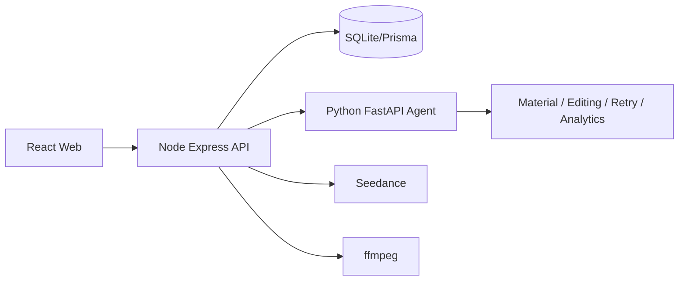

# P1 Python Agent Implementation Plan

> **For agentic workers:** REQUIRED SUB-SKILL: Use superpowers:subagent-driven-development (recommended) or superpowers:executing-plans to implement this plan task-by-task. Steps use checkbox (`- [ ]`) syntax for tracking.

**Goal:** Build P1 features for the AIGC e-commerce video system with a Python Agent service while keeping the existing React + Express + Prisma P0 framework stable.

**Architecture:** Keep Node/Express as the main backend for REST APIs, DB writes, task status, SSE, Seedance calls, and ffmpeg stitching. Add a Python FastAPI + LangGraph-style Agent service for material analysis, embedding-like retrieval, shot planning, retry decisions, subtitle/BGM postprocessing, and mock analytics. Frontend changes should expose Agent decisions and P1 controls without replacing existing P0 flows.

**Tech Stack:** Existing React 18, Ant Design, TypeScript, Express, Prisma, SQLite, ffmpeg; new Python 3.11+, FastAPI, Pydantic, pytest, httpx, numpy, optional LangGraph, optional ECharts on frontend.

---

## Implementation Strategy

This is a P1 competition implementation, not a production rewrite. The plan intentionally avoids moving the existing task pipeline into Python.

The P1 demo flow must be:

```text
Upload material
-> Analyze material with Python Agent
-> Generate script with existing Doubao/mock flow
-> Ask Python Agent for a shot plan
-> Edit one shot
-> Regenerate one shot
-> Auto retry on failure when useful
-> Stitch and postprocess subtitles/BGM
-> Inspect Agent trace
-> View mock analytics dashboard
```

P1 feature mapping:

| Requirement | Implementation |
|---|---|
| 素材标签/Embedding 检索 | Python material analysis + deterministic mock embedding + similarity ranking |
| 智能剪辑 Agent | Python planning graph returns shot prompts, material picks, subtitles, BGM hints, explanations |
| 分镜级编辑 | Node PATCH API + React modal + single-shot regenerate |
| TTS/字幕/BGM | Real subtitle burn-in and default BGM mix; TTS provider abstraction with mock output |
| 失败重试 | Node calls Python retry decision, applies patch, retries up to 2 times |
| 生成过程 trace | Persisted trace table + frontend trace panel |
| Mock 数据看板 | Python mock metrics + React charts |
| 体现 Agent 开发 | Agent graph steps and explanations are visible in trace and shot plan UI |

## File Structure

Create:

```text
apps/agent/
  pyproject.toml
  README.md
  src/agent_app/__init__.py
  src/agent_app/main.py
  src/agent_app/config.py
  src/agent_app/schemas.py
  src/agent_app/agents/material_agent.py
  src/agent_app/agents/editing_agent.py
  src/agent_app/agents/retry_agent.py
  src/agent_app/agents/analytics_agent.py
  src/agent_app/media/postprocess.py
  tests/test_material_agent.py
  tests/test_editing_agent.py
  tests/test_retry_agent.py
  tests/test_analytics_agent.py

apps/api/src/lib/agentClient.ts
apps/api/src/modules/trace/trace.service.ts
apps/api/src/modules/trace/trace.router.ts
apps/api/src/modules/analytics/analytics.router.ts
apps/web/src/api/agent.ts
apps/web/src/api/analytics.ts
apps/web/src/pages/Analytics.tsx
```

Modify:

```text
package.json
pnpm-workspace.yaml
.env.example
apps/api/src/env.ts
apps/api/src/app.ts
apps/api/prisma/schema.prisma
apps/api/src/modules/material/material.router.ts
apps/api/src/modules/material/material.service.ts
apps/api/src/modules/task/task.router.ts
apps/api/src/modules/task/task.service.ts
apps/api/src/modules/creation/pipeline.ts
apps/api/src/lib/ffmpeg.ts
packages/shared/src/api.schema.ts
packages/shared/src/task.schema.ts
apps/web/src/App.tsx
apps/web/src/pages/MaterialLibrary.tsx
apps/web/src/pages/NewVideo.tsx
apps/web/src/pages/TaskDetail.tsx
apps/web/src/pages/Preview.tsx
README.md
docs/项目讲解.md
```

## Task 1: Add Python Agent Service Skeleton

**Files:**
- Create: `apps/agent/pyproject.toml`
- Create: `apps/agent/README.md`
- Create: `apps/agent/src/agent_app/main.py`
- Create: `apps/agent/src/agent_app/config.py`
- Create: `apps/agent/src/agent_app/schemas.py`
- Create: `apps/agent/tests/test_health.py`
- Modify: root `package.json`

- [ ] **Step 1: Create Python project metadata**

Create `apps/agent/pyproject.toml` with:

```toml
[project]
name = "tiktop-agent"
version = "0.1.0"
description = "Python Agent service for P1 AIGC video features"
requires-python = ">=3.11"
dependencies = [
  "fastapi>=0.111.0",
  "uvicorn[standard]>=0.30.0",
  "pydantic>=2.7.0",
  "pydantic-settings>=2.3.0",
  "httpx>=0.27.0",
  "numpy>=1.26.0"
]

[project.optional-dependencies]
dev = [
  "pytest>=8.2.0",
  "ruff>=0.5.0"
]

[tool.pytest.ini_options]
pythonpath = ["src"]
testpaths = ["tests"]

[tool.ruff]
line-length = 100
target-version = "py311"
```

- [ ] **Step 2: Add Python config**

Create `apps/agent/src/agent_app/config.py`:

```python
from pydantic_settings import BaseSettings


class Settings(BaseSettings):
    host: str = "127.0.0.1"
    port: int = 8790
    model_mode: str = "mock"
    storage_root: str = "./storage"
    default_bgm_path: str | None = None


settings = Settings()
```

- [ ] **Step 3: Add initial schemas**

Create `apps/agent/src/agent_app/schemas.py`:

```python
from pydantic import BaseModel, Field


class HealthResponse(BaseModel):
    ok: bool = True
    service: str = "tiktop-agent"
    model_mode: str


class TraceItem(BaseModel):
    stage: str
    message: str
    payload: dict = Field(default_factory=dict)
```

- [ ] **Step 4: Add FastAPI app**

Create `apps/agent/src/agent_app/main.py`:

```python
from fastapi import FastAPI

from agent_app.config import settings
from agent_app.schemas import HealthResponse

app = FastAPI(title="TikTop P1 Agent Service")


@app.get("/health", response_model=HealthResponse)
def health() -> HealthResponse:
    return HealthResponse(model_mode=settings.model_mode)
```

- [ ] **Step 5: Add health test**

Create `apps/agent/tests/test_health.py`:

```python
from fastapi.testclient import TestClient

from agent_app.main import app


def test_health_returns_service_name():
    client = TestClient(app)
    resp = client.get("/health")
    assert resp.status_code == 200
    assert resp.json()["ok"] is True
    assert resp.json()["service"] == "tiktop-agent"
```

- [ ] **Step 6: Add root scripts**

Modify root `package.json` scripts:

```json
"dev:agent": "cd apps/agent && python -m uvicorn agent_app.main:app --app-dir src --host 127.0.0.1 --port 8790",
"test:agent": "cd apps/agent && python -m pytest",
"lint:agent": "cd apps/agent && python -m ruff check ."
```

Do not add `dev:agent` into `pnpm dev` yet; keep Python startup explicit until integration is verified.

- [ ] **Step 7: Verify Python skeleton**

Run:

```powershell
cd apps\agent
python -m pytest
```

Expected:

```text
1 passed
```

Commit:

```powershell
git add apps/agent package.json
git commit -m "feat(agent): add python agent service skeleton"
```

## Task 2: Implement Material Analysis and Mock Embedding

**Files:**
- Modify: `apps/agent/src/agent_app/schemas.py`
- Create: `apps/agent/src/agent_app/agents/material_agent.py`
- Modify: `apps/agent/src/agent_app/main.py`
- Test: `apps/agent/tests/test_material_agent.py`

- [ ] **Step 1: Add material schemas**

Extend `schemas.py`:

```python
class MaterialAnalyzeRequest(BaseModel):
    material_id: str
    filename: str
    mime: str
    kind: str
    product_title: str | None = None
    selling_points: list[str] = Field(default_factory=list)


class MaterialAnalyzeResponse(BaseModel):
    material_id: str
    summary: str
    tags: list[str]
    embedding_text: str
    embedding_vector: list[float]
    trace: list[TraceItem]


class MaterialSearchRequest(BaseModel):
    query: str
    materials: list[MaterialAnalyzeResponse]
    limit: int = 5


class MaterialSearchResult(BaseModel):
    material_id: str
    score: float
    reason: str


class MaterialSearchResponse(BaseModel):
    results: list[MaterialSearchResult]
    trace: list[TraceItem]
```

- [ ] **Step 2: Write material agent tests**

Create `tests/test_material_agent.py`:

```python
from agent_app.agents.material_agent import analyze_material, search_materials
from agent_app.schemas import MaterialAnalyzeRequest, MaterialSearchRequest


def test_analyze_material_generates_tags_and_vector():
    result = analyze_material(
        MaterialAnalyzeRequest(
            material_id="m1",
            filename="white-wireless-earbuds.png",
            mime="image/png",
            kind="image",
            product_title="Wireless Earbuds",
            selling_points=["noise cancelling", "long battery"],
        )
    )
    assert result.material_id == "m1"
    assert "image" in result.tags
    assert len(result.embedding_vector) == 16
    assert result.trace[0].stage == "material.analyze"


def test_search_materials_ranks_related_material_first():
    m1 = analyze_material(
        MaterialAnalyzeRequest(
            material_id="m1",
            filename="white-earbuds.png",
            mime="image/png",
            kind="image",
            product_title="Earbuds",
        )
    )
    m2 = analyze_material(
        MaterialAnalyzeRequest(
            material_id="m2",
            filename="kitchen-pan.mp4",
            mime="video/mp4",
            kind="video",
            product_title="Pan",
        )
    )
    result = search_materials(MaterialSearchRequest(query="earbuds product image", materials=[m2, m1]))
    assert result.results[0].material_id == "m1"
```

- [ ] **Step 3: Implement deterministic mock embedding**

Create `agents/material_agent.py`:

```python
import hashlib
import math
import re

from agent_app.schemas import (
    MaterialAnalyzeRequest,
    MaterialAnalyzeResponse,
    MaterialSearchRequest,
    MaterialSearchResponse,
    MaterialSearchResult,
    TraceItem,
)


def _tokens(text: str) -> list[str]:
    return [x for x in re.split(r"[^a-zA-Z0-9\u4e00-\u9fff]+", text.lower()) if x]


def _vector(text: str, dims: int = 16) -> list[float]:
    values = [0.0] * dims
    for token in _tokens(text):
        digest = hashlib.sha256(token.encode("utf-8")).digest()
        idx = digest[0] % dims
        values[idx] += 1.0
    norm = math.sqrt(sum(v * v for v in values)) or 1.0
    return [round(v / norm, 6) for v in values]


def _cosine(a: list[float], b: list[float]) -> float:
    return sum(x * y for x, y in zip(a, b))


def analyze_material(req: MaterialAnalyzeRequest) -> MaterialAnalyzeResponse:
    base = " ".join([req.filename, req.mime, req.kind, req.product_title or "", *req.selling_points])
    tags = sorted(set([req.kind, *_tokens(base)[:8]]))
    summary = f"{req.kind} material {req.filename} for {req.product_title or 'unknown product'}"
    embedding_text = " ".join([summary, *tags])
    return MaterialAnalyzeResponse(
        material_id=req.material_id,
        summary=summary,
        tags=tags,
        embedding_text=embedding_text,
        embedding_vector=_vector(embedding_text),
        trace=[
            TraceItem(
                stage="material.analyze",
                message="Generated tags and deterministic mock embedding",
                payload={"tags": tags},
            )
        ],
    )


def search_materials(req: MaterialSearchRequest) -> MaterialSearchResponse:
    query_vec = _vector(req.query)
    ranked = sorted(
        (
            MaterialSearchResult(
                material_id=m.material_id,
                score=round(_cosine(query_vec, m.embedding_vector), 6),
                reason=f"Matched query against tags: {', '.join(m.tags[:5])}",
            )
            for m in req.materials
        ),
        key=lambda x: x.score,
        reverse=True,
    )[: req.limit]
    return MaterialSearchResponse(
        results=ranked,
        trace=[
            TraceItem(
                stage="material.search",
                message="Ranked materials by deterministic embedding similarity",
                payload={"query": req.query, "count": len(req.materials)},
            )
        ],
    )
```

- [ ] **Step 4: Expose endpoints**

Modify `main.py`:

```python
from agent_app.agents.material_agent import analyze_material, search_materials
from agent_app.schemas import (
    HealthResponse,
    MaterialAnalyzeRequest,
    MaterialAnalyzeResponse,
    MaterialSearchRequest,
    MaterialSearchResponse,
)


@app.post("/materials/analyze", response_model=MaterialAnalyzeResponse)
def material_analyze(req: MaterialAnalyzeRequest) -> MaterialAnalyzeResponse:
    return analyze_material(req)


@app.post("/materials/search", response_model=MaterialSearchResponse)
def material_search(req: MaterialSearchRequest) -> MaterialSearchResponse:
    return search_materials(req)
```

- [ ] **Step 5: Verify**

Run:

```powershell
cd apps\agent
python -m pytest tests/test_material_agent.py -v
```

Expected:

```text
2 passed
```

Commit:

```powershell
git add apps/agent
git commit -m "feat(agent): add material analysis and retrieval"
```

## Task 3: Implement Editing Agent Shot Plan

**Files:**
- Modify: `apps/agent/src/agent_app/schemas.py`
- Create: `apps/agent/src/agent_app/agents/editing_agent.py`
- Modify: `apps/agent/src/agent_app/main.py`
- Test: `apps/agent/tests/test_editing_agent.py`

- [ ] **Step 1: Add editing schemas**

Extend `schemas.py`:

```python
class ShotInput(BaseModel):
    idx: int
    description: str
    camera_motion: str = ""
    subtitle: str = ""
    bgm_hint: str = ""
    duration_sec: int


class ScriptInput(BaseModel):
    narrative: str
    visual_style: str
    ratio: str
    shots: list[ShotInput]


class ProductInput(BaseModel):
    id: str | None = None
    title: str
    selling_points: list[str] = Field(default_factory=list)
    target_audience: str | None = None
    scene: str | None = None


class MaterialSummary(BaseModel):
    material_id: str
    kind: str
    summary: str
    tags: list[str] = Field(default_factory=list)
    embedding_text: str = ""
    embedding_vector: list[float] = Field(default_factory=list)


class EditingPlanRequest(BaseModel):
    product: ProductInput
    script: ScriptInput
    materials: list[MaterialSummary] = Field(default_factory=list)


class PlannedShot(BaseModel):
    idx: int
    prompt: str
    subtitle: str
    bgm_hint: str
    duration_sec: int
    source_material_id: str | None = None
    reason: str


class EditingPlanResponse(BaseModel):
    shots: list[PlannedShot]
    strategy: str
    trace: list[TraceItem]
```

- [ ] **Step 2: Write editing tests**

Create `tests/test_editing_agent.py`:

```python
from agent_app.agents.editing_agent import build_editing_plan
from agent_app.schemas import EditingPlanRequest, ProductInput, ScriptInput, ShotInput, MaterialSummary


def test_editing_plan_returns_one_planned_shot_per_input_shot():
    req = EditingPlanRequest(
        product=ProductInput(title="Wireless Earbuds", selling_points=["noise cancelling"]),
        script=ScriptInput(
            narrative="Hook then product benefit",
            visual_style="bright clean",
            ratio="9:16",
            shots=[
                ShotInput(idx=0, description="show product", duration_sec=4),
                ShotInput(idx=1, description="use in commute", duration_sec=5),
            ],
        ),
        materials=[
            MaterialSummary(
                material_id="m1",
                kind="image",
                summary="white earbuds product image",
                tags=["earbuds", "image"],
                embedding_text="white earbuds product image",
                embedding_vector=[1.0] + [0.0] * 15,
            )
        ],
    )
    plan = build_editing_plan(req)
    assert len(plan.shots) == 2
    assert plan.shots[0].source_material_id == "m1"
    assert "Wireless Earbuds" in plan.shots[0].prompt
    assert plan.trace[0].stage == "agent.plan.start"
```

- [ ] **Step 3: Implement rule-based Agent graph**

Create `agents/editing_agent.py`:

```python
from agent_app.schemas import EditingPlanRequest, EditingPlanResponse, PlannedShot, TraceItem


def _best_material_id(req: EditingPlanRequest, shot_text: str) -> str | None:
    if not req.materials:
        return None
    shot_tokens = set(shot_text.lower().split())
    ranked = sorted(
        req.materials,
        key=lambda m: len(shot_tokens.intersection(set((m.embedding_text or m.summary).lower().split()))),
        reverse=True,
    )
    return ranked[0].material_id


def build_editing_plan(req: EditingPlanRequest) -> EditingPlanResponse:
    trace = [
        TraceItem(stage="agent.plan.start", message="Read product, script, and materials"),
        TraceItem(stage="agent.plan.retrieve", message="Selected best material per shot"),
        TraceItem(stage="agent.plan.validate", message="Validated shot count and duration limits"),
    ]
    shots: list[PlannedShot] = []
    points = " / ".join(req.product.selling_points[:3])
    for shot in req.script.shots:
        material_id = _best_material_id(req, f"{shot.description} {req.product.title} {points}")
        subtitle = shot.subtitle or (req.product.selling_points[shot.idx % len(req.product.selling_points)] if req.product.selling_points else req.product.title)
        prompt = (
            f"Create a {req.script.ratio} e-commerce short video shot for {req.product.title}. "
            f"Scene: {shot.description}. Visual style: {req.script.visual_style}. "
            f"Selling point: {subtitle}. Avoid real human faces."
        )
        shots.append(
            PlannedShot(
                idx=shot.idx,
                prompt=prompt,
                subtitle=subtitle[:120],
                bgm_hint=shot.bgm_hint or "upbeat commercial",
                duration_sec=max(2, min(12, int(shot.duration_sec))),
                source_material_id=material_id,
                reason="Matched material and rewritten prompt for product-focused generation",
            )
        )
    return EditingPlanResponse(
        shots=shots,
        strategy="Agent v1: product-first prompt rewrite + material retrieval + constraint validation",
        trace=trace,
    )
```

- [ ] **Step 4: Expose endpoint**

Modify `main.py`:

```python
from agent_app.agents.editing_agent import build_editing_plan
from agent_app.schemas import EditingPlanRequest, EditingPlanResponse


@app.post("/editing/plan", response_model=EditingPlanResponse)
def editing_plan(req: EditingPlanRequest) -> EditingPlanResponse:
    return build_editing_plan(req)
```

- [ ] **Step 5: Verify**

Run:

```powershell
cd apps\agent
python -m pytest tests/test_editing_agent.py -v
```

Expected:

```text
1 passed
```

Commit:

```powershell
git add apps/agent
git commit -m "feat(agent): add editing plan agent"
```

## Task 4: Implement Retry Decision Agent

**Files:**
- Modify: `apps/agent/src/agent_app/schemas.py`
- Create: `apps/agent/src/agent_app/agents/retry_agent.py`
- Modify: `apps/agent/src/agent_app/main.py`
- Test: `apps/agent/tests/test_retry_agent.py`

- [ ] **Step 1: Add retry schemas**

Extend `schemas.py`:

```python
class RetryDecisionRequest(BaseModel):
    task_id: str
    shot_id: str | None = None
    shot_idx: int | None = None
    error_message: str
    retry_count: int = 0
    prompt: str = ""
    duration_sec: int = 5


class RetryPatch(BaseModel):
    prompt: str | None = None
    duration_sec: int | None = None


class RetryDecisionResponse(BaseModel):
    should_retry: bool
    reason: str
    patch: RetryPatch = Field(default_factory=RetryPatch)
    trace: list[TraceItem]
```

- [ ] **Step 2: Write retry tests**

Create `tests/test_retry_agent.py`:

```python
from agent_app.agents.retry_agent import decide_retry
from agent_app.schemas import RetryDecisionRequest


def test_retry_decision_clamps_duration_error():
    decision = decide_retry(
        RetryDecisionRequest(
            task_id="t1",
            shot_id="s1",
            error_message="duration not supported",
            retry_count=0,
            prompt="make a long complex video",
            duration_sec=20,
        )
    )
    assert decision.should_retry is True
    assert decision.patch.duration_sec == 5


def test_retry_decision_stops_after_two_retries():
    decision = decide_retry(
        RetryDecisionRequest(
            task_id="t1",
            shot_id="s1",
            error_message="timeout",
            retry_count=2,
            prompt="x",
            duration_sec=5,
        )
    )
    assert decision.should_retry is False
```

- [ ] **Step 3: Implement retry agent**

Create `agents/retry_agent.py`:

```python
from agent_app.schemas import RetryDecisionRequest, RetryDecisionResponse, RetryPatch, TraceItem


def decide_retry(req: RetryDecisionRequest) -> RetryDecisionResponse:
    trace = [
        TraceItem(
            stage="agent.retry.inspect",
            message="Classified generation error",
            payload={"error": req.error_message, "retry_count": req.retry_count},
        )
    ]
    if req.retry_count >= 2:
        return RetryDecisionResponse(
            should_retry=False,
            reason="Retry limit reached",
            trace=trace,
        )
    lower = req.error_message.lower()
    if "duration" in lower:
        return RetryDecisionResponse(
            should_retry=True,
            reason="Duration error can be fixed by clamping to 5 seconds",
            patch=RetryPatch(duration_sec=5),
            trace=trace,
        )
    if "timeout" in lower or "invalidparameter" in lower or "failed" in lower:
        prompt = (req.prompt or "")[:260] + " Keep the scene simple, product-centered, no human face."
        return RetryDecisionResponse(
            should_retry=True,
            reason="Prompt can be simplified for another generation attempt",
            patch=RetryPatch(prompt=prompt, duration_sec=max(2, min(8, req.duration_sec))),
            trace=trace,
        )
    return RetryDecisionResponse(
        should_retry=False,
        reason="Error type is not safe to auto retry",
        trace=trace,
    )
```

- [ ] **Step 4: Expose endpoint**

Modify `main.py`:

```python
from agent_app.agents.retry_agent import decide_retry
from agent_app.schemas import RetryDecisionRequest, RetryDecisionResponse


@app.post("/retry/decide", response_model=RetryDecisionResponse)
def retry_decide(req: RetryDecisionRequest) -> RetryDecisionResponse:
    return decide_retry(req)
```

- [ ] **Step 5: Verify**

Run:

```powershell
cd apps\agent
python -m pytest tests/test_retry_agent.py -v
```

Expected:

```text
2 passed
```

Commit:

```powershell
git add apps/agent
git commit -m "feat(agent): add retry decision agent"
```

## Task 5: Implement Analytics Agent

**Files:**
- Modify: `apps/agent/src/agent_app/schemas.py`
- Create: `apps/agent/src/agent_app/agents/analytics_agent.py`
- Modify: `apps/agent/src/agent_app/main.py`
- Test: `apps/agent/tests/test_analytics_agent.py`

- [ ] **Step 1: Add analytics schemas**

Extend `schemas.py`:

```python
class AnalyticsMetric(BaseModel):
    factor: str
    ctr: float
    cvr: float
    completion_rate: float


class AnalyticsRequest(BaseModel):
    product_title: str | None = None
    task_count: int = 8


class AnalyticsResponse(BaseModel):
    metrics: list[AnalyticsMetric]
    insights: list[str]
    trace: list[TraceItem]
```

- [ ] **Step 2: Write analytics test**

Create `tests/test_analytics_agent.py`:

```python
from agent_app.agents.analytics_agent import build_mock_analytics
from agent_app.schemas import AnalyticsRequest


def test_mock_analytics_returns_metrics_and_insights():
    result = build_mock_analytics(AnalyticsRequest(product_title="Earbuds"))
    assert len(result.metrics) >= 4
    assert result.insights
    assert result.trace[0].stage == "agent.analytics.mock"
```

- [ ] **Step 3: Implement deterministic analytics**

Create `agents/analytics_agent.py`:

```python
from agent_app.schemas import AnalyticsMetric, AnalyticsRequest, AnalyticsResponse, TraceItem


def build_mock_analytics(req: AnalyticsRequest) -> AnalyticsResponse:
    factors = ["pain-point hook", "scene demo", "benefit subtitles", "clean product close-up"]
    metrics = [
        AnalyticsMetric(factor=factors[0], ctr=0.061, cvr=0.027, completion_rate=0.44),
        AnalyticsMetric(factor=factors[1], ctr=0.054, cvr=0.031, completion_rate=0.51),
        AnalyticsMetric(factor=factors[2], ctr=0.049, cvr=0.035, completion_rate=0.57),
        AnalyticsMetric(factor=factors[3], ctr=0.057, cvr=0.029, completion_rate=0.53),
    ]
    return AnalyticsResponse(
        metrics=metrics,
        insights=[
            "Benefit subtitles show the strongest conversion lift.",
            "Scene demo improves completion rate and should be used in shot 2.",
            f"Next video for {req.product_title or 'this product'} should keep product close-up in the first 3 seconds.",
        ],
        trace=[
            TraceItem(
                stage="agent.analytics.mock",
                message="Generated deterministic mock metrics for competition demo",
                payload={"task_count": req.task_count},
            )
        ],
    )
```

- [ ] **Step 4: Expose endpoint**

Modify `main.py`:

```python
from agent_app.agents.analytics_agent import build_mock_analytics
from agent_app.schemas import AnalyticsRequest, AnalyticsResponse


@app.post("/analytics/mock", response_model=AnalyticsResponse)
def analytics_mock(req: AnalyticsRequest) -> AnalyticsResponse:
    return build_mock_analytics(req)
```

- [ ] **Step 5: Verify**

Run:

```powershell
cd apps\agent
python -m pytest tests/test_analytics_agent.py -v
```

Expected:

```text
1 passed
```

Commit:

```powershell
git add apps/agent
git commit -m "feat(agent): add mock analytics agent"
```

## Task 6: Add Python Subtitle and BGM Postprocess

**Files:**
- Modify: `apps/agent/src/agent_app/schemas.py`
- Create: `apps/agent/src/agent_app/media/postprocess.py`
- Modify: `apps/agent/src/agent_app/main.py`
- Test: `apps/agent/tests/test_postprocess.py`

- [ ] **Step 1: Add media schemas**

Extend `schemas.py`:

```python
class SubtitleCue(BaseModel):
    start_sec: float
    end_sec: float
    text: str


class PostprocessRequest(BaseModel):
    input_path: str
    output_path: str
    ratio: str
    subtitles: list[SubtitleCue] = Field(default_factory=list)
    bgm_path: str | None = None
    enable_subtitle: bool = True
    enable_bgm: bool = False


class PostprocessResponse(BaseModel):
    output_path: str
    subtitle_path: str | None = None
    trace: list[TraceItem]
```

- [ ] **Step 2: Write ASS generation test**

Create `tests/test_postprocess.py`:

```python
from agent_app.media.postprocess import build_ass_text
from agent_app.schemas import SubtitleCue


def test_build_ass_text_contains_subtitle():
    text = build_ass_text([SubtitleCue(start_sec=0, end_sec=2.5, text="立即下单")])
    assert "Dialogue:" in text
    assert "立即下单" in text
```

- [ ] **Step 3: Implement postprocess module**

Create `media/postprocess.py`:

```python
import subprocess
from pathlib import Path

from agent_app.schemas import PostprocessRequest, PostprocessResponse, SubtitleCue, TraceItem


def _ass_time(seconds: float) -> str:
    cs = int(round(seconds * 100))
    h = cs // 360000
    m = (cs // 6000) % 60
    s = (cs // 100) % 60
    c = cs % 100
    return f"{h}:{m:02d}:{s:02d}.{c:02d}"


def build_ass_text(cues: list[SubtitleCue]) -> str:
    lines = [
        "[Script Info]",
        "ScriptType: v4.00+",
        "PlayResX: 720",
        "PlayResY: 1280",
        "",
        "[V4+ Styles]",
        "Format: Name, Fontname, Fontsize, PrimaryColour, OutlineColour, BackColour, Bold, Italic, BorderStyle, Outline, Shadow, Alignment, MarginL, MarginR, MarginV, Encoding",
        "Style: Default,Arial,46,&H00FFFFFF,&H00000000,&H66000000,1,0,1,3,1,2,40,40,120,1",
        "",
        "[Events]",
        "Format: Layer, Start, End, Style, Name, MarginL, MarginR, MarginV, Effect, Text",
    ]
    for cue in cues:
        clean = cue.text.replace("\n", " ").replace(",", "，")
        lines.append(f"Dialogue: 0,{_ass_time(cue.start_sec)},{_ass_time(cue.end_sec)},Default,,0,0,0,,{clean}")
    return "\n".join(lines) + "\n"


def run_postprocess(req: PostprocessRequest) -> PostprocessResponse:
    output = Path(req.output_path)
    output.parent.mkdir(parents=True, exist_ok=True)
    trace = [TraceItem(stage="media.postprocess.start", message="Started video postprocess")]
    subtitle_path: str | None = None
    input_arg = req.input_path

    vf_args: list[str] = []
    if req.enable_subtitle and req.subtitles:
        subtitle_file = output.with_suffix(".ass")
        subtitle_file.write_text(build_ass_text(req.subtitles), encoding="utf-8")
        subtitle_path = str(subtitle_file)
        escaped = str(subtitle_file).replace("\\", "/").replace(":", "\\:")
        vf_args = ["-vf", f"ass='{escaped}'"]
        trace.append(TraceItem(stage="media.subtitle", message="Generated ASS subtitles", payload={"path": subtitle_path}))

    args = ["ffmpeg", "-y", "-hide_banner", "-loglevel", "error", "-i", input_arg]
    if req.enable_bgm and req.bgm_path:
        args.extend(["-stream_loop", "-1", "-i", req.bgm_path])
        args.extend(vf_args)
        args.extend(["-shortest", "-map", "0:v:0", "-map", "1:a:0", "-c:v", "libx264", "-c:a", "aac"])
        trace.append(TraceItem(stage="media.bgm", message="Mixed BGM audio"))
    else:
        args.extend(vf_args)
        args.extend(["-c:v", "libx264", "-an"])
    args.extend(["-pix_fmt", "yuv420p", "-movflags", "+faststart", str(output)])
    subprocess.run(args, check=True)
    trace.append(TraceItem(stage="media.postprocess.done", message="Postprocess complete", payload={"output": str(output)}))
    return PostprocessResponse(output_path=str(output), subtitle_path=subtitle_path, trace=trace)
```

- [ ] **Step 4: Expose endpoint**

Modify `main.py`:

```python
from agent_app.media.postprocess import run_postprocess
from agent_app.schemas import PostprocessRequest, PostprocessResponse


@app.post("/media/postprocess", response_model=PostprocessResponse)
def media_postprocess(req: PostprocessRequest) -> PostprocessResponse:
    return run_postprocess(req)
```

- [ ] **Step 5: Verify ASS test**

Run:

```powershell
cd apps\agent
python -m pytest tests/test_postprocess.py -v
```

Expected:

```text
1 passed
```

Commit:

```powershell
git add apps/agent
git commit -m "feat(agent): add subtitle postprocess endpoint"
```

## Task 7: Add Node Agent Client and Environment

**Files:**
- Modify: `.env.example`
- Modify: `apps/api/src/env.ts`
- Create: `apps/api/src/lib/agentClient.ts`
- Test manually with existing typecheck

- [ ] **Step 1: Add env vars**

Add to `.env.example`:

```env
AGENT_BASE_URL=http://localhost:8790
AGENT_TIMEOUT_MS=60000
P1_ENABLE_AGENT=true
P1_ENABLE_SUBTITLE=true
P1_ENABLE_BGM=false
P1_ENABLE_TTS=false
```

- [ ] **Step 2: Extend `env.ts`**

Add fields:

```ts
AGENT_BASE_URL: z.string().default('http://localhost:8790'),
AGENT_TIMEOUT_MS: z.coerce.number().int().positive().default(60_000),
P1_ENABLE_AGENT: z.coerce.boolean().default(true),
P1_ENABLE_SUBTITLE: z.coerce.boolean().default(true),
P1_ENABLE_BGM: z.coerce.boolean().default(false),
P1_ENABLE_TTS: z.coerce.boolean().default(false),
```

- [ ] **Step 3: Create agent client**

Create `apps/api/src/lib/agentClient.ts`:

```ts
import { env } from '../env';

export async function callAgent<TReq, TResp>(path: string, body: TReq): Promise<TResp> {
  if (!env.P1_ENABLE_AGENT) {
    throw new Error('P1 agent is disabled');
  }
  const controller = new AbortController();
  const timeout = setTimeout(() => controller.abort(), env.AGENT_TIMEOUT_MS);
  try {
    const resp = await fetch(`${env.AGENT_BASE_URL}${path}`, {
      method: 'POST',
      headers: { 'Content-Type': 'application/json' },
      body: JSON.stringify(body),
      signal: controller.signal,
    });
    if (!resp.ok) {
      const text = await resp.text();
      throw new Error(`agent ${path} failed: ${resp.status} ${text}`);
    }
    return (await resp.json()) as TResp;
  } finally {
    clearTimeout(timeout);
  }
}
```

- [ ] **Step 4: Verify**

Run:

```powershell
pnpm typecheck
```

Expected: all workspace typechecks pass.

Commit:

```powershell
git add .env.example apps/api/src/env.ts apps/api/src/lib/agentClient.ts
git commit -m "feat(api): add python agent client"
```

## Task 8: Extend Database and Shared API Types

**Files:**
- Modify: `apps/api/prisma/schema.prisma`
- Modify: `packages/shared/src/api.schema.ts`
- Modify: `packages/shared/src/task.schema.ts`

- [ ] **Step 1: Extend Prisma models**

Add fields to `Material`:

```prisma
summary             String?
tagsJson            String?
embeddingText       String?
embeddingVectorJson String?
analyzedAt          DateTime?
```

Add fields to `Shot`:

```prisma
prompt           String?
subtitle         String?
bgmHint          String?
sourceMaterialId String?
retryCount       Int     @default(0)
```

Add models:

```prisma
model TaskTrace {
  id          String   @id @default(cuid())
  taskId      String
  shotId      String?
  stage       String
  level       String
  message     String
  payloadJson String?
  createdAt   DateTime @default(now())

  @@index([taskId])
  @@index([shotId])
}

model MockMetric {
  id             String   @id @default(cuid())
  productId      String?
  taskId         String?
  factor         String
  ctr            Float
  cvr            Float
  completionRate Float
  createdAt      DateTime @default(now())

  @@index([productId])
  @@index([taskId])
}
```

- [ ] **Step 2: Extend Material DTO**

Add optional fields to `MaterialDtoSchema`:

```ts
summary: z.string().nullable().optional(),
tags: z.array(z.string()).optional(),
embeddingText: z.string().nullable().optional(),
analyzedAt: z.string().nullable().optional(),
```

- [ ] **Step 3: Extend Shot DTO**

Add fields to `ShotDtoSchema`:

```ts
prompt: z.string().nullable().optional(),
subtitle: z.string().nullable().optional(),
bgmHint: z.string().nullable().optional(),
sourceMaterialId: z.string().nullable().optional(),
retryCount: z.number().int().nonnegative().optional(),
```

- [ ] **Step 4: Add API schemas**

Add:

```ts
export const UpdateShotReqSchema = z.object({
  description: z.string().min(2).max(400).optional(),
  cameraMotion: z.string().max(80).optional(),
  prompt: z.string().max(800).optional(),
  subtitle: z.string().max(120).optional(),
  bgmHint: z.string().max(80).optional(),
  durationSec: z.number().int().min(2).max(12).optional(),
  sourceMaterialId: z.string().nullable().optional(),
});
export type UpdateShotReq = z.infer<typeof UpdateShotReqSchema>;

export const TraceDtoSchema = z.object({
  id: z.string(),
  taskId: z.string(),
  shotId: z.string().nullable().optional(),
  stage: z.string(),
  level: z.string(),
  message: z.string(),
  payload: z.record(z.unknown()).optional(),
  createdAt: z.string(),
});
export type TraceDto = z.infer<typeof TraceDtoSchema>;
```

- [ ] **Step 5: Push database**

Run:

```powershell
pnpm --filter @tiktop/api prisma:push
pnpm typecheck
```

Expected: Prisma push succeeds and typecheck passes.

Commit:

```powershell
git add apps/api/prisma/schema.prisma packages/shared/src/api.schema.ts packages/shared/src/task.schema.ts
git commit -m "feat(shared): add p1 data model and dto fields"
```

## Task 9: Add Trace Persistence

**Files:**
- Create: `apps/api/src/modules/trace/trace.service.ts`
- Create: `apps/api/src/modules/trace/trace.router.ts`
- Modify: `apps/api/src/app.ts`

- [ ] **Step 1: Create trace service**

Create:

```ts
import { prisma } from '../../lib/prisma';

import type { TraceDto } from '@tiktop/shared';

export async function addTrace(args: {
  taskId: string;
  shotId?: string;
  stage: string;
  level?: 'info' | 'warn' | 'error';
  message: string;
  payload?: Record<string, unknown>;
}): Promise<void> {
  await prisma.taskTrace.create({
    data: {
      taskId: args.taskId,
      shotId: args.shotId,
      stage: args.stage,
      level: args.level ?? 'info',
      message: args.message,
      payloadJson: args.payload ? JSON.stringify(args.payload) : undefined,
    },
  });
}

export async function listTrace(taskId: string): Promise<TraceDto[]> {
  const rows = await prisma.taskTrace.findMany({
    where: { taskId },
    orderBy: { createdAt: 'asc' },
  });
  return rows.map((row) => ({
    id: row.id,
    taskId: row.taskId,
    shotId: row.shotId,
    stage: row.stage,
    level: row.level,
    message: row.message,
    payload: row.payloadJson ? (JSON.parse(row.payloadJson) as Record<string, unknown>) : undefined,
    createdAt: row.createdAt.toISOString(),
  }));
}
```

- [ ] **Step 2: Create trace router**

Create:

```ts
import { Router } from 'express';

import { listTrace } from './trace.service';

export const traceRouter: Router = Router();

traceRouter.get('/tasks/:taskId/trace', async (req, res, next) => {
  try {
    res.json(await listTrace(req.params.taskId));
  } catch (err) {
    next(err);
  }
});
```

- [ ] **Step 3: Mount router**

Modify `app.ts`:

```ts
import { traceRouter } from './modules/trace/trace.router';

app.use('/api', traceRouter);
```

- [ ] **Step 4: Verify**

Run:

```powershell
pnpm typecheck
```

Expected: pass.

Commit:

```powershell
git add apps/api/src/modules/trace apps/api/src/app.ts
git commit -m "feat(api): persist task trace events"
```

## Task 10: Integrate Material Agent in Node

**Files:**
- Modify: `apps/api/src/modules/material/material.service.ts`
- Modify: `apps/api/src/modules/material/material.router.ts`
- Modify: `packages/shared/src/api.schema.ts`

- [ ] **Step 1: Extend material DTO mapper**

Modify `toDto()` to include:

```ts
summary: record.summary,
tags: record.tagsJson ? (JSON.parse(record.tagsJson) as string[]) : [],
embeddingText: record.embeddingText,
analyzedAt: record.analyzedAt?.toISOString() ?? null,
```

Update the `record` type in `toDto()` to include the new nullable fields.

- [ ] **Step 2: Add service function `analyzeMaterial`**

Add to `material.service.ts`:

```ts
import { callAgent } from '../../lib/agentClient';

export async function analyzeMaterial(id: string): Promise<MaterialDto> {
  const record = await prisma.material.findUnique({ where: { id } });
  if (!record) throw new Error(`material ${id} not found`);
  const response = await callAgent<
    {
      material_id: string;
      filename: string;
      mime: string;
      kind: string;
    },
    {
      summary: string;
      tags: string[];
      embedding_text: string;
      embedding_vector: number[];
    }
  >('/materials/analyze', {
    material_id: record.id,
    filename: record.filename,
    mime: record.mime,
    kind: record.kind,
  });
  const updated = await prisma.material.update({
    where: { id },
    data: {
      summary: response.summary,
      tagsJson: JSON.stringify(response.tags),
      embeddingText: response.embedding_text,
      embeddingVectorJson: JSON.stringify(response.embedding_vector),
      analyzedAt: new Date(),
    },
  });
  return toDto(updated);
}
```

- [ ] **Step 3: Add analyze route**

Modify `material.router.ts`:

```ts
import { analyzeMaterial, deleteMaterial, listMaterials, saveUploadedMaterial } from './material.service';

materialRouter.post('/:id/analyze', async (req, res, next) => {
  try {
    res.json(await analyzeMaterial(req.params.id));
  } catch (err) {
    next(err);
  }
});
```

- [ ] **Step 4: Verify**

Run:

```powershell
pnpm typecheck
```

Expected: pass.

Commit:

```powershell
git add apps/api/src/modules/material packages/shared/src/api.schema.ts
git commit -m "feat(api): add material agent analysis endpoint"
```

## Task 11: Add Editing Plan API

**Files:**
- Modify: `apps/api/src/modules/script/script.router.ts`
- Modify: `apps/api/src/modules/task/task.service.ts`
- Modify: `packages/shared/src/api.schema.ts`

- [ ] **Step 1: Add shared editing plan DTOs**

Add to shared API schema:

```ts
export const PlannedShotDtoSchema = z.object({
  idx: z.number().int(),
  prompt: z.string(),
  subtitle: z.string(),
  bgmHint: z.string(),
  durationSec: z.number().int(),
  sourceMaterialId: z.string().nullable().optional(),
  reason: z.string(),
});
export type PlannedShotDto = z.infer<typeof PlannedShotDtoSchema>;

export const EditingPlanDtoSchema = z.object({
  shots: z.array(PlannedShotDtoSchema),
  strategy: z.string(),
});
export type EditingPlanDto = z.infer<typeof EditingPlanDtoSchema>;
```

- [ ] **Step 2: Add route `POST /api/scripts/:id/editing-plan`**

In `script.router.ts`, load script, product, analyzed materials, call `/editing/plan`, return the plan. Request body is empty for v1.

Implementation shape:

```ts
scriptRouter.post('/:id/editing-plan', async (req, res, next) => {
  try {
    const script = await prisma.script.findUnique({
      where: { id: req.params.id },
      include: { product: { include: { materials: true } } },
    });
    if (!script) {
      res.status(404).json({ message: 'script not found' });
      return;
    }
    const payload = JSON.parse(script.payload);
    const response = await callAgent('/editing/plan', {
      product: {
        id: script.product.id,
        title: script.product.title,
        selling_points: JSON.parse(script.product.sellingPoints),
        target_audience: script.product.targetAudience,
        scene: script.product.scene,
      },
      script: {
        narrative: payload.narrative,
        visual_style: payload.visualStyle,
        ratio: payload.ratio,
        shots: payload.shots.map((s: any) => ({
          idx: s.idx,
          description: s.description,
          camera_motion: s.cameraMotion ?? '',
          subtitle: s.subtitle ?? '',
          bgm_hint: s.bgmHint ?? '',
          duration_sec: s.durationSec,
        })),
      },
      materials: script.product.materials.map((m) => ({
        material_id: m.id,
        kind: m.kind,
        summary: m.summary ?? m.filename,
        tags: m.tagsJson ? JSON.parse(m.tagsJson) : [],
        embedding_text: m.embeddingText ?? '',
        embedding_vector: m.embeddingVectorJson ? JSON.parse(m.embeddingVectorJson) : [],
      })),
    });
    res.json(response);
  } catch (err) {
    next(err);
  }
});
```

Add imports for `prisma` and `callAgent`.

- [ ] **Step 3: Verify**

Run:

```powershell
pnpm typecheck
```

Expected: pass.

Commit:

```powershell
git add apps/api/src/modules/script packages/shared/src/api.schema.ts
git commit -m "feat(api): add editing plan endpoint"
```

## Task 12: Add Shot Edit and Single-Shot Regenerate

**Files:**
- Modify: `apps/api/src/modules/task/task.router.ts`
- Modify: `apps/api/src/modules/task/task.service.ts`
- Modify: `apps/api/src/modules/creation/pipeline.ts`
- Modify: `apps/api/src/lib/ffmpeg.ts`

- [ ] **Step 1: Add `updateShot` service**

Add to `task.service.ts`:

```ts
export async function updateShot(
  taskId: string,
  shotId: string,
  patch: UpdateShotReq,
): Promise<TaskDto | null> {
  await prisma.shot.update({
    where: { id: shotId, taskId },
    data: {
      description: patch.description,
      cameraMotion: patch.cameraMotion,
      prompt: patch.prompt,
      subtitle: patch.subtitle,
      bgmHint: patch.bgmHint,
      durationSec: patch.durationSec,
      sourceMaterialId: patch.sourceMaterialId,
    },
  });
  return getTaskDto(taskId);
}
```

Import `UpdateShotReq`.

- [ ] **Step 2: Add PATCH route**

In `task.router.ts`:

```ts
taskRouter.patch('/:taskId/shots/:shotId', async (req, res, next) => {
  try {
    const parsed = UpdateShotReqSchema.safeParse(req.body);
    if (!parsed.success) {
      res.status(400).json({ message: 'invalid shot update', issues: parsed.error.issues });
      return;
    }
    const dto = await updateShot(req.params.taskId, req.params.shotId, parsed.data);
    if (!dto) {
      res.status(404).json({ message: 'task not found' });
      return;
    }
    res.json(dto);
  } catch (err) {
    next(err);
  }
});
```

- [ ] **Step 3: Extract reusable shot generation**

In `pipeline.ts`, extract current per-shot logic into:

```ts
async function generateOneShot(args: {
  taskId: string;
  shotId: string;
  ratio: Ratio;
  productMaterial?: string | null;
}): Promise<string>
```

It must:

```text
load shot by id
choose prompt = shot.prompt ?? shot.description
call generateClip
write clip path
setShotStatus(video_ok)
return absolute clip path
```

- [ ] **Step 4: Add `restitchTask` helper**

In `pipeline.ts`, add:

```ts
export async function restitchTask(taskId: string, ratio: Ratio): Promise<void>
```

It must:

```text
load all shots ordered by idx
ensure every shot has clipPath
call concatClips
setTaskStatus(succeeded, outputPath)
```

- [ ] **Step 5: Add regenerate route**

In `task.router.ts`:

```ts
taskRouter.post('/:taskId/shots/:shotId/regenerate', async (req, res, next) => {
  try {
    const task = await getTaskDto(req.params.taskId);
    if (!task) {
      res.status(404).json({ message: 'task not found' });
      return;
    }
    setImmediate(async () => {
      await setTaskStatus({ taskId: task.id, status: 'shots_running', stage: '单分镜重生成中' });
      await generateOneShot({ taskId: task.id, shotId: req.params.shotId, ratio: task.ratio });
      await setTaskStatus({ taskId: task.id, status: 'stitching', stage: '重新拼接中' });
      await restitchTask(task.id, task.ratio);
    });
    res.status(202).json(task);
  } catch (err) {
    next(err);
  }
});
```

Export `generateOneShot` and `restitchTask` from `pipeline.ts`.

- [ ] **Step 6: Verify**

Run:

```powershell
pnpm typecheck
```

Expected: pass.

Commit:

```powershell
git add apps/api/src/modules/task apps/api/src/modules/creation apps/api/src/lib/ffmpeg.ts
git commit -m "feat(api): add shot edit and single shot regeneration"
```

## Task 13: Integrate Retry Agent into Pipeline

**Files:**
- Modify: `apps/api/src/modules/creation/pipeline.ts`
- Modify: `apps/api/src/modules/task/task.service.ts`
- Modify: `apps/api/src/modules/trace/trace.service.ts`

- [ ] **Step 1: Add trace calls around shot generation**

In `generateOneShot`, call:

```ts
await addTrace({ taskId, shotId, stage: 'shot.generate.start', message: `Generating shot ${shot.idx + 1}` });
```

After success:

```ts
await addTrace({ taskId, shotId, stage: 'shot.generate.success', message: `Shot ${shot.idx + 1} generated`, payload: { clipPath: clipRel } });
```

After failure:

```ts
await addTrace({ taskId, shotId, stage: 'shot.generate.failed', level: 'error', message: msg });
```

- [ ] **Step 2: Add retry call on generation failure**

When a shot generation fails and `retryCount < 2`, call:

```ts
const decision = await callAgent('/retry/decide', {
  task_id: taskId,
  shot_id: shot.id,
  shot_idx: shot.idx,
  error_message: msg,
  retry_count: shot.retryCount,
  prompt: shot.prompt ?? shot.description,
  duration_sec: shot.durationSec,
});
```

If `decision.should_retry`, update shot:

```ts
await prisma.shot.update({
  where: { id: shot.id },
  data: {
    prompt: decision.patch?.prompt ?? undefined,
    durationSec: decision.patch?.duration_sec ?? undefined,
    retryCount: { increment: 1 },
  },
});
```

Then call `generateOneShot` once more.

- [ ] **Step 3: Record retry trace**

Always record:

```ts
await addTrace({
  taskId,
  shotId: shot.id,
  stage: 'agent.retry.decision',
  message: decision.reason,
  payload: decision,
});
```

- [ ] **Step 4: Verify**

Run:

```powershell
pnpm typecheck
```

Expected: pass.

Commit:

```powershell
git add apps/api/src/modules/creation apps/api/src/modules/task apps/api/src/modules/trace
git commit -m "feat(api): add agent retry decisions to pipeline"
```

## Task 14: Add Postprocess Call After Stitching

**Files:**
- Modify: `apps/api/src/modules/creation/pipeline.ts`
- Modify: `apps/api/src/lib/storage.ts`

- [ ] **Step 1: Build subtitle cues**

After concat creates `output.mp4`, build cues from ordered shots:

```ts
let cursor = 0;
const subtitles = shots.map((shot) => {
  const start = cursor;
  cursor += shot.durationSec;
  return {
    start_sec: start,
    end_sec: cursor,
    text: shot.subtitle || shot.description.slice(0, 24),
  };
});
```

- [ ] **Step 2: Call Python media postprocess**

If `env.P1_ENABLE_SUBTITLE || env.P1_ENABLE_BGM`, call:

```ts
const postAbs = path.join(STORAGE_ROOT, 'tasks', taskId, 'output_p1.mp4');
const response = await callAgent('/media/postprocess', {
  input_path: outAbs,
  output_path: postAbs,
  ratio,
  subtitles,
  enable_subtitle: env.P1_ENABLE_SUBTITLE,
  enable_bgm: env.P1_ENABLE_BGM,
});
const finalRel = relativeFromAbs(postAbs);
await setTaskStatus({ taskId, status: 'succeeded', outputPath: finalRel, stage: '完成' });
```

If postprocess fails, keep original `output.mp4`, record trace warning, and still mark task succeeded.

- [ ] **Step 3: Verify**

Run:

```powershell
pnpm typecheck
```

Expected: pass.

Commit:

```powershell
git add apps/api/src/modules/creation
git commit -m "feat(api): add subtitle postprocess after stitching"
```

## Task 15: Add Frontend Agent APIs

**Files:**
- Create: `apps/web/src/api/agent.ts`
- Create: `apps/web/src/api/analytics.ts`
- Modify: `apps/web/src/api/material.ts`
- Modify: `apps/web/src/api/task.ts`
- Modify: `apps/web/src/api/script.ts`

- [ ] **Step 1: Add material analyze client**

In `api/material.ts` add:

```ts
export async function analyzeMaterial(id: string): Promise<MaterialDto> {
  const { data } = await client.post<MaterialDto>(`/materials/${id}/analyze`);
  return data;
}
```

- [ ] **Step 2: Add editing plan client**

In `api/script.ts` add:

```ts
export async function createEditingPlan(scriptId: string): Promise<EditingPlanDto> {
  const { data } = await client.post<EditingPlanDto>(`/scripts/${scriptId}/editing-plan`);
  return data;
}
```

- [ ] **Step 3: Add task edit clients**

In `api/task.ts` add:

```ts
export async function updateShot(taskId: string, shotId: string, body: UpdateShotReq): Promise<TaskDto> {
  const { data } = await client.patch<TaskDto>(`/tasks/${taskId}/shots/${shotId}`, body);
  return data;
}

export async function regenerateShot(taskId: string, shotId: string): Promise<TaskDto> {
  const { data } = await client.post<TaskDto>(`/tasks/${taskId}/shots/${shotId}/regenerate`);
  return data;
}

export async function getTaskTrace(taskId: string): Promise<TraceDto[]> {
  const { data } = await client.get<TraceDto[]>(`/tasks/${taskId}/trace`);
  return data;
}
```

- [ ] **Step 4: Add analytics client**

Create `api/analytics.ts`:

```ts
import { client } from './client';

export interface AnalyticsMetric {
  factor: string;
  ctr: number;
  cvr: number;
  completion_rate: number;
}

export interface AnalyticsResponse {
  metrics: AnalyticsMetric[];
  insights: string[];
}

export async function getMockAnalytics(): Promise<AnalyticsResponse> {
  const { data } = await client.get<AnalyticsResponse>('/analytics/mock');
  return data;
}
```

- [ ] **Step 5: Verify**

Run:

```powershell
pnpm typecheck
```

Expected: pass.

Commit:

```powershell
git add apps/web/src/api
git commit -m "feat(web): add p1 api clients"
```

## Task 16: Update Material Library UI

**Files:**
- Modify: `apps/web/src/pages/MaterialLibrary.tsx`

- [ ] **Step 1: Add analyze mutation**

Use `analyzeMaterial` mutation and invalidate `['materials']` on success.

- [ ] **Step 2: Add button on each material card**

Each card should show:

```text
分析素材
```

Button disabled while mutation is running.

- [ ] **Step 3: Show Agent output**

Show summary and tags:

```tsx
{item.summary && <Paragraph ellipsis={{ rows: 2 }}>{item.summary}</Paragraph>}
{item.tags?.map((tag) => <Tag key={tag}>{tag}</Tag>)}
```

- [ ] **Step 4: Verify UI build**

Run:

```powershell
pnpm typecheck
```

Expected: pass.

Commit:

```powershell
git add apps/web/src/pages/MaterialLibrary.tsx
git commit -m "feat(web): show material agent analysis"
```

## Task 17: Update New Video UI with Editing Plan

**Files:**
- Modify: `apps/web/src/pages/NewVideo.tsx`
- Modify: `apps/web/src/components/ScriptBoard.tsx`

- [ ] **Step 1: Add editing plan state**

In `NewVideo.tsx`, add:

```ts
const [editingPlan, setEditingPlan] = useState<EditingPlanDto | null>(null);
```

- [ ] **Step 2: Add mutation**

After script generation, add a button:

```text
智能匹配素材
```

It calls `createEditingPlan(script.id)` and stores result.

- [ ] **Step 3: Display Agent strategy**

Render:

```tsx
{editingPlan && (
  <Alert type="info" message="Agent 剪辑策略" description={editingPlan.strategy} />
)}
```

For each planned shot, show:

```text
推荐素材
改写 prompt
字幕
BGM
原因
```

- [ ] **Step 4: Verify**

Run:

```powershell
pnpm typecheck
```

Expected: pass.

Commit:

```powershell
git add apps/web/src/pages/NewVideo.tsx apps/web/src/components/ScriptBoard.tsx
git commit -m "feat(web): show editing agent plan"
```

## Task 18: Add Shot Edit Modal and Trace Panel

**Files:**
- Modify: `apps/web/src/pages/TaskDetail.tsx`

- [ ] **Step 1: Add selected shot state**

Add:

```ts
const [editingShot, setEditingShot] = useState<ShotDto | null>(null);
```

- [ ] **Step 2: Add edit button per shot card**

Add button:

```text
编辑分镜
```

Click sets `editingShot`.

- [ ] **Step 3: Add modal form fields**

Modal fields:

```text
description
cameraMotion
prompt
subtitle
bgmHint
durationSec
```

Submit calls `updateShot(task.id, editingShot.id, values)`.

- [ ] **Step 4: Add regenerate button**

Add button:

```text
重生成该分镜
```

It calls `regenerateShot(task.id, shot.id)` and refetches task.

- [ ] **Step 5: Add trace query**

Use `getTaskTrace(id)` and render Collapse panel:

```text
Agent Trace
stage / level / message / createdAt
```

- [ ] **Step 6: Verify**

Run:

```powershell
pnpm typecheck
```

Expected: pass.

Commit:

```powershell
git add apps/web/src/pages/TaskDetail.tsx
git commit -m "feat(web): add shot editing and trace panel"
```

## Task 19: Add Mock Analytics Backend and Page

**Files:**
- Create: `apps/api/src/modules/analytics/analytics.router.ts`
- Modify: `apps/api/src/app.ts`
- Create: `apps/web/src/pages/Analytics.tsx`
- Modify: `apps/web/src/App.tsx`
- Modify: `apps/web/package.json`

- [ ] **Step 1: Add backend analytics route**

Create `analytics.router.ts`:

```ts
import { Router } from 'express';

import { callAgent } from '../../lib/agentClient';

export const analyticsRouter: Router = Router();

analyticsRouter.get('/mock', async (_req, res, next) => {
  try {
    const data = await callAgent('/analytics/mock', { task_count: 8 });
    res.json(data);
  } catch (err) {
    next(err);
  }
});
```

Mount in `app.ts`:

```ts
app.use('/api/analytics', analyticsRouter);
```

- [ ] **Step 2: Add ECharts dependency**

Run:

```powershell
pnpm --filter @tiktop/web add echarts echarts-for-react
```

- [ ] **Step 3: Create analytics page**

Create page with:

```text
Metric bar chart: factor vs CTR/CVR/completion
Insight list: Agent recommendations
```

- [ ] **Step 4: Add route and nav item**

In `App.tsx`, add route:

```text
/analytics
```

and top nav item:

```text
数据看板
```

- [ ] **Step 5: Verify**

Run:

```powershell
pnpm typecheck
pnpm lint
```

Expected: pass.

Commit:

```powershell
git add apps/api/src/modules/analytics apps/api/src/app.ts apps/web/src/pages/Analytics.tsx apps/web/src/App.tsx apps/web/package.json pnpm-lock.yaml
git commit -m "feat(web): add mock analytics dashboard"
```

## Task 20: Update Preview Page for P1 Output

**Files:**
- Modify: `apps/web/src/pages/Preview.tsx`

- [ ] **Step 1: Add P1 labels**

Show tags when output exists:

```text
已烧录字幕
BGM: enabled/disabled
Agent enhanced
```

Use task metadata and config-independent wording; if exact flags are not in DTO, show:

```text
P1 后处理视频
```

- [ ] **Step 2: Verify**

Run:

```powershell
pnpm typecheck
```

Expected: pass.

Commit:

```powershell
git add apps/web/src/pages/Preview.tsx
git commit -m "feat(web): label p1 enhanced preview"
```

## Task 21: Add Smoke Test Script

**Files:**
- Create: `scripts/smoke-p1.ps1`
- Modify: `README.md`

- [ ] **Step 1: Create smoke script**

Create PowerShell script that:

```text
checks /api/health
checks Python /health
creates a product
generates script
asks editing plan
starts task
polls until succeeded/failed
prints outputUrl
```

- [ ] **Step 2: Add README usage**

Add:

```powershell
pnpm dev:api
pnpm dev:web
pnpm dev:agent
.\scripts\smoke-p1.ps1
```

- [ ] **Step 3: Verify**

Run only after Python and Node servers are started:

```powershell
.\scripts\smoke-p1.ps1
```

Expected:

```text
agent ok
api ok
task succeeded
```

Commit:

```powershell
git add scripts/smoke-p1.ps1 README.md
git commit -m "docs: add p1 smoke test instructions"
```

## Task 22: Final Verification and Documentation

**Files:**
- Modify: `README.md`
- Modify: `docs/项目讲解.md`

- [ ] **Step 1: Update README P1 section**

Replace P1 todo with implemented list:

```text
P1 已实现:
- Python Agent Service
- 素材标签/Embedding 检索
- 智能剪辑 Agent
- 分镜级编辑和单分镜重生成
- 字幕/BGM 后处理
- 失败重试决策
- 生成过程 trace
- Mock 数据看板
```

- [ ] **Step 2: Update architecture docs**

Add a section:

```text
P1 Python Agent 架构
Node 主控 + Python Agent 决策服务
```

Include this diagram:



- [ ] **Step 3: Full verification**

Run:

```powershell
pnpm typecheck
pnpm lint
pnpm check:ffmpeg
cd apps\agent
python -m pytest
python -m ruff check .
```

Expected:

```text
all pass
```

- [ ] **Step 4: Manual demo checklist**

Open:

```text
http://localhost:5173/materials
```

Verify:

```text
upload material
analyze material
see tags
create video
generate script
generate editing plan
start task
edit one shot
regenerate one shot
open trace panel
open preview
open analytics dashboard
```

- [ ] **Step 5: Commit docs**

```powershell
git add README.md docs/项目讲解.md
git commit -m "docs: describe p1 python agent architecture"
```

## Self-Review

Spec coverage:

- P1 material tags/Embedding retrieval: Tasks 2, 10, 16.
- P1 intelligent editing Agent: Tasks 3, 11, 17.
- P1 shot-level editing: Tasks 12, 18.
- P1 TTS/subtitle/BGM: Task 6 and Task 14. TTS is provider-ready/mock, subtitle and BGM are real P1 demo capabilities.
- P1 failure retry: Tasks 4 and 13.
- P1 generation trace: Tasks 9, 13, 18.
- P1 mock analytics dashboard: Tasks 5 and 19.
- Python usage: Tasks 1-6 are Python service implementation; Node only bridges.
- Existing framework stability: Node remains main backend; P0 endpoints are preserved.

Implementation defaults:

- Keep `pnpm dev` unchanged until all P1 services are stable.
- Start Python with `pnpm dev:agent`.
- Store embedding vectors as JSON in SQLite for P1; do not add sqlite-vec or pgvector.
- Use deterministic mock embeddings and analytics for competition demo reliability.
- Use real ffmpeg subtitle burn-in; keep true TTS optional.
- Retry at most 2 times per shot.
- If P1 postprocess fails, keep original stitched video as final output and record warning trace.
