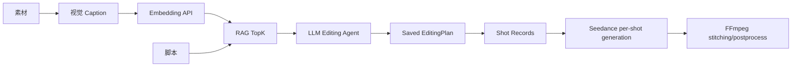

# P1.5 Agent Depth Upgrade Implementation Plan

> **For agentic workers:** REQUIRED SUB-SKILL: Use superpowers:subagent-driven-development (recommended) or superpowers:executing-plans to implement this plan task-by-task. Steps use checkbox (`- [ ]`) syntax for tracking.

**Goal:** Upgrade the current P1 demo into a deeper Agent/RAG workflow where Python is the only AI runtime, materials use visual caption + external embeddings, LangGraph calls an LLM to produce a generation plan, and the plan is actually applied to video generation.

**Architecture:** Keep Node as API gateway, Prisma database owner, upload/static/SSE service, and Python callback receiver. Move all AI-heavy runtime work into Python: caption, embedding, RAG retrieval, LLM editing-plan generation, retry, shot generation, stitching, and postprocess. Treat “智能剪辑计划” as a generation-time shot plan, not as professional NLE timeline editing.

**Tech Stack:** Node.js + Express + TypeScript + Prisma + SQLite; Python 3.11 + FastAPI + Pydantic + LangGraph + httpx + numpy; Doubao visual/text model; external embedding API; FFmpeg; React + TypeScript + Ant Design.

---

## Definitions And Scope

### What “智能剪辑计划” Means In This Plan

“智能剪辑计划” means a generation plan before video generation:

- which product/material image should be used as first-frame reference for each shot;
- what prompt should be sent to Seedance for each shot;
- what subtitle and BGM hint should be used;
- how long each shot should be;
- why the Agent made that choice.

It does **not** mean a full nonlinear editor that cuts existing video material, adds transitions, aligns to beat, or performs timeline-level professional editing. The actual video-file processing remains:

```text
generated shot clips -> FFmpeg normalize/stitch -> subtitle/BGM postprocess -> output video
```

### Final Target Flow

```text
Material upload
  -> visual caption
  -> tags / summary / embedding
  -> save Material semantic fields

Script generation
  -> original script shots

Editing-plan generation
  -> embed shot query
  -> retrieve topK materials per shot
  -> LLM Editing Agent generates JSON plan
  -> validate and save EditingPlan

Task creation
  -> require editingPlanId
  -> create Shot records from EditingPlan
  -> Python Pipeline uses planned prompt/sourceMaterial/subtitle/duration

Video generation
  -> Seedance per shot
  -> Retry Agent if needed
  -> FFmpeg stitching
  -> subtitle/BGM postprocess
  -> trace + SSE + preview
```

### Assumptions Confirmed By User

- Keep Node as API gateway; do not delete the whole `apps/api`.
- Remove unused Node-side AI runtime after Python replacements exist.
- Use external embedding API instead of local hash embedding.
- Do not migrate SQLite/Prisma to MySQL/PostgreSQL in this phase.
- Add visual caption using the existing Doubao model family if available.
- Intelligent editing plan must be part of the generation flow.

### Configuration To Add

Add these environment variables to `.env.example`, `apps/api/.env` docs, and Python settings:

```env
ARK_VISION_MODEL=
ARK_EMBEDDING_MODEL=
MATERIAL_RAG_TOP_K=3
EDITING_PLAN_REQUIRED=true
```

The implementation should use the same `ARK_API_KEY` and `ARK_BASE_URL` already used for Doubao-compatible APIs.

---

## Files To Create Or Modify

### Python Agent

- Modify: `apps/agent/pyproject.toml`
  - Ensure `httpx` and `numpy` remain dependencies.
- Modify: `apps/agent/src/agent_app/config.py`
  - Add `ark_vision_model`, `ark_embedding_model`, `material_rag_top_k`.
- Modify: `apps/agent/src/agent_app/schemas.py`
  - Add caption fields, RAG candidate schemas, saved editing plan response shape, regenerate/restitch request schemas.
- Create: `apps/agent/src/agent_app/providers/vision_caption.py`
  - Calls Doubao vision model to caption images.
- Create: `apps/agent/src/agent_app/providers/embedding.py`
  - Calls external embedding API and returns normalized float vectors.
- Modify: `apps/agent/src/agent_app/agents/material_agent.py`
  - Replace hash embedding with caption + external embedding.
- Modify: `apps/agent/src/agent_app/agents/editing_graph.py`
  - Replace rule-only prompt rewrite with RAG + LLM planning + validation/repair.
- Modify: `apps/agent/src/agent_app/providers/ark_text.py`
  - Reuse low-level chat completion helper or expose one for editing graph.
- Modify: `apps/agent/src/agent_app/agents/pipeline_graph.py`
  - Add regenerate-shot/restitch callable entry points.
- Modify: `apps/agent/src/agent_app/main.py`
  - Register new endpoints.
- Tests:
  - Modify/Create tests under `apps/agent/tests/` for embedding, caption fallback, editing graph, pipeline regenerate/restitch.

### Node API

- Modify: `apps/api/prisma/schema.prisma`
  - Add `EditingPlan` model and relation from `Script`.
  - Add `caption` and maybe `embeddingModel` fields to `Material`.
- Modify: `packages/shared/src/api.schema.ts` or related shared schemas
  - Add `editingPlanId` to create task request.
  - Add EditingPlan DTO/schema.
- Modify: `packages/shared/src/script.schema.ts`
  - Add shared planned-shot DTO if not already present.
- Modify: `apps/api/src/modules/script/script.router.ts`
  - Save editing plans and return `editingPlanId`.
- Modify: `apps/api/src/modules/script/script.service.ts`
  - Add plan persistence helpers.
- Modify: `apps/api/src/modules/task/task.service.ts`
  - Create shots from saved EditingPlan when task starts.
- Modify: `apps/api/src/modules/task/task.router.ts`
  - Require/accept `editingPlanId`; route regenerate/restitch through Python.
- Modify: `apps/api/src/modules/creation/pythonPipeline.ts`
  - Ensure source material paths are resolved from planned shot material IDs.
- Modify/Delete:
  - `apps/api/src/providers/volcArk.ts`
  - `apps/api/src/providers/volcSeedance.ts`
  - `apps/api/src/modules/creation/pipeline.ts`
  - `apps/api/src/lib/queue.ts`
  - Possibly `apps/api/src/lib/ffmpeg.ts`
  - Remove only after tests prove no imports remain.
- Tests:
  - Add or update Node integration tests if test harness exists; otherwise rely on typecheck plus smoke script.

### Frontend

- Modify: `apps/web/src/api/script.ts`
  - Return saved editing plan with `id`.
- Modify: `apps/web/src/api/task.ts`
  - Send `editingPlanId` when starting task.
- Modify: `apps/web/src/pages/NewVideo.tsx`
  - Make editing-plan step required before “一键成片”.
- Modify: `apps/web/src/components/ScriptBoard.tsx`
  - Show plan ID, selected material, RAG reason, LLM reason.
- Modify: `apps/web/src/pages/MaterialLibrary.tsx`
  - Show caption, embedding model/status.

### Docs And Scripts

- Modify: `.env.example`
- Modify: `README.md`
- Modify: `docs/项目讲解.md`
- Modify: `scripts/smoke-p1.ps1`
  - Require editing plan before task creation.
- Optional: Create `docs/known-issues.md` entry for external embedding/vision fallback.

---

## Task 1: Add Configuration And Shared Schemas

**Files:**

- Modify: `apps/agent/src/agent_app/config.py`
- Modify: `apps/agent/src/agent_app/schemas.py`
- Modify: `.env.example`
- Modify: `packages/shared/src/task.schema.ts`
- Modify: `packages/shared/src/api.schema.ts`
- Test: `apps/agent/tests/test_config.py` if config tests exist, otherwise schema tests in related agent tests.

- [x] **Step 1: Add Python settings fields**

Update `apps/agent/src/agent_app/config.py` so settings include:

```python
ark_vision_model: str | None = None
ark_embedding_model: str | None = None
material_rag_top_k: int = 3
```

Expected behavior:

- If `ark_vision_model` is missing, caption provider returns deterministic fallback caption.
- If `ark_embedding_model` is missing, embedding provider raises a clear error in live mode and uses deterministic fallback only in mock mode.

- [x] **Step 2: Add Python schemas**

Add these schemas to `apps/agent/src/agent_app/schemas.py`:

```python
class RagCandidate(BaseModel):
    material_id: str
    kind: str
    caption: str | None = None
    summary: str
    tags: list[str] = Field(default_factory=list)
    score: float


class ShotRagContext(BaseModel):
    idx: int
    query: str
    candidates: list[RagCandidate] = Field(default_factory=list)


class MaterialAnalyzeResponse(BaseModel):
    material_id: str
    caption: str | None = None
    summary: str
    tags: list[str]
    embedding_text: str
    embedding_vector: list[float]
    embedding_model: str | None = None
    trace: list[TraceItem]
```

Keep backward-compatible field names already used by Node.

- [x] **Step 3: Add shared CreateTask request field**

In shared task API schema, add:

```ts
editingPlanId: z.string().optional();
```

Expected behavior:

- API can still typecheck during migration.
- Later task will enforce it when `EDITING_PLAN_REQUIRED=true`.

- [x] **Step 4: Add `.env.example` entries**

Add:

```env
ARK_VISION_MODEL=
ARK_EMBEDDING_MODEL=
MATERIAL_RAG_TOP_K=3
EDITING_PLAN_REQUIRED=true
```

- [x] **Step 5: Verify schemas**

Run:

```powershell
pnpm typecheck
conda run --no-capture-output -n tiktop_agent_p1 python -m pytest tests/test_health.py -q
```

Expected:

```text
typecheck passes
health tests pass
```

- [x] **Step 6: Commit**

```powershell
git add .env.example packages/shared apps/agent/src/agent_app/config.py apps/agent/src/agent_app/schemas.py
git commit -m "feat(agent): add p15 config and schemas"
```

---

## Task 2: Add Vision Caption Provider

**Files:**

- Create: `apps/agent/src/agent_app/providers/vision_caption.py`
- Modify: `apps/agent/src/agent_app/agents/material_agent.py`
- Test: `apps/agent/tests/test_vision_caption.py`

- [x] **Step 1: Write provider tests**

Create `apps/agent/tests/test_vision_caption.py`:

```python
from pathlib import Path

from agent_app.providers.vision_caption import caption_material


def test_caption_material_falls_back_without_model(tmp_path, monkeypatch):
    image = tmp_path / "product.jpg"
    image.write_bytes(b"fake")
    monkeypatch.setattr("agent_app.providers.vision_caption.settings.model_mode", "mock")

    caption = caption_material(str(image), "image/jpeg", "无线耳机")

    assert "无线耳机" in caption
    assert "product.jpg" in caption
```

- [x] **Step 2: Implement provider**

Create `apps/agent/src/agent_app/providers/vision_caption.py`:

```python
from pathlib import Path

import httpx

from agent_app.config import settings


def caption_material(path: str, mime: str, product_title: str | None = None) -> str:
    filename = Path(path).name
    if settings.model_mode == "mock" or not settings.ark_api_key or not settings.ark_vision_model:
        title = product_title or "未知商品"
        return f"{filename} 是与 {title} 相关的电商素材，适合用于商品展示或场景说明。"

    data_url = _image_data_url(path, mime)
    prompt = (
        "请用一句中文描述这张电商素材图，突出商品主体、场景、颜色、构图和可用于带货视频的价值。"
        "不要编造品牌、价格、销量、认证。控制在80字以内。"
    )
    payload = {
        "model": settings.ark_vision_model,
        "messages": [
            {
                "role": "user",
                "content": [
                    {"type": "text", "text": prompt},
                    {"type": "image_url", "image_url": {"url": data_url}},
                ],
            }
        ],
        "temperature": 0.2,
    }
    headers = {"Authorization": f"Bearer {settings.ark_api_key}", "Content-Type": "application/json"}
    resp = httpx.post(f"{settings.ark_base_url}/chat/completions", headers=headers, json=payload, timeout=60)
    resp.raise_for_status()
    return resp.json()["choices"][0]["message"]["content"].strip()
```

Also add a local helper `_image_data_url(path: str, mime: str) -> str` in the same file, following the existing image data URL pattern in `seedance_video.py`.

- [x] **Step 3: Integrate into material analysis**

Update `material_agent.py`:

- If `kind == "image"` and a local path is provided in request, call `caption_material`.
- If no local path exists, fallback to filename/product-title caption.
- Include caption in `summary`, `embedding_text`, and trace.

If current `MaterialAnalyzeRequest` does not include file path, extend Node request payload in a later task; for now keep fallback behavior.

- [x] **Step 4: Run tests**

```powershell
conda run --no-capture-output -n tiktop_agent_p1 python -m pytest tests/test_vision_caption.py tests/test_material_agent.py -q
```

Expected:

```text
all selected tests pass
```

- [x] **Step 5: Commit**

```powershell
git add apps/agent/src/agent_app/providers/vision_caption.py apps/agent/src/agent_app/agents/material_agent.py apps/agent/tests/test_vision_caption.py apps/agent/tests/test_material_agent.py
git commit -m "feat(agent): caption materials with vision model"
```

---

## Task 3: Add External Embedding Provider And RAG Search

**Files:**

- Create: `apps/agent/src/agent_app/providers/embedding.py`
- Modify: `apps/agent/src/agent_app/agents/material_agent.py`
- Test: `apps/agent/tests/test_embedding_provider.py`
- Test: `apps/agent/tests/test_material_agent.py`

- [x] **Step 1: Write embedding tests**

Create `apps/agent/tests/test_embedding_provider.py`:

```python
from agent_app.providers.embedding import cosine_similarity, normalize_vector


def test_normalize_vector_returns_unit_vector():
    vec = normalize_vector([3.0, 4.0])
    assert vec == [0.6, 0.8]


def test_cosine_similarity_prefers_similar_vector():
    query = normalize_vector([1.0, 0.0])
    good = normalize_vector([0.9, 0.1])
    bad = normalize_vector([0.0, 1.0])

    assert cosine_similarity(query, good) > cosine_similarity(query, bad)
```

- [x] **Step 2: Implement embedding provider**

Create `apps/agent/src/agent_app/providers/embedding.py`:

```python
import hashlib
import math

import httpx

from agent_app.config import settings


def normalize_vector(values: list[float]) -> list[float]:
    norm = math.sqrt(sum(x * x for x in values)) or 1.0
    return [round(x / norm, 8) for x in values]


def cosine_similarity(a: list[float], b: list[float]) -> float:
    return float(sum(x * y for x, y in zip(a, b)))


def fallback_embedding(text: str, dims: int = 64) -> list[float]:
    values = [0.0] * dims
    for token in text.lower().split():
        digest = hashlib.sha256(token.encode("utf-8")).digest()
        values[digest[0] % dims] += 1.0
    return normalize_vector(values)


def embed_text(text: str) -> tuple[list[float], str]:
    if settings.model_mode == "mock":
        return fallback_embedding(text), "mock-hash-64"

    if not settings.ark_api_key or not settings.ark_embedding_model:
        raise RuntimeError("ARK_EMBEDDING_MODEL is required for live material embedding")

    headers = {"Authorization": f"Bearer {settings.ark_api_key}", "Content-Type": "application/json"}
    payload = {"model": settings.ark_embedding_model, "input": text}
    resp = httpx.post(f"{settings.ark_base_url}/embeddings", headers=headers, json=payload, timeout=60)
    resp.raise_for_status()
    data = resp.json()
    values = data["data"][0]["embedding"]
    return normalize_vector([float(x) for x in values]), settings.ark_embedding_model
```

- [x] **Step 3: Replace material hash vector**

Update `material_agent.py`:

- Remove `_vector` hash logic as the primary path.
- Use `embed_text(embedding_text)`.
- Save `embedding_model`.
- Keep mock fallback only when `MODEL_MODE=mock`.

- [x] **Step 4: Update search to use query embedding**

Update `search_materials`:

```python
query_vec, model = embed_text(req.query)
ranked = sorted(
    (
        MaterialSearchResult(
            material_id=m.material_id,
            score=round(cosine_similarity(query_vec, m.embedding_vector), 6),
            reason=f"RAG matched query with material: {m.summary}",
        )
        for m in req.materials
        if m.embedding_vector
    ),
    key=lambda x: x.score,
    reverse=True,
)[: req.limit]
```

Trace should include:

```text
material.search.embedding
material.search.rank
```

- [x] **Step 5: Run tests**

```powershell
conda run --no-capture-output -n tiktop_agent_p1 python -m pytest tests/test_embedding_provider.py tests/test_material_agent.py -q
```

Expected:

```text
all selected tests pass
```

- [x] **Step 6: Commit**

```powershell
git add apps/agent/src/agent_app/providers/embedding.py apps/agent/src/agent_app/agents/material_agent.py apps/agent/tests/test_embedding_provider.py apps/agent/tests/test_material_agent.py
git commit -m "feat(agent): use external embeddings for material rag"
```

---

## Task 4: Persist Material Caption And Embedding Metadata In Node

**Files:**

- Modify: `apps/api/prisma/schema.prisma`
- Modify: `apps/api/src/modules/material/material.router.ts`
- Modify: `apps/api/src/modules/material/material.service.ts`
- Modify: `packages/shared/src/api.schema.ts`
- Modify: `apps/web/src/pages/MaterialLibrary.tsx`

- [x] **Step 1: Extend Prisma Material**

Add fields:

```prisma
caption        String?
embeddingModel String?
```

Keep existing:

```prisma
summary
tagsJson
embeddingText
embeddingVectorJson
```

- [x] **Step 2: Push schema**

Run:

```powershell
pnpm --filter @tiktop/api prisma:push
```

Expected:

```text
database synced
Prisma Client generated
```

- [x] **Step 3: Send file path to Python material analyzer**

When Node calls Python `/materials/analyze`, include:

```json
{
  "material_id": "m_example",
  "path": "D:\\tiktop_shop\\storage\\uploads\\m_example.jpg",
  "filename": "m_example.jpg",
  "mime": "image/jpeg",
  "kind": "image",
  "product_title": "无线降噪耳机",
  "selling_points": ["主动降噪", "长续航", "佩戴舒适"]
}
```

Also update Python `MaterialAnalyzeRequest` to accept:

```python
path: str | None = None
```

- [x] **Step 4: Persist caption and embedding model**

Update Node material service so Python response fields save to DB:

```ts
caption: result.caption ?? null,
summary: result.summary,
tagsJson: JSON.stringify(result.tags),
embeddingText: result.embedding_text,
embeddingVectorJson: JSON.stringify(result.embedding_vector),
embeddingModel: result.embedding_model ?? null,
analyzedAt: new Date(),
```

- [x] **Step 5: Show fields in frontend**

Update Material Library to show:

```text
caption
summary
tags
embedding model
analyzedAt
```

- [x] **Step 6: Verify**

Run:

```powershell
pnpm typecheck
pnpm lint
```

Expected:

```text
both pass
```

- [x] **Step 7: Commit**

```powershell
git add apps/api/prisma/schema.prisma apps/api/src/modules/material packages/shared apps/web/src/pages/MaterialLibrary.tsx apps/agent/src/agent_app/schemas.py
git commit -m "feat(api): persist material caption embeddings"
```

---

## Task 5: Add Saved EditingPlan Model

**Files:**

- Modify: `apps/api/prisma/schema.prisma`
- Modify: `packages/shared/src/api.schema.ts`
- Modify: `packages/shared/src/script.schema.ts`
- Modify: `apps/api/src/modules/script/script.service.ts`
- Modify: `apps/api/src/modules/script/script.router.ts`

- [x] **Step 1: Add Prisma model**

Add:

```prisma
model EditingPlan {
  id          String   @id @default(cuid())
  scriptId    String
  script      Script   @relation(fields: [scriptId], references: [id], onDelete: Cascade)
  strategy    String
  payloadJson String
  createdAt   DateTime @default(now())

  @@index([scriptId])
}
```

Add relation to `Script`:

```prisma
editingPlans EditingPlan[]
```

- [x] **Step 2: Push schema**

Run:

```powershell
pnpm --filter @tiktop/api prisma:push
```

Expected:

```text
database synced
```

- [x] **Step 3: Define shared DTO**

Add a DTO shape:

```ts
export const EditingPlanDtoSchema = z.object({
  id: z.string(),
  scriptId: z.string(),
  strategy: z.string(),
  trace: z.array(z.any()).default([]),
  shots: z.array(
    z.object({
      idx: z.number().int().min(0),
      prompt: z.string(),
      subtitle: z.string(),
      bgmHint: z.string(),
      durationSec: z.number().int().min(2).max(12),
      sourceMaterialId: z.string().nullable(),
      reason: z.string(),
    }),
  ),
  createdAt: z.string(),
});
```

- [x] **Step 4: Persist plan in script router**

Change `POST /api/scripts/:id/editing-plan`:

```text
call Python /editing/plan
map result to DTO
save EditingPlan payloadJson
return saved plan with id
```

- [x] **Step 5: Add get/list endpoints**

Add:

```text
GET /api/scripts/:id/editing-plans
GET /api/scripts/:id/editing-plans/latest
```

These help frontend recover previous generated plan after refresh.

- [x] **Step 6: Verify**

Run:

```powershell
pnpm typecheck
pnpm lint
```

Expected:

```text
both pass
```

- [x] **Step 7: Commit**

```powershell
git add apps/api/prisma/schema.prisma apps/api/src/modules/script packages/shared
git commit -m "feat(api): persist editing plans"
```

---

## Task 6: Build LLM-Driven LangGraph Editing Agent

**Files:**

- Modify: `apps/agent/src/agent_app/agents/editing_graph.py`
- Modify: `apps/agent/src/agent_app/providers/ark_text.py`
- Modify: `apps/agent/src/agent_app/schemas.py`
- Test: `apps/agent/tests/test_editing_graph.py`
- Test: `apps/agent/tests/test_editing_agent.py`

- [x] **Step 1: Add test for LLM-plan shape using mock mode**

Update `tests/test_editing_graph.py` with a test that expects:

```python
result = run_editing_graph(req)

assert result.shots[0].prompt
assert result.shots[0].duration_sec <= 12
assert result.shots[0].source_material_id in {None, "m_1", "m_2"}
assert any(t.stage == "editing.rag.retrieve" for t in result.trace)
assert any(t.stage == "editing.llm.plan" for t in result.trace)
```

- [x] **Step 2: Add low-level chat helper**

In `ark_text.py`, expose:

```python
def chat_json(system_prompt: str, user_payload: dict, stage: str) -> dict:
    if settings.model_mode == "mock" or not settings.ark_api_key or not settings.ark_text_model:
        return {
            "strategy": f"mock plan for {stage}",
            "shots": [
                {
                    "idx": shot["idx"],
                    "prompt": f"Create an ecommerce shot for {user_payload['product']['title']}: {shot['description']}",
                    "subtitle": shot.get("subtitle") or user_payload["product"]["title"],
                    "bgm_hint": shot.get("bgm_hint") or "upbeat commercial",
                    "duration_sec": max(2, min(12, int(shot.get("duration_sec", 4)))),
                    "source_material_id": (
                        user_payload.get("rag_context", [{}])[0].get("candidates", [{}])[0].get("material_id")
                        if user_payload.get("rag_context")
                        and user_payload.get("rag_context", [{}])[0].get("candidates")
                        else None
                    ),
                    "reason": "Mock LLM selected the top RAG candidate and rewrote the prompt.",
                }
                for shot in user_payload["script"]["shots"]
            ],
        }

    headers = {"Authorization": f"Bearer {settings.ark_api_key}", "Content-Type": "application/json"}
    payload = {
        "model": settings.ark_text_model,
        "messages": [
            {"role": "system", "content": system_prompt},
            {"role": "user", "content": json.dumps(user_payload, ensure_ascii=False)},
        ],
        "response_format": {"type": "json_object"},
        "temperature": 0.4,
    }
    resp = httpx.post(f"{settings.ark_base_url}/chat/completions", headers=headers, json=payload, timeout=60)
    resp.raise_for_status()
    return json.loads(resp.json()["choices"][0]["message"]["content"])
```

Behavior:

- In `MODEL_MODE=mock`, return deterministic JSON useful for tests.
- In live mode, call Doubao chat completion with JSON response format.
- On invalid JSON, raise a clear `RuntimeError`.

- [x] **Step 3: Replace rule-only graph**

Refactor `editing_graph.py` nodes:

```text
start
retrieve_materials
build_context
llm_editing_plan
validate_plan
repair_plan
explain
```

The LLM prompt must include these constraints:

```text
You are creating a generation plan, not editing existing video files.
Each shot may select at most one source_material_id.
Use only candidate material IDs. Do not invent IDs.
Use null if no candidate is relevant.
duration_sec must be 2-12.
Total duration should be <= 15 when possible.
Avoid real human faces and exaggerated product claims.
Return strict JSON only.
```

- [x] **Step 4: Validate and repair**

Use Pydantic to validate:

- shot count equals original script shot count;
- each idx exists;
- prompt is non-empty;
- duration is clamped to 2-12;
- source material ID is in candidate set or null.

If validation fails once:

```text
call chat_json again with error details and original payload
```

If still invalid:

```text
fallback to deterministic rule plan and trace stage editing.llm.fallback
```

- [x] **Step 5: Run tests**

```powershell
conda run --no-capture-output -n tiktop_agent_p1 python -m pytest tests/test_editing_graph.py tests/test_editing_agent.py -q
```

Expected:

```text
all selected tests pass
```

- [x] **Step 6: Commit**

```powershell
git add apps/agent/src/agent_app/agents/editing_graph.py apps/agent/src/agent_app/providers/ark_text.py apps/agent/src/agent_app/schemas.py apps/agent/tests/test_editing_graph.py apps/agent/tests/test_editing_agent.py
git commit -m "feat(agent): generate editing plans with llm graph"
```

---

## Task 7: Require EditingPlan For Task Creation

**Files:**

- Modify: `packages/shared/src/api.schema.ts`
- Modify: `apps/api/src/env.ts`
- Modify: `apps/api/src/modules/task/task.service.ts`
- Modify: `apps/api/src/modules/task/task.router.ts`
- Modify: `apps/web/src/api/task.ts`
- Modify: `apps/web/src/pages/NewVideo.tsx`
- Modify: `apps/web/src/components/ScriptBoard.tsx`

- [x] **Step 1: Add env flag**

In `apps/api/src/env.ts`, add:

```ts
EDITING_PLAN_REQUIRED: z.coerce.boolean().default(true);
```

- [x] **Step 2: Update create task request schema**

Add:

```ts
editingPlanId: z.string().optional();
```

- [x] **Step 3: Create shots from EditingPlan**

Modify `createTask`:

```text
load script
if EDITING_PLAN_REQUIRED and no editingPlanId -> throw 400-style error
if editingPlanId exists:
  load plan by id and scriptId
  create Shot records from plan.shots
else:
  fallback to script.shots
```

For plan-created shots, write:

```ts
description: originalShot.description,
cameraMotion: originalShot.cameraMotion ?? '',
durationSec: planned.durationSec,
prompt: planned.prompt,
subtitle: planned.subtitle,
bgmHint: planned.bgmHint,
sourceMaterialId: planned.sourceMaterialId,
status: 'pending',
```

- [x] **Step 4: Update frontend flow**

In `NewVideo.tsx`:

- Store saved `editingPlan.id`.
- Disable “一键成片” until editing plan exists.
- Button text: `先生成智能分镜方案` when missing.
- Start task with:

```ts
startVideoTask({ scriptId: script.id, ratio, editingPlanId: editingPlan.id });
```

- [x] **Step 5: Update ScriptBoard**

Show:

```text
智能分镜方案 ID
每个分镜使用的素材 ID
LLM reason
```

- [x] **Step 6: Verify**

Run:

```powershell
pnpm typecheck
pnpm lint
```

Expected:

```text
both pass
```

- [x] **Step 7: Commit**

```powershell
git add packages/shared apps/api/src/env.ts apps/api/src/modules/task apps/web/src/api/task.ts apps/web/src/pages/NewVideo.tsx apps/web/src/components/ScriptBoard.tsx
git commit -m "feat(app): require saved editing plan for generation"
```

---

## Task 8: Move Regenerate And Restitch Fully To Python

**Files:**

- Modify: `apps/agent/src/agent_app/schemas.py`
- Modify: `apps/agent/src/agent_app/agents/pipeline_graph.py`
- Modify: `apps/agent/src/agent_app/main.py`
- Modify: `apps/api/src/modules/task/task.router.ts`
- Modify: `apps/api/src/modules/creation/pythonPipeline.ts`
- Test: `apps/agent/tests/test_pipeline_graph.py`

- [x] **Step 1: Add Python request schemas**

Add:

```python
class RegenerateShotRequest(BaseModel):
    task_id: str
    ratio: str
    storage_root: str
    shot: PipelineShotInput
    callback_base_url: str
    callback_token: str


class RestitchRequest(BaseModel):
    task_id: str
    ratio: str
    storage_root: str
    shots: list[PipelineShotInput]
    enable_subtitle: bool = True
    enable_bgm: bool = False
    callback_base_url: str
    callback_token: str
```

- [x] **Step 2: Add Python endpoints**

In `main.py`:

```python
@app.post("/pipeline/regenerate-shot")
def pipeline_regenerate_shot(req: RegenerateShotRequest) -> PipelineRunResponse:
    return regenerate_shot(req)

@app.post("/pipeline/restitch")
def pipeline_restitch(req: RestitchRequest) -> PipelineRunResponse:
    return restitch_task(req)
```

- [x] **Step 3: Implement Python regenerate**

Regenerate one shot:

```text
generate one clip
callback shot video_ok
call restitch
callback task succeeded
```

- [x] **Step 4: Change Node regenerate route**

Update `POST /api/tasks/:taskId/shots/:shotId/regenerate`:

```text
load task and shot
send request to Python /pipeline/regenerate-shot
return current task DTO
```

Do not import Node `generateOneShot`.

- [x] **Step 5: Verify no Node legacy imports remain**

Run:

```powershell
rg "generateOneShot|runPipeline|restitchTask|volcArk|volcSeedance" apps/api/src
```

Expected:

```text
no results, except removed files before deletion
```

- [x] **Step 6: Run tests**

```powershell
conda run --no-capture-output -n tiktop_agent_p1 python -m pytest tests/test_pipeline_graph.py -q
pnpm typecheck
pnpm lint
```

Expected:

```text
all pass
```

- [x] **Step 7: Commit**

```powershell
git add apps/agent/src/agent_app apps/api/src/modules/task apps/api/src/modules/creation
git commit -m "feat(pipeline): regenerate shots through python"
```

---

## Task 9: Delete Node Legacy AI Runtime

**Files:**

- Delete: `apps/api/src/providers/volcArk.ts`
- Delete: `apps/api/src/providers/volcSeedance.ts`
- Delete: `apps/api/src/modules/creation/pipeline.ts`
- Delete: `apps/api/src/lib/queue.ts`
- Delete: `apps/api/src/lib/ffmpeg.ts` only if no imports remain
- Modify: `apps/api/src/modules/task/task.router.ts`
- Modify: `apps/api/src/modules/script/script.service.ts`
- Modify: `apps/api/package.json` if dependencies become unused

- [x] **Step 1: Confirm imports are gone**

Run:

```powershell
rg "providers/volc|creation/pipeline|lib/queue|lib/ffmpeg|generateOneShot|runPipeline|restitchTask" apps/api/src
```

Expected:

```text
no active imports
```

- [x] **Step 2: Delete files**

Delete only files with no remaining imports:

```text
apps/api/src/providers/volcArk.ts
apps/api/src/providers/volcSeedance.ts
apps/api/src/modules/creation/pipeline.ts
apps/api/src/lib/queue.ts
apps/api/src/lib/ffmpeg.ts
```

- [x] **Step 3: Remove unused dependencies**

Check `apps/api/package.json`.

If `openai` is no longer used by Node:

```json
"openai": remove
```

If `p-queue` is no longer used:

```json
"p-queue": remove
```

Run:

```powershell
pnpm install
```

- [x] **Step 4: Verify**

Run:

```powershell
pnpm typecheck
pnpm lint
rg "volcArk|volcSeedance|p-queue|openai" apps/api/src apps/api/package.json
```

Expected:

```text
typecheck and lint pass
legacy AI references gone
```

- [x] **Step 5: Commit**

```powershell
git add apps/api pnpm-lock.yaml
git commit -m "refactor(api): remove legacy node ai runtime"
```

---

## Task 10: Update Smoke Script For Required EditingPlan

**Files:**

- Modify: `scripts/smoke-p1.ps1`
- Modify: `README.md`

- [ ] **Step 1: Update smoke flow**

Change `scripts/smoke-p1.ps1`:

```text
health API
health Agent
create product
generate script
create saved editing plan
start task with editingPlanId
poll task if -RunVideoTask
```

- [ ] **Step 2: Print plan details**

Script should print:

```text
editing plan created: ep_xxx
planned shots: 3
selected materials: m_example
```

- [ ] **Step 3: Verify lightweight smoke**

Run:

```powershell
.\scripts\smoke-p1.ps1
```

Expected:

```text
api ok
agent ok
product created
script generated
editing plan created
Skipping video task
```

- [ ] **Step 4: Commit**

```powershell
git add scripts/smoke-p1.ps1 README.md
git commit -m "test: update p1 smoke for editing plans"
```

---

## Task 11: Documentation And Concept Cleanup

**Files:**

- Modify: `README.md`
- Modify: `docs/项目讲解.md`
- Modify: `docs/known-issues.md`

- [ ] **Step 1: Update terminology**

Use:

```text
智能分镜/剪辑计划
生成前规划
视频后处理/拼接
```

Avoid claiming:

```text
LLM performs professional video editing
LLM directly edits generated video files
```

- [ ] **Step 2: Add final architecture diagram**

Add:



- [ ] **Step 3: Explain Node cleanup**

Document:

```text
Node is API gateway and database owner.
Python is the only AI runtime.
```

- [ ] **Step 4: Explain external embedding**

Document:

```text
Embedding vectors are not sent directly to Doubao text model.
Vectors are used for retrieval.
Only caption/summary/tags/score are included in LLM context.
```

- [ ] **Step 5: Commit**

```powershell
git add README.md docs/项目讲解.md docs/known-issues.md
git commit -m "docs: describe p15 rag editing workflow"
```

---

## Task 12: Final Verification

**Files:**

- No planned source modifications unless verification finds issues.

- [ ] **Step 1: Run Python tests**

```powershell
conda run --no-capture-output -n tiktop_agent_p1 python -m pytest --basetemp D:\tiktop_shop\.codex\pytest-p15-final
```

Expected:

```text
all tests pass
```

- [ ] **Step 2: Run Python lint**

```powershell
pnpm lint:agent
```

Expected:

```text
All checks passed
```

- [ ] **Step 3: Run Node/Web checks**

```powershell
pnpm typecheck
pnpm lint
pnpm check:ffmpeg
pnpm --filter @tiktop/web build
```

Expected:

```text
all pass; Vite chunk-size warning is acceptable
```

- [ ] **Step 4: Run lightweight smoke**

```powershell
.\scripts\smoke-p1.ps1
```

Expected:

```text
editing plan created
video task skipped unless -RunVideoTask
```

- [ ] **Step 5: Run full live smoke if API quota is available**

```powershell
.\scripts\smoke-p1.ps1 -RunVideoTask
```

Expected:

```text
task succeeded
outputUrl printed
```

- [ ] **Step 6: Commit final verification notes if docs changed**

```powershell
git status --short
```

Expected:

```text
clean working tree
```

---

## Self-Review

### Spec Coverage

- Remove unused Node AI backend: Tasks 8 and 9.
- External embedding API: Tasks 1, 3, and 4.
- Visual caption with Doubao vision model: Task 2.
- LLM-driven LangGraph Agent: Task 6.
- Intelligent editing plan applied to generation: Tasks 5 and 7.
- Clarify that this is generation planning, not professional timeline editing: Definitions and Task 11.
- Keep SQLite/Prisma: Task 4 and Task 5 extend Prisma without database migration.
- Final smoke and verification: Task 12.

### Known Risks

- Exact Doubao embedding endpoint request/response shape must match the actual provider configuration. Implement provider code with clear errors and tests using mock mode.
- Vision caption needs local file path passed from Node; Task 4 handles this.
- Deleting Node legacy files must happen only after regenerate/restitch move to Python; Tasks 8 and 9 enforce this order.
- If `EDITING_PLAN_REQUIRED=true`, existing scripts without plans cannot start tasks. This is intentional for P1.5, but smoke and UI must guide the user.

### Execution Recommendation

Use subagent-driven execution if available. The best split is:

- Agent A: Tasks 1-4, material caption/embedding/RAG.
- Agent B: Tasks 5-7, saved editing plan and LLM graph.
- Agent C: Tasks 8-9, Python regenerate and Node cleanup.
- Main agent: Tasks 10-12, docs, smoke, final verification.
