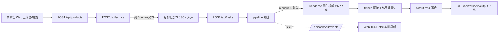
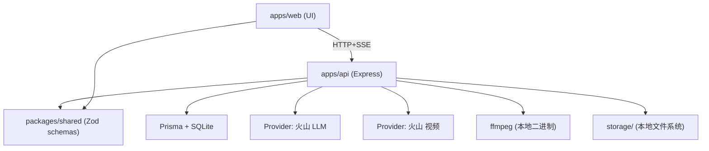
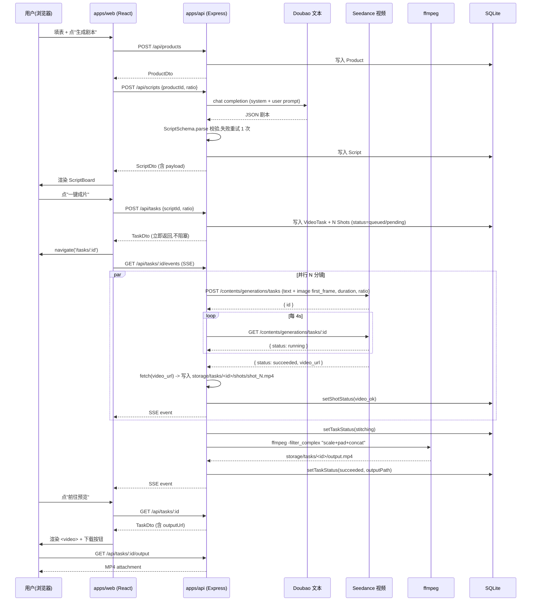
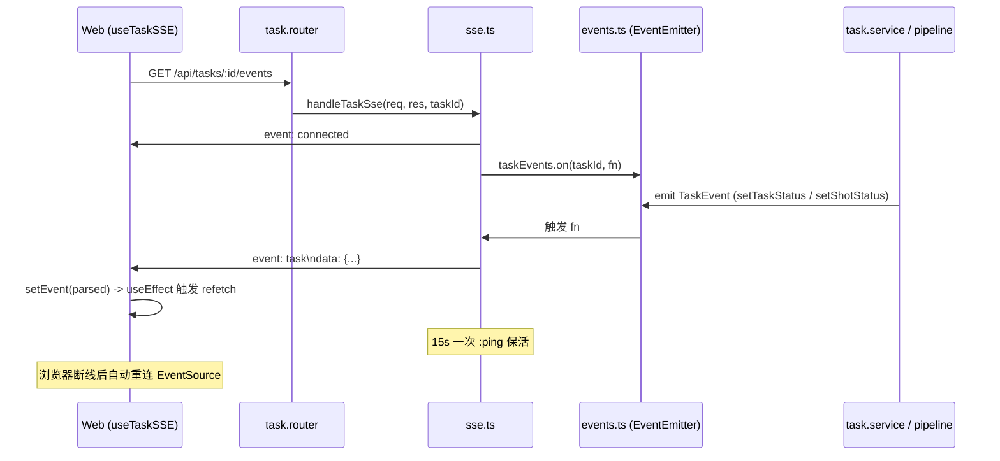
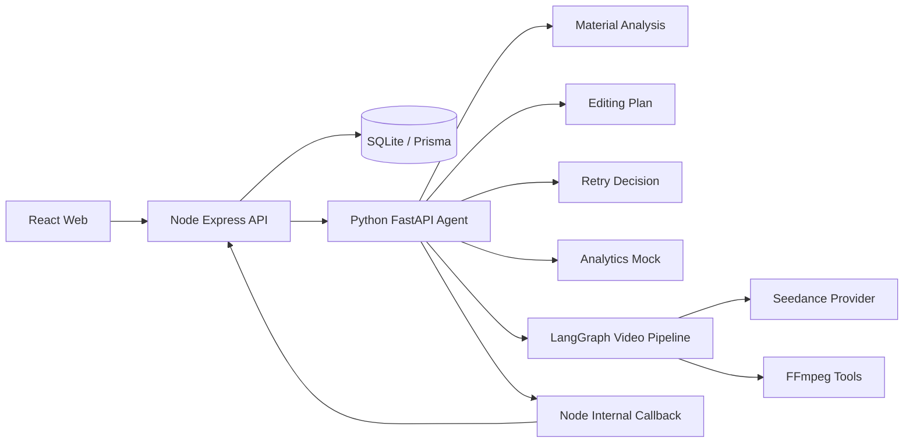

# 项目讲解文档

> AIGC 带货视频生成系统 / TikTok Shop 挑战赛 P0 实现
>
> 本文档详细讲解项目的启动方式、目录结构、每个文件的作用、调用链路与常见 debug 入口。

---

## 目录

1. [启动指南](#一启动指南)
2. [工程总览](#二工程总览)
3. [后端模块详解 apps/api](#三后端模块详解-appsapi)
4. [前端模块详解 apps/web](#四前端模块详解-appsweb)
5. [共享层 packages/shared](#五共享层-packagesshared)
6. [配置与环境变量](#六配置与环境变量)
7. [核心调用链路](#七核心调用链路)
8. [常见问题排查](#八常见问题排查)

---

## 一、启动指南

### 1.1 每日启动（最常用）

打开 PowerShell：

```powershell
cd d:\tiktop_shop
pnpm dev
```

`pnpm dev` 会同时启动 `apps/api`（端口 8787）和 `apps/web`（端口 5173）。看到这两行说明都起来了：

```text
apps/web dev:   ➜  Local:   http://localhost:5173/
apps/api dev:   api listening port=8787 modelMode=...
```

打开浏览器：<http://localhost:5173/>

**关闭服务**：在跑 `pnpm dev` 的终端里按 `Ctrl + C`。如果端口没释放，用：

```powershell
Get-NetTCPConnection -LocalPort 8787,5173 -ErrorAction SilentlyContinue | ForEach-Object { Stop-Process -Id $_.OwningProcess -Force }
```

### 1.2 只启动单边

```powershell
pnpm dev:api   # 只启动后端
pnpm dev:web   # 只启动前端
```

### 1.3 切换 mock / live 模式

修改 **`apps/api/.env`**（不是根目录的 `.env`！）的 `MODEL_MODE` 字段：

| 取值 | 说明 | 用途 |
|---|---|---|
| `mock` | 用桩剧本 + ffmpeg 纯色占位，无需 API Key | 本地链路调试、UI 演示 |
| `live` | 调用真实火山方舟模型 | 真实出片，演示视频 |

`live` 模式还需要填这三项：
- `ARK_API_KEY=...`
- `ARK_TEXT_MODEL=ep-xxxxx...`（Doubao-Seed-2.0-pro endpoint id）
- `ARK_VIDEO_MODEL=ep-xxxxx...`（Doubao-Seedance-1.5-pro endpoint id）

保存 `apps/api/.env` 后，**tsx watch 会自动重启 api 进程**（看终端会有 "Restarting..." 字样）。如果没自动重启，touch 一下任意 `.ts` 文件就行。

重启完毕后可以验证：

```powershell
(Invoke-RestMethod "http://localhost:8787/api/health").modelMode
# 应该看到 mock 或 live
```

### 1.4 重置数据库（清空所有任务和素材）

```powershell
Remove-Item d:\tiktop_shop\apps\api\prisma\dev.db -Force
Remove-Item d:\tiktop_shop\storage\tasks,d:\tiktop_shop\storage\uploads -Recurse -Force
pnpm --filter @tiktop/api prisma:push
```

数据库重置后，正在运行的 api 需要重启（同上 touch 一下 .ts 文件）。

### 1.5 完整冒烟（不开浏览器，命令行跑一遍）

```powershell
$body = @{ title="测试商品"; sellingPoints=@("卖点1","卖点2"); ratio="9:16" } | ConvertTo-Json -Compress
$p = Invoke-RestMethod http://localhost:8787/api/products -Method Post -Body $body -ContentType "application/json"
$s = Invoke-RestMethod http://localhost:8787/api/scripts -Method Post -Body (@{ productId=$p.id; ratio="9:16" } | ConvertTo-Json -Compress) -ContentType "application/json"
$t = Invoke-RestMethod http://localhost:8787/api/tasks -Method Post -Body (@{ scriptId=$s.id; ratio="9:16" } | ConvertTo-Json -Compress) -ContentType "application/json"
"task=$($t.id)"
while ($true) { Start-Sleep 3; $c = Invoke-RestMethod "http://localhost:8787/api/tasks/$($t.id)"; "$($c.status)"; if ($c.status -in 'succeeded','failed') { $c.outputUrl; break } }
```

---

## 二、工程总览

### 2.1 仓库结构

```text
tiktop_shop/
├─ apps/
│  ├─ api/                # Node.js + Express 后端
│  │  ├─ prisma/
│  │  │  ├─ schema.prisma           # 数据库 schema
│  │  │  └─ dev.db                  # SQLite 文件 (gitignored)
│  │  ├─ src/
│  │  │  ├─ index.ts                # 进程入口
│  │  │  ├─ app.ts                  # express 应用装配
│  │  │  ├─ env.ts                  # 环境变量 + zod 校验
│  │  │  ├─ lib/                    # 基础设施 (无业务)
│  │  │  ├─ providers/              # 外部模型适配层 (LLM / 视频)
│  │  │  └─ modules/                # 业务模块 (素材/商品/剧本/创作/任务)
│  │  └─ .env                       # 后端启动时实际读取的 env (gitignored)
│  └─ web/                # React 前端
│     ├─ index.html
│     ├─ vite.config.ts
│     └─ src/
│        ├─ main.tsx                # 入口
│        ├─ App.tsx                 # 路由壳 + 顶部导航
│        ├─ api/                    # 后端 SDK 封装 (axios)
│        ├─ hooks/                  # useTaskSSE 等自定义 hook
│        ├─ components/             # 跨页面组件
│        ├─ pages/                  # 四个核心页面
│        └─ styles/global.css
├─ packages/
│  └─ shared/             # 前后端共享 Zod schema 与 TS 类型
├─ storage/               # 素材/分镜/最终视频落盘 (gitignored)
│  ├─ uploads/<materialId>          # 上传素材
│  └─ tasks/<taskId>/
│     ├─ shots/shot_N.mp4           # 每个分镜的 Seedance 输出
│     └─ output.mp4                 # ffmpeg 拼接后的最终视频
├─ scripts/check-ffmpeg.mjs
├─ docs/项目讲解.md       # 本文件
├─ eslint.config.mjs / .prettierrc / .stylelintrc.json / .husky/...
├─ pnpm-workspace.yaml
├─ package.json
└─ README.md
```

### 2.2 端到端数据流



### 2.3 模块依赖关系



---

## 三、后端模块详解 (apps/api)

### 3.1 入口三件套

#### `src/index.ts` — 进程入口
做三件事：
1. 调用 `initStorage()` 创建 `storage/{uploads,tasks,logs}` 目录（如果不存在）
2. 调用 `createApp()` 拼装 Express 应用
3. `app.listen(env.PORT)` 监听端口

debug 入口：进程启动失败、端口冲突、storage 路径错误，都在这里抛。

#### `src/app.ts` — Express 应用装配
做四件事：
1. 装中间件：`cors()`、`express.json()`
2. 挂静态资源：`/static/*` 服务 `storage/` 目录（所有素材、分镜、产物都通过这里能访问）
3. 挂业务路由：`/api/materials`、`/api/products`、`/api/scripts`、`/api/tasks` + 健康检查 `/api/health`
4. 兜底：404 处理 + 全局错误处理（用 `logger.error` 打印，返回 500 JSON）

debug 入口：404 排查路由是否挂上；500 看 `logger.error` 的 stack。

#### `src/env.ts` — 环境变量解析
用 zod 把 `process.env` 解析为强类型 `env` 对象。任何字段类型不对或缺失（如 `PORT` 非数字）会在进程启动时直接抛错。

| 字段 | 说明 |
|---|---|
| `PORT` | api 监听端口，默认 8787 |
| `DATABASE_URL` | Prisma 连接串，默认 `file:./dev.db` |
| `STORAGE_ROOT` | 素材/产物落盘根目录（**相对仓库根目录**） |
| `PUBLIC_BASE_URL` | 拼接 url 用的 base，默认 `http://localhost:8787` |
| `MODEL_MODE` | `mock` 或 `live`，控制是否调用真模型 |
| `ARK_API_KEY` / `ARK_BASE_URL` / `ARK_TEXT_MODEL` / `ARK_VIDEO_MODEL` | 火山方舟接入 |
| `ARK_VIDEO_POLL_INTERVAL_MS` | Seedance 轮询间隔，默认 4s |
| `ARK_VIDEO_POLL_TIMEOUT_MS` | Seedance 轮询总超时，默认 10 分钟 |

### 3.2 基础设施 `src/lib/`

#### `lib/prisma.ts`
导出一个 PrismaClient 单例 `prisma`。所有业务模块都从这里 import。

#### `lib/logger.ts`
基于 `pino` 的结构化日志。开发模式 pretty 打印（带颜色），生产模式纯 JSON。
- `logger.info({ taskId, shotIdx }, 'message')` — 标准用法
- `taskLogger(taskId)` — 自动绑定 taskId 字段的 child logger，pipeline 里贯穿用

debug 入口：终端里看 logger 输出，过滤 taskId 即可拿到一条 task 的完整 trace。

#### `lib/storage.ts`
本地文件系统抽象。
- `STORAGE_ROOT`：解析为绝对路径（基于源码位置 `apps/api/src/lib/storage.ts` 向上找仓库根，再拼 `env.STORAGE_ROOT`）。**这是为什么修改 .env 后 storage 仍然落在仓库根的关键。**
- `ensureDir(p)`、`absFromRelative(rel)`、`relativeFromAbs(abs)`、`publicUrlForRelative(rel)`
- `initStorage()`：启动时创建子目录

#### `lib/queue.ts`
导出全局 `videoQueue = new PQueue({ concurrency: 5 })`。Seedance 调用全部走它，强约束 5 并发。**所有 task 共享同一个队列**，避免多 task 互相打架超配额。

debug 入口：怀疑并发卡死时，看 `videoQueue.pending`、`videoQueue.size`。

#### `lib/ffmpeg.ts`
封装两个能力，**直接 spawn ffmpeg 二进制**（不用 fluent-ffmpeg，参数更可控）：

- `generateMockClip({ outPath, durationSec, ratio, label })`：用 lavfi 生成一段纯色 + drawtext 文字的占位视频，给 mock 模式用
- `concatClips({ clipPaths, outPath, ratio })`：把 N 个分镜片段统一缩放/补黑边到目标画幅（720×1280 或 1280×720），concat 为最终 MP4

关键的 ffmpeg 命令是：
```bash
# 占位视频
ffmpeg -y -f lavfi -t 4 -i color=c=0x2e6df5:s=720x1280:r=24 -vf "drawtext=text='...':fontcolor=white:fontsize=...:x=(w-text_w)/2:y=(h-text_h)/2:box=1:boxcolor=black@0.5:boxborderw=10" -c:v libx264 -pix_fmt yuv420p ...

# 拼接 (动态生成 filter_complex)
ffmpeg -y -i shot_0.mp4 -i shot_1.mp4 -i shot_2.mp4 \
  -filter_complex "[0:v]scale=720:1280:force_original_aspect_ratio=decrease,pad=720:1280:(ow-iw)/2:(oh-ih)/2:black,setsar=1,fps=24[v0];[1:v]...[v1];[2:v]...[v2];[v0][v1][v2]concat=n=3:v=1:a=0[outv]" \
  -map [outv] -c:v libx264 -pix_fmt yuv420p ...
```

debug 入口：ffmpeg 报错时看 logger 输出的 `cmd` 字段，复制到 PowerShell 直接跑就能复现。所有 ffmpeg 命令都加了 `-hide_banner -loglevel error`，stderr 只有真错误。

### 3.3 Providers 外部模型适配层

#### `providers/volcArk.ts` — 文本模型 (Doubao-Seed-2.0-pro)
通过 OpenAI SDK 调用 OpenAI 兼容的火山方舟 Chat Completions。

关键函数 `generateScript({ product })`：
1. mock 模式 / 缺 key / 缺 model id → 直接返回 `mockScript()` 桩剧本
2. live 模式 → 构造 system prompt（强约束 JSON schema）+ user prompt（商品信息），调 chat completion 并指定 `response_format: { type: 'json_object' }`
3. 拿到响应后用 `ScriptSchema.parse(json)` 校验
4. **失败重试 1 次**：把错误信息追加成一条 user message "上一次返回不合法 (...)，请严格按 JSON Schema 重新输出。" 再发一次
5. 仍失败抛 Error

prompt 模板在 `modules/script/prompts.ts`，包含 6 条硬约束（duration 必须 2-12 整数、shots 1-5 个、不出现真人面部等）。

debug 入口：
- Zod 校验失败 → logger.warn 会打印 "script generation attempt failed" + 原始 err
- 想看完整 prompt → 在 `volcArk.ts` 里临时加 `logger.info({ systemPrompt, userPrompt })`

#### `providers/volcSeedance.ts` — 视频模型 (Doubao-Seedance-1.5-pro)
**Seedance API 不支持视频输入，只支持文本和图片（first_frame / last_frame）。**

关键函数 `generateClip({ prompt, ratio, durationSec, imagePath, outPath })`：

1. mock 模式 / 缺 key → 直接调 `generateMockClip()` 生成纯色占位
2. live 模式 → 调 `generateClipLive()`：
   - 构造 content 数组：先 text，再可选 image（带 `role: "first_frame"`）
   - POST `/contents/generations/tasks` 创建任务，body 含顶层字段 `ratio`、`duration`、`resolution: "720p"`
   - 拿到 `taskId`，按 `ARK_VIDEO_POLL_INTERVAL_MS`（默认 4s）周期 GET `/contents/generations/tasks/:id` 轮询
   - status 变为 `succeeded` → 取 `content.video_url` → 下载到本地 `outPath`
   - status 变为 `failed`/`cancelled` → 抛错
   - 超过 `ARK_VIDEO_POLL_TIMEOUT_MS`（默认 10 分钟）抛超时错

`clampSeedanceDuration(requested)`：把任意时长 clamp 到 [2, 12] 整数（Seedance 1.5 pro 支持的范围）。

`toAccessibleImageUrl(relativePath)`：把本地图片读出来转 base64 data URL（Seedance 接受 https url 或 base64）。

debug 入口：
- Seedance 报 400 `InvalidParameter` → 看 logger 的 err 字段，错误信息会带详细参数名
- 卡在轮询不动 → logger 会持续打 `seedance poll non-2xx`（如果有 5xx），或者就是模型在跑
- 超时 → 看 `lastStatus` 字段判断 Volcano 那边停在什么状态

### 3.4 业务模块 `src/modules/`

#### `modules/material/` — 素材模块
- `material.router.ts`：3 个端点：
  - `GET /api/materials?productId=xxx` 列表
  - `POST /api/materials` (multipart, 字段 `file`) 上传，单文件最大 100MB
  - `DELETE /api/materials/:id` 删除
- `material.service.ts`：
  - `saveUploadedMaterial({ buffer, originalName, mime, productId })`：写文件到 `storage/uploads/<id><ext>`，insert 一条 Material 记录，返回 DTO
  - `listMaterials({ productId })`：按 productId 过滤
  - `deleteMaterial(id)`：删 DB 行 + 删本地文件（unlink 失败忽略，不阻塞）
  - `toDto()`：DB 记录 → API DTO（含 `url` 字段拼出可访问的 `/static/...`）

#### `modules/product/` — 商品模块
- `product.router.ts`：3 个端点（GET 列表 / GET 详情 / POST 创建）
- `product.service.ts`：
  - `sellingPoints` 在 DB 里以 JSON 字符串存储（SQLite 没原生数组）；DTO 转换时解析回数组

#### `modules/script/` — 剧本模块
- `script.router.ts`：2 个端点（POST 生成 / GET 详情）
- `script.service.ts`：
  - `createScriptForProduct({ productId, ratio })`：load 商品 → 调 `generateScript()` Provider → 持久化 → 返回 DTO
- `prompts.ts`：system + user prompt 模板生成器，所有 LLM 约束都在这里

#### `modules/creation/` — 创作模块
- `creation.router.ts`：（当前空，creation 通过 task 路由触发）
- `pipeline.ts`：**核心编排逻辑**
  
  `runPipeline({ taskId, script, ratio })` 状态机：
  1. `setTaskStatus(shots_running)` 通知开始
  2. `await prisma.shot.findMany(...)` 拿到所有分镜
  3. 把每个 shot 通过 `videoQueue.add()` 入队（全局 5 并发）；shot[0] 如果有商品主图就传入做 first_frame
  4. 等所有 shot 完成
  5. 任一 shot failed → 抛错，整 task fail
  6. 全部成功 → `setTaskStatus(stitching)` → `concatClips()` 拼接 → `setTaskStatus(succeeded, outputPath)`
  7. 异常都被 catch → `setTaskStatus(failed, errorMsg)`

debug 入口：pipeline 中每个 setTaskStatus 都会 emit SSE 事件，所以 task 卡在哪个状态前端立刻能看出来。

#### `modules/task/` — 任务模块
- `task.router.ts`：4 个端点：
  - `POST /api/tasks`：创建 task + `setImmediate(() => runPipeline(...))` 异步触发，立即返回
  - `GET /api/tasks/:id`：拿状态 + 分镜列表
  - `GET /api/tasks/:id/events`：SSE 长连接
  - `GET /api/tasks/:id/output`：触发 MP4 下载（attachment）
- `task.service.ts`：
  - `createTask({ scriptId, ratio })`：在 DB 创建 VideoTask + N 个 Shot 记录，状态 queued/pending
  - `getTaskDto(id)`：组装含 shots 的完整 DTO
  - `setTaskStatus({ taskId, status, errorMsg?, outputPath?, stage? })`：写 DB + emit 事件
  - `setShotStatus({ shotId, status, imagePath?, clipPath?, errorMsg? })`：写 DB + emit 事件
- `events.ts`：单例 `taskEvents` (基于 EventEmitter)，整个进程级别的事件总线
- `sse.ts`：`handleTaskSse(req, res, taskId)`：
  - 设置 SSE 响应头
  - 推一条 `event: connected` 给客户端
  - 订阅 `taskEvents.on(taskId, ...)`，转发为 `event: task` 数据
  - 15s 心跳 `: ping`（保活）
  - 客户端断开时清理订阅 + 心跳定时器

### 3.5 数据模型 (`prisma/schema.prisma`)

5 张表，关系如下：

```mermaid
erDiagram
    Product ||--o{ Material : has
    Product ||--o{ Script : has
    Product ||--o{ VideoTask : has
    Script  ||--o{ VideoTask : produces
    VideoTask ||--o{ Shot : contains

    Product { string id PK; string title; string sellingPoints "JSON 数组"; string mainMaterialId; }
    Material { string id PK; string kind "image|video"; string path; string productId FK; }
    Script { string id PK; string productId FK; string payload "JSON Script"; }
    VideoTask { string id PK; string productId FK; string scriptId FK; string ratio; string status; string outputPath; }
    Shot { string id PK; string taskId FK; int idx; string description; float durationSec; string status "pending|video_ok|failed"; string clipPath; }
```

VideoTask.status 取值：`queued` / `script_generating` / `script_ready` / `shots_running` / `stitching` / `succeeded` / `failed`。

debug 入口：直接看 DB 数据用 `pnpm --filter @tiktop/api prisma:studio`，浏览器打开 GUI。

---

## 四、前端模块详解 (apps/web)

### 4.1 入口

#### `src/main.tsx`
应用根。包装 4 层 provider：
1. `ConfigProvider` (AntD) — 中文语言包 + 自定义主题色 `#ff2c55`
2. `AntApp` — AntD message/notification 容器
3. `QueryClientProvider` (TanStack Query) — 默认配置：1 次重试，30s staleTime
4. `BrowserRouter` (React Router)

#### `src/App.tsx`
路由壳：顶部导航 + 路由表

| 路径 | 组件 |
|---|---|
| `/` | 重定向到 `/new` |
| `/materials` | MaterialLibraryPage |
| `/new` | NewVideoPage |
| `/tasks/:id` | TaskDetailPage |
| `/tasks/:id/preview` | PreviewPage |

### 4.2 页面

#### `pages/MaterialLibrary.tsx` — 素材库
- `Dragger` 拖拽上传区，`beforeUpload` hook 拦截后调 `uploadMaterial()` 走自定义上传
- 上传后 invalidate `['materials']` 缓存自动刷新
- 网格卡片：图片直接渲染 ``，视频渲染 `<video controls muted>`
- 删除走 `removeMutation` + Popconfirm

#### `pages/NewVideo.tsx` — 新建视频
单页三步：商品信息 → 剧本预览 → 一键成片

- AntD `Form` 表单，包含 6 个字段：title / sellingPoints (mode="tags") / targetAudience / scene / mainMaterialId (Select, 只列 image) / ratio (Radio.Group)
- 「生成剧本」按钮 → `generateMutation`：先创建 Product，再调生成 Script
- 「一键成片」按钮 → `startTaskMutation`：调 POST /api/tasks，拿 taskId 后 `navigate('/tasks/:id')`
- 中间靠 `<Steps current={step}>` 展示进度

#### `pages/TaskDetail.tsx` — 任务详情
- `useTaskSSE(id)` 建 SSE 长连接拿实时事件
- `useQuery` 拿任务详情，`refetchInterval` 在任务未结束时 3s 轮询（双保险，万一 SSE 断连）
- SSE 事件触发时 `taskQuery.refetch()` 立即刷新
- 顶部 `Progress` 条 + 状态徽标 + 当前 stage
- 分镜卡片网格：每张卡片显示状态图标、序号、时长、画面描述、镜头运动；clipUrl 就绪后渲染 `<video>` 小预览
- 成功后展示「前往预览」按钮，跳 `/tasks/:id/preview`

#### `pages/Preview.tsx` — 预览导出
- 拿任务详情，要求 status=succeeded
- 大尺寸 `<video controls autoPlay>` 播放 outputUrl
- 「下载 MP4」按钮 → `<a href="/api/tasks/:id/output">`，浏览器触发 attachment 下载
- 下方 `Descriptions` 展示任务元信息

### 4.3 共用组件

#### `components/ScriptBoard.tsx`
只读剧本展示。顶部 `Descriptions` 显示叙事/视觉风格/总时长/约束，下面网格列出所有分镜卡片。NewVideo 页面引用。

### 4.4 API 封装

#### `api/client.ts`
axios 实例，baseURL `/api`，timeout 60s。响应拦截器把错误统一规整成 `new Error(message)`。

#### `api/{material,product,script,task}.ts`
对应后端各模块，导出类型安全的请求函数。所有响应类型都引用 `packages/shared` 的 DTO 类型，**前后端零类型漂移**。

### 4.5 Hooks

#### `hooks/useTaskSSE.ts`
- `useEffect` 中创建 `new EventSource('/api/tasks/<id>/events')`
- 监听 `task` 事件，parse JSON 后 `setEvent(parsed)`
- unmount 时关闭 EventSource
- 浏览器原生支持 EventSource 自动重连，所以错误处理简单

---

## 五、共享层 `packages/shared`

### 5.1 `script.schema.ts`
- `RatioSchema`: `'9:16' | '16:9'`
- `ShotSchema`: 单个分镜（idx / description / cameraMotion / subtitle / bgmHint / durationSec ∈ [2,12] 整数）
- `ScriptSchema`: 完整剧本 + `.refine()` 强约束总时长 ≤ 15s
- `ProductInfoSchema`: 商品信息（title / sellingPoints / targetAudience / scene / mainMaterialId / ratio）

### 5.2 `task.schema.ts`
- `TaskStatusSchema`: 7 个枚举值
- `ShotStatusSchema`: 4 个枚举值
- `TaskEventSchema`: SSE 事件结构（taskId / status / shotsTotal / shotsDone / currentStage / errorMsg / updatedAt）
- `TASK_TERMINAL_STATUSES`: `['succeeded', 'failed']`

### 5.3 `api.schema.ts`
所有 REST 接口的请求/响应 DTO + 对应类型。前端 axios 用、后端 router 校验也用，**单一事实来源**。

---

## 六、配置与环境变量

### 6.1 `.env` 文件三份

| 文件 | 用途 | 是否在 git |
|---|---|---|
| `.env.example` | 模板，给协作者参考 | ✅ git 提交 |
| `.env` (根目录) | 仅 `pnpm prisma:push` 等根级命令读取 | ❌ gitignored |
| `apps/api/.env` | **api 进程实际读取的 env**，运行时改这份 | ❌ gitignored |

> 同步规则：改完根目录 `.env` 后记得 `copy .env apps\api\.env`，否则 api 看不到新配置。

### 6.2 `pnpm-workspace.yaml`
- `packages`: 工作空间包含哪些子包
- `allowBuilds`: 允许执行 postinstall 脚本的依赖白名单（pnpm 11 新语法）

### 6.3 工程规范配置

| 文件 | 作用 |
|---|---|
| `eslint.config.mjs` | ESLint 9 flat config，TS + React Hooks + import 排序 |
| `.prettierrc` | 100 列、单引号、尾随逗号 |
| `.prettierignore` | 排除 lock 文件、storage、prisma migrations |
| `.stylelintrc.json` | CSS 规范（stylelint-config-standard） |
| `.husky/pre-commit` | 自动跑 lint-staged |
| `.editorconfig` | IDE 通用配置 |

`package.json` 中的脚本：
- `pnpm dev` — 启动前后端
- `pnpm typecheck` — TS 类型检查（所有包）
- `pnpm lint` / `pnpm lint:fix` — ESLint
- `pnpm format` / `pnpm format:check` — Prettier
- `pnpm stylelint` — StyleLint
- `pnpm check:ffmpeg` — 检查 ffmpeg 是否可用

---

## 七、核心调用链路

### 7.1 一键成片完整链路

下面这条链路从「用户点按钮」到「拿到 MP4」每个文件干了什么。



### 7.2 SSE 进度推送链路



### 7.3 失败排查路径

| 现象 | 第一站排查 | 第二站排查 |
|---|---|---|
| 前端打不开 | `pnpm dev` 输出有 vite 报错？ | `apps/web/vite.config.ts` 端口/proxy |
| api 启动失败 | 端口 8787 被占？env 字段缺失？ | `apps/api/src/env.ts` 校验异常 |
| 上传 500 | logger 输出的 err | `material.service.ts` 磁盘权限/路径 |
| 剧本生成失败 | logger 'script generation attempt failed' | `volcArk.ts` Zod 校验 + Doubao 返回原文 |
| 视频生成 400 | logger err 字段（带 Volcano error 详情） | `volcSeedance.ts` body 字段名是否对齐 |
| 视频生成超时 | `ARK_VIDEO_POLL_TIMEOUT_MS` 是否够 | 检查 Volcano 后台任务状态 |
| 拼接失败 | logger 'concat failed' + cmd | 复制 cmd 到 PowerShell 单独跑 |
| SSE 一直 connecting | DevTools Network 看 EventSource 状态 | Vite proxy 是否正确转发 `/api` |
| 任务卡在 shots_running | DB 看 Shot.status 分布 | logger 找对应 shotIdx 错误 |

---

## 八、常见问题排查

### 8.1 `pnpm` 找不到
```powershell
corepack enable
corepack prepare pnpm@latest --activate
pnpm -v
```
如果还是没有：可能 Cursor 内置的 node 抢了 PATH。先打开普通 PowerShell（不是 Cursor 集成终端），跑 `where.exe node`，确认是 `D:\DevTools\nodejs\v24.15.0\node-v24.15.0-win-x64\node.exe` 之类的真实路径，而不是 Cursor 自带的 helper。

### 8.2 `ffmpeg -version` 找不到
确认 ffmpeg 的 `bin` 目录已加入系统 PATH。装完后**必须重启 Cursor**，PATH 才会刷新。

### 8.3 端口冲突 EADDRINUSE
```powershell
Get-NetTCPConnection -LocalPort 8787,5173 -ErrorAction SilentlyContinue | ForEach-Object { Stop-Process -Id $_.OwningProcess -Force }
```
然后重跑 `pnpm dev`。

### 8.4 Prisma 报 schema 不匹配
```powershell
pnpm --filter @tiktop/api prisma:push
```
如果改了 `schema.prisma` 加了新字段，必须 push 才能让 DB 跟上。

### 8.5 改了 .env 但 api 没生效
- 确认改的是 `apps/api/.env`，不是根目录的 `.env`
- 重启 api：touch 任意 `apps/api/src/*.ts` 文件触发 tsx watch 重启，或者干脆 Ctrl+C 重跑 `pnpm dev`
- 验证：`(Invoke-RestMethod http://localhost:8787/api/health).modelMode` 看看是不是新值

### 8.6 mock 模式下视频拼接 OK 但播不动
mock 模式生成的是纯色 + 文字占位视频，浏览器播放正常。如果播不动，看 DevTools Network 加载 MP4 的请求状态码。

### 8.7 live 模式 Seedance 报 InvalidParameter
- `duration not supported`：检查 shot.durationSec 是否在 [2, 12] 整数。Schema 已经强约束，但如果你本地有老的 Script 数据，可能含非法值
- `image_url`：base64 太大可能触发限制。最大单图建议 < 5MB
- 模型 endpoint 状态：去火山方舟控制台看 endpoint 是不是「运行中」

### 8.8 任务状态卡死不更新
- 看 logger 输出有没有 stack trace
- 检查 SSE 连接：DevTools Network → Filter "EventStream"，看是不是绿色
- 兜底：TaskDetail 页有 3s 轮询，SSE 断了也能拿到最新状态

### 8.9 想看一条 task 完整 trace
所有 pipeline 中的 `logger.info({ taskId, ... }, ...)` 都会带 taskId 字段。终端里：
```powershell
# 在 PowerShell 里筛
pnpm dev | Select-String "taskId.*t_xxxxxx"
```
或者直接看 dev server 输出，taskId 是 trace 锚点。

---

## 九、给后续开发者的建议

- 新加模块时按 `material/product/script/creation/task` 的目录约定来：每个模块一个 router、一个 service，复杂的话可以加 dto.ts、prompts.ts 等辅助文件
- 新加 REST 接口时**先在 `packages/shared/src/api.schema.ts` 定义 Zod schema**，前后端再各自引用，保证类型一致
- 新加 ffmpeg 操作时优先在 `lib/ffmpeg.ts` 里加纯函数，pipeline 调用 — 别在 pipeline 里直接拼 ffmpeg 命令
- 新加 LLM prompt 时放到 `modules/<mod>/prompts.ts`，**不要把 prompt 散在业务逻辑里**
- 想加 P1 的"分镜级编辑"？只需要：① 新增一个 `PATCH /api/tasks/:taskId/shots/:idx`，② 把 pipeline 改成可"局部重生成"，③ 前端 TaskDetail 加编辑按钮
- 想加 P1 的"素材 Embedding 检索"？建议新建 `modules/embedding/` 模块，复用 Doubao 的 embedding 模型，向量存 `sqlite-vec` 扩展或直接 Postgres + pgvector

---

> 维护提示：本文档随代码同步更新。修改了模块结构、调用链路或环境变量后，记得同步刷新对应章节。
## P1/P2 Python 后端迁移说明

当前系统采用 Node 网关 + Python AI 服务的组合。迁移后不是让前端同时调用两个后端，而是保持：

```text
React -> Node API -> Python Agent/Pipeline
```

Node 继续负责 Prisma 数据库、素材上传、静态资源、任务查询、SSE 进度、前端统一 API 和下载接口。Python 负责模型调用、LangGraph 工作流、分镜视频生成、失败重试、FFmpeg 拼接后处理和 Agent trace 回写。

### P1 Python Agent 架构



### 模块职责

- Node API：保留稳定业务入口，管理数据库、上传文件、静态文件、任务状态、SSE 和前端 API。
- Python Agent：承接 AI 密集逻辑，包括素材分析、脚本生成、智能剪辑计划、失败重试、数据看板 mock、视频生成流水线。
- LangGraph：用于把 Agent 工作流拆成可解释节点，例如素材检索、prompt 改写、约束校验、分镜生成、拼接、后处理、完成回写。
- Callback：Python 通过 Node 内部接口写回 trace、shot 状态和 task 状态，避免 Python 直接拥有数据库。

### 已知问题

- Seedance 1.5 Pro i2v 对 `duration` 的实际校验可能比 `2-12` 范围更严格，当前保留 Retry Agent 兜底。详见 `docs/known-issues.md`。
