# 项目讲解文档

> 当前版本：`p1-python-agent-v0.3`
>
> 本文档用于详细讲解“电商场景 AIGC 带货视频生成系统”的当前实现。当前项目不是只完成 P0，而是在 P0 基础上继续完成了 P1 的 Python Agent、LangGraph 工作流、素材分析、智能剪辑、分镜编辑、失败重试、后处理、trace 和数据看板。

---

## 目录

1. [项目定位与比赛要求对应](#一项目定位与比赛要求对应)
2. [当前完成内容总览](#二当前完成内容总览)
3. [整体架构设计](#三整体架构设计)
4. [核心调用链路图](#四核心调用链路图)
5. [启动、配置与验证](#五启动配置与验证)
6. [Node 主后端详解](#六node-主后端详解)
7. [Python Agent 服务详解](#七python-agent-服务详解)
8. [前端页面详解](#八前端页面详解)
9. [数据库与文件存储详解](#九数据库与文件存储详解)
10. [关键业务流程逐步讲解](#十关键业务流程逐步讲解)
11. [Agent、LangGraph 与 Retry 机制](#十一agentlanggraph-与-retry-机制)
12. [测试、演示与答辩建议](#十二测试演示与答辩建议)
13. [已知问题与后续扩展](#十三已知问题与后续扩展)

---

## 一、项目定位与比赛要求对应

本项目面向 TikTok Shop / 电商带货短视频场景，目标是让商家输入商品信息、上传素材后，系统自动完成：

- 商品信息理解。
- 带货脚本生成。
- 分镜规划。
- 视频片段生成。
- 视频拼接与后处理。
- 成片预览与下载。
- 生成过程追踪。
- 基于 mock 数据的效果看板和优化建议。

比赛任务中提到的重点可以拆成三层：

| 层级          | 比赛关注点                                                 | 当前实现           |
| ------------- | ---------------------------------------------------------- | ------------------ |
| P0 基础生成   | 商品输入、素材上传、脚本生成、视频生成、任务进度、预览下载 | 已完成             |
| P1 Agent 增强 | 素材理解、智能剪辑、分镜编辑、失败重试、trace、数据看板    | 已完成             |
| P2 扩展方向   | 更真实的投放数据、A/B 测试、部署运维、合规审核             | 当前保留为后续扩展 |

项目当前主线不是“单纯前端页面 + 一个后端接口”，而是一个多服务协作的 AIGC 工作流系统：

```text
前端负责交互
Node 负责业务 API、数据库、任务状态和文件
Python 负责 Agent、模型调用和视频生成工作流
FFmpeg 负责媒体拼接和后处理
```

---

## 二、当前完成内容总览

### 2.1 P0 已完成内容

P0 是最基础的端到端生成链路，核心目标是“能从商品信息生成一条视频”。

- 素材库：上传图片/视频，保存到 `storage/uploads`。
- 商品建模：标题、卖点、目标人群、使用场景、画幅。
- 脚本生成：调用文本模型生成结构化 JSON。
- 分镜生成：每个分镜包含描述、镜头运动、字幕、BGM 提示、时长。
- 视频生成：调用 Seedance 生成每个分镜视频。
- 视频拼接：使用 FFmpeg 拼接分镜，并保留音频。
- 任务系统：任务状态、分镜状态、错误信息、SSE 实时推送。
- 预览导出：在线播放最终 MP4，并支持下载。

### 2.2 P1 已完成内容

P1 是在 P0 基础上增强“智能体”和“可控编辑”能力。

- Python FastAPI Agent 服务，端口 `8790`。
- LangGraph 工作流，用于智能剪辑和视频生成流程编排。
- 素材分析 Agent：为素材生成标签、摘要、embedding 向量。
- 素材相似度检索：让剪辑计划可以选择更合适的素材。
- 智能剪辑 Agent：根据商品、脚本、素材生成分镜级剪辑计划。
- Retry Agent：根据失败原因做重试决策，例如修正时长、简化 prompt。
- Python 视频 Pipeline：脚本生成、视频生成、回调 Node、拼接、后处理。
- 分镜编辑：支持修改单个分镜 prompt、字幕、素材等。
- 单分镜重生成：重生成一个分镜后重新拼接最终视频。
- 字幕/BGM 后处理：字幕渲染已接入，BGM/TTS 保留扩展点。
- Agent trace：记录关键步骤，前端可查看生成过程。
- 数据看板：展示生成因子、转化效果和中文 Agent 优化建议。
- 冒烟测试脚本：`scripts/smoke-p1.ps1` 支持轻量测试和真实视频测试。

### 2.3 当前版本的核心价值

当前版本最重要的变化是：系统不再只是“生成视频”，而是开始具备 Agent 工作流特征。

具体体现为：

- 生成前：分析素材，理解商品。
- 生成中：通过 LangGraph 编排脚本、分镜、视频、重试、拼接。
- 失败时：Retry Agent 根据错误决定如何调整参数。
- 生成后：记录 trace，并在数据看板里给优化建议。
- 用户侧：可以编辑单个分镜，而不是只能重新生成整条视频。

---

## 三、整体架构设计

### 3.1 当前采用的架构

当前架构是：

```text
React 前端 -> Node Express 主后端 -> Python FastAPI Agent
                         |
                         -> Prisma + SQLite
                         -> storage 本地文件
                         -> SSE 进度推送
```

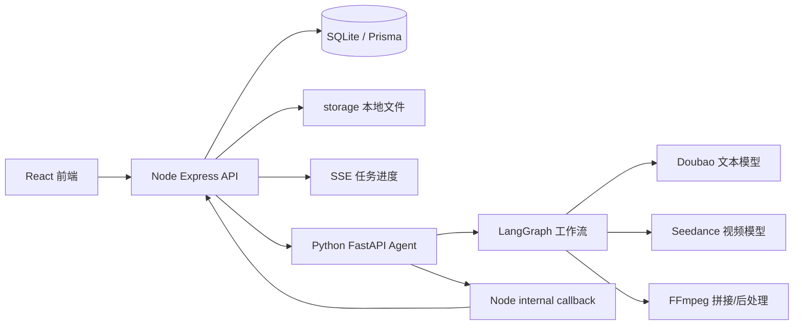

### 3.2 为什么不是全 Node，也不是全 Python

P0 已经用 Node + Express + Prisma 跑通了前端 API、数据库、上传、任务状态和 SSE。如果全部改成 Python，会破坏已有稳定链路，迁移成本高。

但 Agent、LangGraph、模型编排、视频工作流更适合 Python，所以 P1 采用折中架构：

- Node 继续做业务网关。
- Python 专门做 AI 能力。
- 前端只调用 Node，不直接调用两个后端。
- Node 和 Python 通过 HTTP 内部接口协作。

这种结构和很多真实项目类似：业务后端负责稳定业务，AI 服务负责模型和智能体。

### 3.3 服务职责边界

| 服务         | 主要职责                                                      | 不适合承担                           |
| ------------ | ------------------------------------------------------------- | ------------------------------------ |
| React 前端   | 页面交互、表单、任务展示、视频预览、trace 展示                | 直接保存数据库、直接调用模型         |
| Node API     | 前端 API、Prisma、文件上传、静态资源、SSE、任务记录、回调入口 | 复杂 Agent 编排、长流程 AI 工作流    |
| Python Agent | 素材分析、智能剪辑、Retry、LangGraph、模型调用、视频 pipeline | 面向前端的全部业务 API、Prisma owner |
| FFmpeg       | 视频拼接、音频保留、字幕后处理                                | 决策逻辑、任务状态管理               |

---

## 四、核心调用链路图

这一章是讲解系统时最重要的部分。建议答辩时重点讲这些图。

### 4.1 端到端主链路

用户从上传素材到得到视频，完整链路如下：

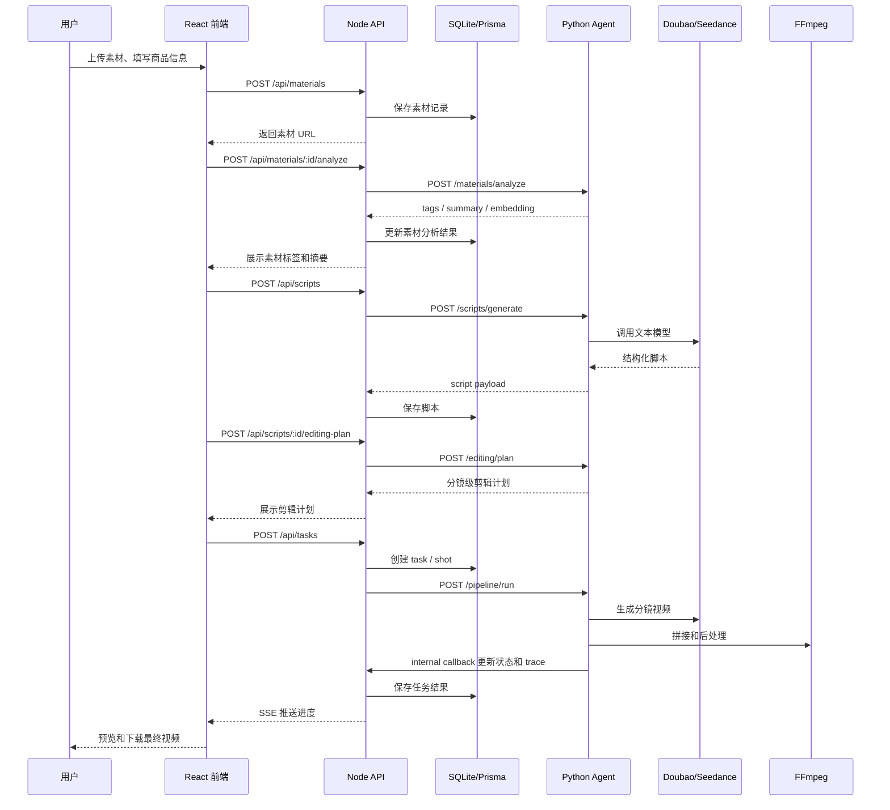

这条链路体现了系统的完整闭环：

- 前端触发业务。
- Node 负责状态和持久化。
- Python 负责 AI 工作流。
- 模型负责内容生成。
- FFmpeg 负责媒体处理。
- SSE 负责实时反馈。

### 4.2 素材分析链路

素材分析是 P1 的基础。如果没有素材分析，后面的智能剪辑只能根据文字脚本生成 prompt，无法利用用户上传的真实商品素材。

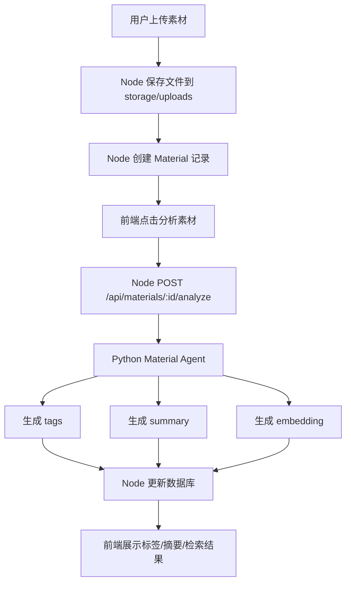

相关文件：

| 文件                                                | 作用                       |
| --------------------------------------------------- | -------------------------- |
| `apps/web/src/pages/MaterialLibrary.tsx`            | 素材库页面，触发上传和分析 |
| `apps/api/src/modules/material/material.router.ts`  | Node 素材接口              |
| `apps/api/src/modules/material/material.service.ts` | 保存素材、更新分析结果     |
| `apps/agent/src/agent_app/agents/material_agent.py` | Python 素材分析逻辑        |

### 4.3 脚本生成与智能剪辑链路

P0 只有脚本生成，P1 加入剪辑计划。剪辑计划的作用是把“脚本文字”变成“可执行的视频生成方案”。

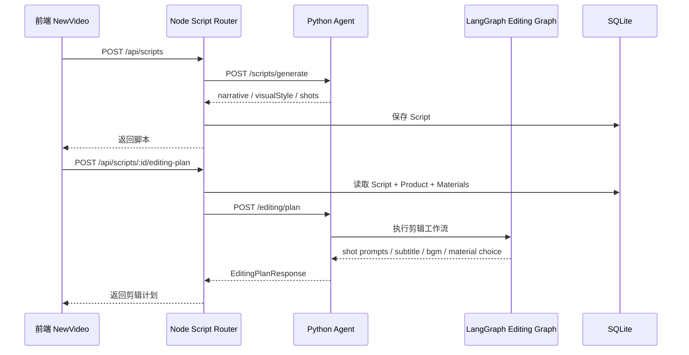

剪辑计划会影响：

- 每个分镜的生成 prompt。
- 每个分镜是否使用商品素材。
- 字幕和 BGM 提示。
- 时长是否合法。
- 后续生成失败时的重试空间。

### 4.4 Python Pipeline 视频生成链路

开启 `PYTHON_PIPELINE_ENABLED=true` 后，视频生成由 Python Pipeline 执行。

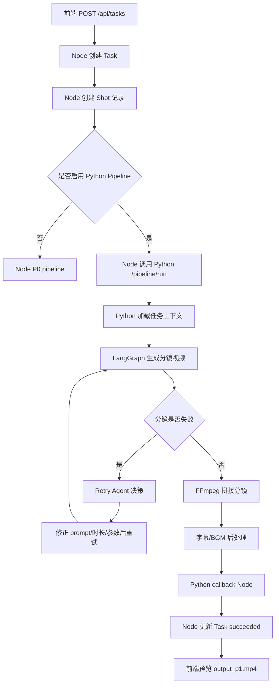

关键点：

- Node 创建任务和分镜记录，保证数据库统一。
- Python 执行长耗时 AI 工作流。
- Python 每个关键阶段回调 Node，Node 持久化状态和 trace。
- 前端通过 Node SSE 获取实时进度。

### 4.5 任务状态与 SSE 链路

任务状态不是前端轮询猜出来的，而是后端维护并通过 SSE 推送。

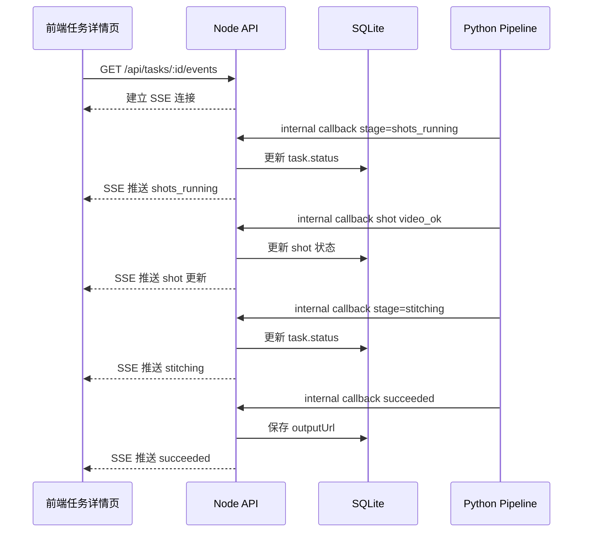

相关文件：

- `apps/api/src/modules/task/sse.ts`
- `apps/api/src/modules/task/events.ts`
- `apps/api/src/modules/internal/internal.router.ts`
- `apps/web/src/hooks/useTaskSSE.ts`

### 4.6 分镜编辑与单分镜重生成链路

P1 的一个关键增强是“不是整条视频重做”，而是可以单独编辑并重生成某个分镜。

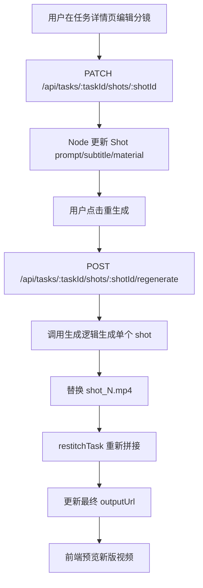

这比“重新生成全部分镜”更适合真实剪辑工作，因为用户通常只想改一个镜头。

### 4.7 Retry Agent 链路

Retry Agent 的作用是让失败不是简单终止，而是根据错误类型选择修正方案。

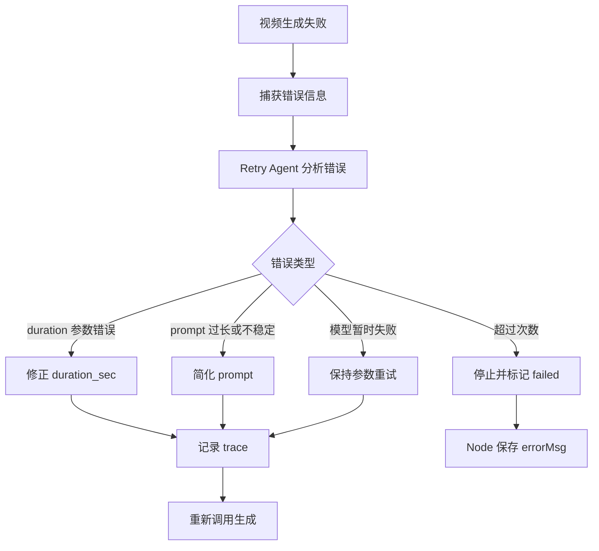

当前已记录的已知问题之一就是 Seedance 1.5 Pro 图生视频偶发 `duration` 参数 400。Retry Agent 会识别 duration 错误，在重试时修正为更稳妥的时长。

### 4.8 Trace 链路

Trace 用来回答“这个视频是怎么生成出来的”。比赛答辩时，这是体现工程完整度和可观测性的部分。

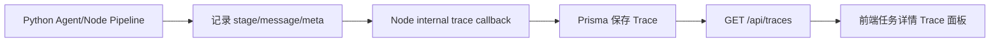

Trace 可以记录：

- 脚本生成开始/结束。
- 剪辑计划生成开始/结束。
- 分镜生成开始/成功/失败。
- Retry 决策。
- FFmpeg 拼接。
- 后处理。
- 最终输出。

### 4.9 数据看板链路

数据看板当前是 mock analytics，用于展示 P1 的“生成效果分析”和“Agent 优化建议”。

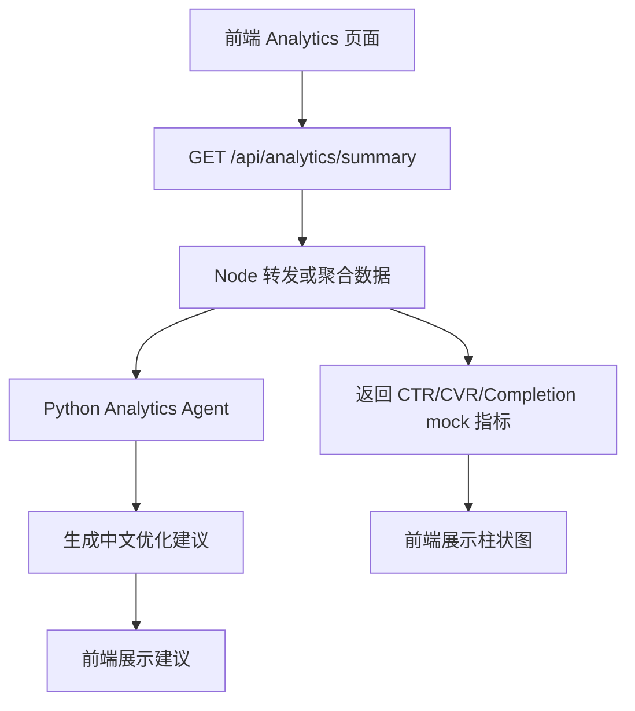

这部分不是为了声称有真实投放数据，而是为了展示系统可以接入效果反馈，未来支持 A/B 测试和投放优化闭环。

---

## 五、启动、配置与验证

### 5.1 启动服务

建议打开三个 PowerShell：

```powershell
pnpm dev:agent
pnpm dev:api
pnpm dev:web
```

访问地址：

```text
前端：http://localhost:5173
Node API：http://127.0.0.1:8787/api/health
Python Agent：http://127.0.0.1:8790/health
```

### 5.2 真实模型配置

真实模型模式需要在 `apps/api/.env` 中配置：

```env
MODEL_MODE=live
PYTHON_PIPELINE_ENABLED=true
AGENT_BASE_URL=http://127.0.0.1:8790
ARK_API_KEY=你的火山方舟APIKey
ARK_TEXT_MODEL=你的文本模型endpoint
ARK_VIDEO_MODEL=你的视频模型endpoint
```

`.env` 和 `apps/api/.env` 不上传到 GitHub，用来保护 API Key。

### 5.3 冒烟测试

轻量测试：

```powershell
.\scripts\smoke-p1.ps1
```

真实视频测试：

```powershell
.\scripts\smoke-p1.ps1 -RunVideoTask
```

真实视频测试会创建商品、生成脚本、生成剪辑计划、启动真实视频任务、轮询任务状态，并输出最终视频地址。

### 5.4 验证命令

```powershell
pnpm typecheck
pnpm lint
pnpm check:ffmpeg
pnpm --filter @tiktop/web build
pnpm test:agent
pnpm lint:agent
```

---

## 六、Node 主后端详解

Node 后端位于 `apps/api`，技术栈是：

```text
Node.js + Express + TypeScript + Prisma + SQLite
```

### 6.1 Node 当前负责什么

Node 是整个系统的主业务后端，负责：

- 对前端暴露统一 REST API。
- 管理 Prisma 数据库。
- 保存商品、素材、脚本、任务、分镜和 trace。
- 处理文件上传。
- 暴露 `/static/*` 静态文件访问。
- 维护任务状态。
- 通过 SSE 推送任务进度。
- 调用 Python Agent。
- 接收 Python Pipeline 的内部回调。
- 保留 P0 Node Pipeline 作为兼容路径。

### 6.2 Node 目录结构

```text
apps/api/
├─ prisma/
│  └─ schema.prisma
└─ src/
   ├─ index.ts
   ├─ app.ts
   ├─ env.ts
   ├─ lib/
   │  ├─ agentClient.ts
   │  ├─ ffmpeg.ts
   │  ├─ logger.ts
   │  ├─ prisma.ts
   │  ├─ queue.ts
   │  └─ storage.ts
   ├─ providers/
   │  ├─ volcArk.ts
   │  └─ volcSeedance.ts
   └─ modules/
      ├─ agent/
      ├─ analytics/
      ├─ creation/
      ├─ internal/
      ├─ material/
      ├─ product/
      ├─ script/
      ├─ task/
      └─ trace/
```

### 6.3 Node 关键文件说明

| 文件                                     | 作用                                                       |
| ---------------------------------------- | ---------------------------------------------------------- |
| `src/index.ts`                           | 进程入口，初始化 storage，启动 Express                     |
| `src/app.ts`                             | 注册中间件、静态资源、业务路由、错误处理                   |
| `src/env.ts`                             | 解析环境变量，例如 `MODEL_MODE`、`PYTHON_PIPELINE_ENABLED` |
| `src/lib/prisma.ts`                      | PrismaClient 单例                                          |
| `src/lib/storage.ts`                     | storage 路径、静态 URL、目录初始化                         |
| `src/lib/agentClient.ts`                 | Node 调用 Python Agent 的 HTTP 封装                        |
| `src/lib/ffmpeg.ts`                      | Node 侧 FFmpeg 拼接，保留 P0 兼容                          |
| `src/modules/material/`                  | 素材上传、分析、检索                                       |
| `src/modules/product/`                   | 商品 CRUD                                                  |
| `src/modules/script/`                    | 脚本生成、剪辑计划                                         |
| `src/modules/task/`                      | 任务创建、状态、SSE、分镜编辑和重生成                      |
| `src/modules/creation/pythonPipeline.ts` | 调用 Python Pipeline                                       |
| `src/modules/internal/`                  | Python 回调 Node 的内部接口                                |
| `src/modules/trace/`                     | trace 持久化和查询                                         |
| `src/modules/analytics/`                 | 数据看板接口                                               |

### 6.4 Node API 路由总览

| Method | Path                                          | 说明                  |
| ------ | --------------------------------------------- | --------------------- |
| GET    | `/api/health`                                 | Node API 健康检查     |
| GET    | `/api/agent/health`                           | 转发检查 Python Agent |
| GET    | `/api/materials`                              | 素材列表              |
| POST   | `/api/materials`                              | 上传素材              |
| DELETE | `/api/materials/:id`                          | 删除素材              |
| POST   | `/api/materials/:id/analyze`                  | 分析素材              |
| GET    | `/api/materials/search`                       | 素材相似度检索        |
| GET    | `/api/products`                               | 商品列表              |
| POST   | `/api/products`                               | 创建商品              |
| GET    | `/api/products/:id`                           | 商品详情              |
| POST   | `/api/scripts`                                | 生成脚本              |
| GET    | `/api/scripts/:id`                            | 脚本详情              |
| POST   | `/api/scripts/:id/editing-plan`               | 生成智能剪辑计划      |
| POST   | `/api/tasks`                                  | 创建视频任务          |
| GET    | `/api/tasks/:id`                              | 查询任务详情          |
| GET    | `/api/tasks/:id/events`                       | SSE 任务进度          |
| PATCH  | `/api/tasks/:taskId/shots/:shotId`            | 修改分镜              |
| POST   | `/api/tasks/:taskId/shots/:shotId/regenerate` | 重生成分镜            |
| GET    | `/api/traces`                                 | 查询 trace            |
| GET    | `/api/analytics/summary`                      | 数据看板摘要          |

### 6.5 Node 调用 Python 的方式

Node 通过 `agentClient.ts` 访问 Python：

```text
Node router/service
  -> callAgent(...)
  -> http://127.0.0.1:8790/...
  -> Python FastAPI
  -> 返回 JSON
```

调用关系：

- 素材分析：Node `/api/materials/:id/analyze` -> Python `/materials/analyze`
- 素材检索：Node `/api/materials/search` -> Python `/materials/search`
- 脚本生成：Node `/api/scripts` -> Python `/scripts/generate`
- 剪辑计划：Node `/api/scripts/:id/editing-plan` -> Python `/editing/plan`
- 视频 Pipeline：Node `/api/tasks` -> Python `/pipeline/run`

---

## 七、Python Agent 服务详解

Python Agent 位于 `apps/agent`，技术栈是：

```text
Python 3.11 + FastAPI + Pydantic + LangGraph + LangChain Core + httpx + numpy
```

### 7.1 Python 当前负责什么

Python 负责系统中的 AI-heavy 部分：

- FastAPI Agent 服务入口。
- 素材分析。
- embedding 生成和相似度计算。
- 智能剪辑计划。
- LangGraph 剪辑工作流。
- Retry Agent。
- Python 版文本模型调用。
- Python 版 Seedance 视频生成。
- Python 版 FFmpeg 拼接。
- 字幕/BGM 后处理。
- 回调 Node 更新任务状态、分镜状态和 trace。

### 7.2 Python 目录结构

```text
apps/agent/
├─ pyproject.toml
├─ src/agent_app/
│  ├─ main.py
│  ├─ config.py
│  ├─ schemas.py
│  ├─ callbacks.py
│  ├─ agents/
│  │  ├─ material_agent.py
│  │  ├─ editing_agent.py
│  │  ├─ editing_graph.py
│  │  ├─ retry_agent.py
│  │  ├─ analytics_agent.py
│  │  └─ pipeline_graph.py
│  ├─ providers/
│  │  ├─ ark_text.py
│  │  └─ seedance_video.py
│  └─ media/
│     ├─ ffmpeg_tools.py
│     └─ postprocess.py
└─ tests/
```

### 7.3 Python 关键文件说明

| 文件                 | 作用                                         |
| -------------------- | -------------------------------------------- |
| `main.py`            | FastAPI 入口，定义 Agent API                 |
| `config.py`          | Python 服务配置，例如模型模式、Node 回调地址 |
| `schemas.py`         | Pydantic 请求/响应模型                       |
| `callbacks.py`       | Python 回调 Node 的工具函数                  |
| `material_agent.py`  | 生成素材标签、摘要、embedding                |
| `editing_agent.py`   | 生成分镜剪辑计划                             |
| `editing_graph.py`   | LangGraph 剪辑计划工作流                     |
| `retry_agent.py`     | 失败重试策略                                 |
| `analytics_agent.py` | 数据看板中文建议                             |
| `pipeline_graph.py`  | Python 视频生成 LangGraph Pipeline           |
| `ark_text.py`        | 文本模型调用                                 |
| `seedance_video.py`  | Seedance 视频生成                            |
| `ffmpeg_tools.py`    | 拼接视频并保留音频                           |
| `postprocess.py`     | 字幕/BGM 后处理                              |

### 7.4 Python Agent API

| Method | Path                 | 说明                      |
| ------ | -------------------- | ------------------------- |
| GET    | `/health`            | Python Agent 健康检查     |
| POST   | `/materials/analyze` | 素材分析                  |
| POST   | `/materials/search`  | 素材相似度检索            |
| POST   | `/scripts/generate`  | 生成脚本                  |
| POST   | `/editing/plan`      | 生成智能剪辑计划          |
| POST   | `/retry/decide`      | 失败重试决策              |
| POST   | `/analytics/summary` | 数据看板建议              |
| POST   | `/pipeline/run`      | 启动 Python 视频 Pipeline |

---

## 八、前端页面详解

前端位于 `apps/web`，技术栈是：

```text
React + Vite + TypeScript + Ant Design + TanStack Query + Zustand + ECharts
```

### 8.1 页面结构

| 页面     | 文件                                     | 作用                                       |
| -------- | ---------------------------------------- | ------------------------------------------ |
| 素材库   | `apps/web/src/pages/MaterialLibrary.tsx` | 上传素材、查看素材、分析素材               |
| 新建视频 | `apps/web/src/pages/NewVideo.tsx`        | 创建商品、生成脚本、生成剪辑计划、启动任务 |
| 任务详情 | `apps/web/src/pages/TaskDetail.tsx`      | 查看任务进度、分镜、trace、编辑和重生成    |
| 预览页   | `apps/web/src/pages/Preview.tsx`         | 播放和下载最终视频                         |
| 数据看板 | `apps/web/src/pages/Analytics.tsx`       | 展示生成因子、转化效果和 Agent 建议        |

### 8.2 前端请求封装

| 文件                            | 作用                       |
| ------------------------------- | -------------------------- |
| `apps/web/src/api/client.ts`    | Axios client               |
| `apps/web/src/api/material.ts`  | 素材接口                   |
| `apps/web/src/api/product.ts`   | 商品接口                   |
| `apps/web/src/api/script.ts`    | 脚本和剪辑计划接口         |
| `apps/web/src/api/task.ts`      | 任务、分镜编辑、重生成接口 |
| `apps/web/src/api/agent.ts`     | Agent 健康检查等           |
| `apps/web/src/api/analytics.ts` | 数据看板接口               |

### 8.3 前端状态更新逻辑

任务详情页通过 SSE 获取实时状态：

```text
TaskDetail.tsx
  -> useTaskSSE(taskId)
  -> GET /api/tasks/:id/events
  -> 收到 task/shot 更新
  -> 重新刷新任务详情
```

这样用户能看到：

- 当前任务是 `queued`、`shots_running`、`stitching` 还是 `succeeded`。
- 哪个分镜生成完成。
- 哪个分镜失败。
- 最终视频是否生成。

---

## 九、数据库与文件存储详解

### 9.1 数据库

当前数据库由 Node 后端通过 Prisma 管理：

```text
apps/api/prisma/schema.prisma
apps/api/prisma/dev.db
```

使用 SQLite 是为了本地 demo 简单、可复制。核心表可以理解为：

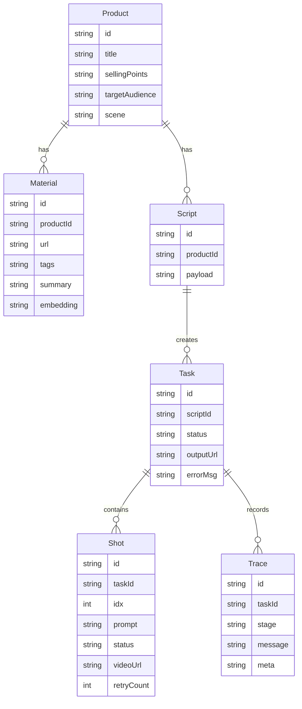

### 9.2 为什么数据库仍然在 Node

当前建议数据库仍由 Node 管理，原因是：

- Prisma 和已有 schema 都在 Node。
- 前端所有业务 API 已经通过 Node。
- Python 如果直接写 SQLite，会带来双写、连接和 schema 同步问题。
- Python 通过 Node internal callback 更新状态，更符合服务边界。

### 9.3 文件存储

文件统一在 `storage/`：

```text
storage/
├─ uploads/              # 用户上传素材
└─ tasks/<taskId>/       # 分镜视频、拼接视频、后处理视频
   ├─ shots/
   │  ├─ shot_0.mp4
   │  ├─ shot_1.mp4
   │  └─ shot_2.mp4
   ├─ output.mp4
   └─ output_p1.mp4
```

`storage/` 不提交到 GitHub，因为它包含用户上传内容和生成视频。

---

## 十、关键业务流程逐步讲解

### 10.1 创建商品

1. 用户在 `/new` 页面填写商品标题、卖点、目标人群、场景、画幅。
2. 前端调用 `POST /api/products`。
3. Node 使用 Zod 校验请求。
4. Node 通过 Prisma 保存 Product。
5. 前端拿到 productId，用于后续脚本生成。

### 10.2 上传并分析素材

1. 用户在 `/materials` 上传素材。
2. Node 使用 multer 接收 multipart 文件。
3. 文件保存到 `storage/uploads`。
4. Material 表保存文件名、路径、mime、productId。
5. 用户点击“分析素材”。
6. Node 调用 Python `/materials/analyze`。
7. Python 生成标签、摘要、embedding。
8. Node 保存分析结果。
9. 前端显示标签、摘要和检索信息。

### 10.3 生成脚本

1. 用户点击生成脚本。
2. Node 读取商品信息。
3. 如果启用 Python 模式，Node 调用 Python `/scripts/generate`。
4. Python 调用 Doubao 文本模型。
5. 模型返回结构化 JSON。
6. Python/Pydantic 校验结构。
7. Node 保存 Script。
8. 前端显示脚本和分镜。

### 10.4 生成剪辑计划

1. 前端调用 `POST /api/scripts/:id/editing-plan`。
2. Node 读取 Script、Product、Material。
3. Node 把上下文传给 Python `/editing/plan`。
4. Python Editing Agent 结合商品、脚本和素材。
5. LangGraph 组织剪辑计划流程。
6. 返回每个分镜的建议：
   - prompt
   - subtitle
   - bgmHint
   - duration
   - selectedMaterial
   - reason
7. 前端展示剪辑计划。

### 10.5 生成视频

1. 用户点击开始生成。
2. Node 创建 Task 和 Shot。
3. Node 返回 taskId，前端跳转任务详情页。
4. Node 后台调用 Python `/pipeline/run`。
5. Python Pipeline 依次生成每个分镜视频。
6. 每个分镜成功后回调 Node 更新 shot。
7. 所有分镜完成后 FFmpeg 拼接。
8. 后处理字幕/BGM。
9. Python 回调 Node 更新 task 为 `succeeded`。
10. 前端通过 SSE 收到最终状态。
11. 用户进入预览页播放和下载视频。

### 10.6 单分镜重生成

1. 用户在任务详情页修改某个分镜 prompt 或字幕。
2. 前端调用 `PATCH /api/tasks/:taskId/shots/:shotId`。
3. Node 更新该 Shot。
4. 用户点击重生成。
5. Node 调用单分镜生成逻辑。
6. 新视频替换旧的 `shot_N.mp4`。
7. Node/FFmpeg 重新拼接最终视频。
8. 前端预览新的成片。

---

## 十一、Agent、LangGraph 与 Retry 机制

### 11.1 Agent 在项目里的含义

这里的 Agent 不是单纯“调用一次大模型”，而是有任务目标、有输入输出、有工具调用、有失败处理的工作单元。

当前包括：

| Agent           | 输入                 | 输出                     | 作用                 |
| --------------- | -------------------- | ------------------------ | -------------------- |
| Material Agent  | 素材文件信息         | tags、summary、embedding | 理解素材             |
| Editing Agent   | 商品、脚本、素材     | 分镜剪辑计划             | 把脚本转成可执行方案 |
| Retry Agent     | 错误、分镜、重试次数 | 是否重试、如何改参数     | 提高生成稳定性       |
| Analytics Agent | mock 指标            | 中文优化建议             | 展示反馈优化能力     |

### 11.2 LangGraph 的作用

LangGraph 用在两个核心文件：

- `editing_graph.py`
- `pipeline_graph.py`

它的作用是把多个步骤组织成工作流，而不是散落在一个大函数里。

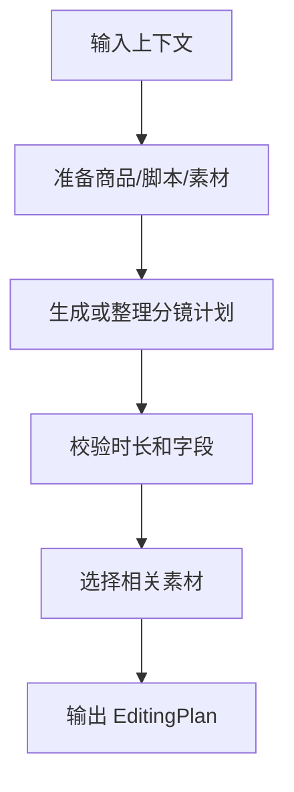

视频 Pipeline 的 LangGraph 更复杂：

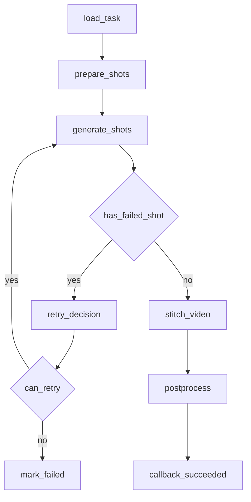

### 11.3 Retry Agent 具体效果

以 Seedance duration 错误为例：

```text
第一次请求：
duration 参数被模型接口拒绝 -> 400 InvalidParameter

Retry Agent：
识别错误中包含 duration -> 把 duration_sec 修正为更稳定的值 -> 允许重试

第二次请求：
使用修正后的参数生成 -> 成功概率提高
```

它的意义是：

- 避免一次参数错误就导致整条视频失败。
- 把失败处理逻辑集中在 Agent 中，方便后续扩展。
- trace 中可以记录为什么重试、重试改了什么。

---

## 十二、测试、演示与答辩建议

### 12.1 自动化验证

建议提交前运行：

```powershell
pnpm typecheck
pnpm lint
pnpm check:ffmpeg
pnpm --filter @tiktop/web build
pnpm test:agent
pnpm lint:agent
```

### 12.2 冒烟验证

轻量：

```powershell
.\scripts\smoke-p1.ps1
```

完整真实视频：

```powershell
.\scripts\smoke-p1.ps1 -RunVideoTask
```

### 12.3 演示顺序

建议按这个顺序讲：

1. 先打开 README，说明当前是 `p1-python-agent-v0.3`。
2. 展示整体架构图：Node 主后端 + Python Agent。
3. 打开素材库，上传并分析素材。
4. 新建商品，生成脚本。
5. 生成 Agent 剪辑计划，说明素材分析如何影响分镜。
6. 启动视频任务，展示 SSE 进度。
7. 打开任务详情，展示分镜、trace 和错误重试记录。
8. 预览最终视频。
9. 修改一个分镜并重生成，说明 P1 的可控编辑能力。
10. 打开数据看板，说明 mock analytics 和 Agent 优化建议。

### 12.4 答辩时可以强调的点

- 系统是端到端的，不只是 prompt demo。
- Node 和 Python 职责清晰，前端只调用 Node。
- Python 体现了 Agent 开发和 LangGraph 编排。
- 素材分析结果参与剪辑计划。
- Retry Agent 解决真实模型调用的不稳定问题。
- trace 让生成过程可解释、可排查。
- 单分镜重生成让系统更接近真实剪辑工具。

---

## 十三、已知问题与后续扩展

### 13.1 已知问题

- Seedance 1.5 Pro 图生视频有时会对 `duration` 参数返回 400。当前 Retry Agent 会在重试时修正时长，记录见 `docs/known-issues.md`。
- 数据看板当前使用 mock analytics，用于展示效果分析闭环，不代表真实投放数据。
- TTS/BGM 当前是 provider-ready 扩展点，P1 demo 重点是字幕渲染、音频保留和后处理链路。

### 13.2 后续扩展方向

- 接入真实投放数据，替换 mock analytics。
- 增加 A/B 测试任务和多版本视频对比。
- 增加合规审核 Agent，例如敏感词、夸大宣传、平台规则检查。
- 将 SQLite 升级为 PostgreSQL，并引入 pgvector 存储 embedding。
- 增加任务队列和后台 worker，提高长任务稳定性。
- 增加对象存储，将 `storage/` 替换为 OSS/S3。
- 将 TTS/BGM provider 真正接入生产模型。

---

## 附录：核心文件快速索引

| 类型                   | 文件                                                   |
| ---------------------- | ------------------------------------------------------ |
| 前端入口               | `apps/web/src/main.tsx`、`apps/web/src/App.tsx`        |
| 素材页面               | `apps/web/src/pages/MaterialLibrary.tsx`               |
| 新建视频页面           | `apps/web/src/pages/NewVideo.tsx`                      |
| 任务详情页面           | `apps/web/src/pages/TaskDetail.tsx`                    |
| 数据看板页面           | `apps/web/src/pages/Analytics.tsx`                     |
| Node 入口              | `apps/api/src/index.ts`、`apps/api/src/app.ts`         |
| Node 环境变量          | `apps/api/src/env.ts`                                  |
| Node 调 Python         | `apps/api/src/lib/agentClient.ts`                      |
| Node Python Pipeline   | `apps/api/src/modules/creation/pythonPipeline.ts`      |
| Node 任务路由          | `apps/api/src/modules/task/task.router.ts`             |
| Node internal callback | `apps/api/src/modules/internal/internal.router.ts`     |
| Python 入口            | `apps/agent/src/agent_app/main.py`                     |
| Python 配置            | `apps/agent/src/agent_app/config.py`                   |
| 素材 Agent             | `apps/agent/src/agent_app/agents/material_agent.py`    |
| 剪辑 Agent             | `apps/agent/src/agent_app/agents/editing_agent.py`     |
| 剪辑 LangGraph         | `apps/agent/src/agent_app/agents/editing_graph.py`     |
| Retry Agent            | `apps/agent/src/agent_app/agents/retry_agent.py`       |
| Pipeline LangGraph     | `apps/agent/src/agent_app/agents/pipeline_graph.py`    |
| Python Seedance        | `apps/agent/src/agent_app/providers/seedance_video.py` |
| Python FFmpeg          | `apps/agent/src/agent_app/media/ffmpeg_tools.py`       |
| 后处理                 | `apps/agent/src/agent_app/media/postprocess.py`        |
| 冒烟测试               | `scripts/smoke-p1.ps1`                                 |
