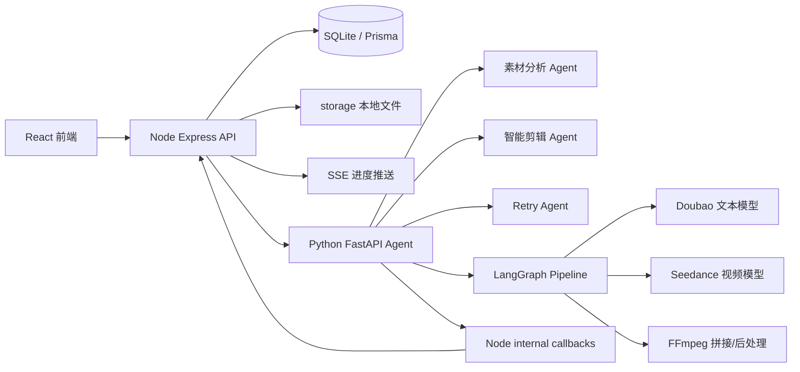

# 项目讲解文档

> 当前版本：`p1-python-agent-v0.3`
>
> 本文档用于讲解“电商场景 AIGC 带货视频生成系统”的当前实现。当前项目不是只完成了 P0，而是在 P0 基础上继续完成了 P1 的 Python Agent、LangGraph 工作流、素材分析、智能剪辑、分镜编辑、失败重试、后处理、trace 和数据看板。

---

## 目录

1. [项目定位](#一项目定位)
2. [当前完成内容](#二当前完成内容)
3. [整体架构](#三整体架构)
4. [启动与测试](#四启动与测试)
5. [Node 主后端说明](#五node-主后端说明)
6. [Python Agent 服务说明](#六python-agent-服务说明)
7. [前端页面说明](#七前端页面说明)
8. [核心业务链路](#八核心业务链路)
9. [数据库与文件存储](#九数据库与文件存储)
10. [比赛任务对应关系](#十比赛任务对应关系)
11. [常见问题](#十一常见问题)

---

## 一、项目定位

本项目面向电商带货短视频生成场景，目标是让商家输入商品信息、上传商品素材后，自动生成可用于 TikTok Shop / 短视频平台的带货视频。

当前系统已经具备三层能力：

- P0 基础链路：商品建模、脚本生成、分镜视频生成、FFmpeg 拼接、进度展示、预览下载。
- P1 Agent 增强：素材分析、智能剪辑计划、分镜编辑、失败重试、后处理、trace、数据看板。
- Python 后端迁移：AI 相关能力逐步迁移到 Python FastAPI + LangGraph，Node 保留为稳定 API 网关和数据库 owner。

---

## 二、当前完成内容

### 2.1 P0 已完成内容

- 素材库：上传图片/视频，落盘到 `storage/uploads`，支持列表和删除。
- 商品建模：标题、卖点、目标人群、场景、画幅等字段。
- 脚本生成：调用 Doubao 文本模型生成结构化 JSON 脚本。
- 分镜生成：每个分镜包含画面描述、镜头运动、字幕、BGM 提示、时长。
- 视频生成：调用 Seedance 生成分镜视频。
- 视频拼接：使用 FFmpeg 拼接多个分镜，并保留音频。
- 任务系统：任务状态、分镜状态、错误信息、SSE 实时推送。
- 预览导出：在线播放最终 MP4，并支持下载。

### 2.2 P1 已完成内容

- Python FastAPI Agent 服务，端口 `8790`。
- LangGraph 工作流，用于智能剪辑和视频生成流程编排。
- 素材分析 Agent：生成标签、摘要、embedding 向量。
- 素材相似度检索：为剪辑计划选择更合适的素材。
- 智能剪辑 Agent：根据商品、脚本、素材生成分镜级剪辑计划。
- Retry Agent：根据失败原因做重试决策，例如修正时长、简化 prompt。
- Python 视频 Pipeline：脚本生成、分镜生成、回调 Node、拼接、后处理。
- 分镜编辑：修改单个分镜 prompt、字幕、素材等。
- 单分镜重生成：重生成后重新拼接最终视频。
- 字幕/BGM 后处理：字幕渲染已接入，BGM/TTS 预留扩展点。
- Agent trace：记录关键步骤，前端可查看生成过程。
- 数据看板：展示生成因子、转化效果和中文 Agent 优化建议。
- 冒烟测试脚本：`scripts/smoke-p1.ps1` 支持轻量测试和真实视频测试。

---

## 三、整体架构

当前采用“Node 主后端 + Python AI Agent 服务”的架构。

```text
React 前端
   |
   v
Node Express API
   |-- Prisma + SQLite
   |-- 本地素材/视频文件
   |-- SSE 任务进度
   |-- 静态资源访问
   |
   v
Python FastAPI Agent
   |-- LangGraph 工作流
   |-- 素材分析 Agent
   |-- 智能剪辑 Agent
   |-- Retry Agent
   |-- Seedance 视频生成
   |-- FFmpeg 拼接和后处理
```



### 3.1 为什么不把所有后端都改成 Python

当前 Node 后端已经承担了前端 API、Prisma 数据库、上传文件、静态资源、SSE、任务状态等稳定能力。全部迁移到 Python 会导致工作量大、风险高，而且会破坏 P0 已经跑通的链路。

当前更合适的方式是：

- Node 保留“业务网关”和数据库 owner。
- Python 负责 AI-heavy 部分，也就是 Agent、模型调用、工作流编排、视频 pipeline。
- 前端仍然只调用 Node，用户不会感知两个后端。

这个结构也符合常见工程实践：Node/Java 后端做业务服务，Python 服务专门做 AI 能力。

---

## 四、启动与测试

### 4.1 启动服务

建议打开三个 PowerShell：

```powershell
pnpm dev:agent
pnpm dev:api
pnpm dev:web
```

访问地址：

```text
前端：http://localhost:5173
Node API：http://127.0.0.1:8787/api/health
Python Agent：http://127.0.0.1:8790/health
```

### 4.2 真实模型配置

真实模型模式需要在 `apps/api/.env` 中配置：

```env
MODEL_MODE=live
PYTHON_PIPELINE_ENABLED=true
AGENT_BASE_URL=http://127.0.0.1:8790
ARK_API_KEY=你的火山方舟APIKey
ARK_TEXT_MODEL=你的文本模型endpoint
ARK_VIDEO_MODEL=你的视频模型endpoint
```

`.env` 和 `apps/api/.env` 不会上传到 GitHub，这是为了保护 API Key。

### 4.3 冒烟测试

轻量测试：

```powershell
.\scripts\smoke-p1.ps1
```

真实视频测试：

```powershell
.\scripts\smoke-p1.ps1 -RunVideoTask
```

真实视频测试会创建商品、生成脚本、生成剪辑计划、启动视频任务、轮询任务状态，并输出最终视频地址。

### 4.4 验证命令

```powershell
pnpm typecheck
pnpm lint
pnpm check:ffmpeg
pnpm --filter @tiktop/web build
pnpm test:agent
pnpm lint:agent
```

---

## 五、Node 主后端说明

Node 后端位于 `apps/api`，技术栈是 `Node.js + Express + TypeScript + Prisma + SQLite`。

### 5.1 Node 当前负责什么

- Express 路由注册和错误处理。
- 前端 REST API。
- Prisma 数据库访问。
- 商品、素材、脚本、任务、分镜、trace 的持久化。
- 文件上传和静态资源访问。
- SSE 任务进度推送。
- 与 Python Agent 通信。
- 接收 Python Pipeline 的内部回调。
- 保留 P0 Node Pipeline 作为兼容路径。

### 5.2 关键文件

| 文件                                              | 作用                                                       |
| ------------------------------------------------- | ---------------------------------------------------------- |
| `apps/api/src/app.ts`                             | Express 应用装配，注册所有路由                             |
| `apps/api/src/env.ts`                             | 环境变量解析，例如 `MODEL_MODE`、`PYTHON_PIPELINE_ENABLED` |
| `apps/api/src/lib/prisma.ts`                      | PrismaClient 单例                                          |
| `apps/api/src/lib/storage.ts`                     | 本地文件路径、静态 URL、storage 初始化                     |
| `apps/api/src/lib/agentClient.ts`                 | Node 调用 Python Agent 的 HTTP client                      |
| `apps/api/src/modules/material/`                  | 素材上传、分析转发、检索                                   |
| `apps/api/src/modules/script/`                    | 脚本生成、剪辑计划转发                                     |
| `apps/api/src/modules/task/`                      | 任务创建、查询、SSE、分镜编辑、重生成                      |
| `apps/api/src/modules/creation/pythonPipeline.ts` | Node 启动 Python 视频 Pipeline                             |
| `apps/api/src/modules/internal/`                  | Python 回调 Node 更新任务、分镜和 trace                    |
| `apps/api/src/modules/trace/`                     | trace 查询和持久化                                         |
| `apps/api/src/modules/analytics/`                 | 数据看板接口                                               |

### 5.3 Node 到 Python 的调用关系

Node 不直接实现所有 AI 逻辑，而是把 AI-heavy 请求转给 Python：

- `/api/agent/health` -> Python `/health`
- `/api/materials/:id/analyze` -> Python `/materials/analyze`
- `/api/materials/search` -> Python `/materials/search`
- `/api/scripts` 在 Python 模式下 -> Python `/scripts/generate`
- `/api/scripts/:id/editing-plan` -> Python `/editing/plan`
- `/api/tasks` 在 Python Pipeline 模式下 -> Python `/pipeline/run`

---

## 六、Python Agent 服务说明

Python Agent 位于 `apps/agent`，技术栈是 `FastAPI + Pydantic + LangGraph + LangChain Core + httpx + numpy`。

### 6.1 Python 当前负责什么

- Agent 服务入口。
- 素材分析。
- embedding 生成和相似度计算。
- 智能剪辑计划。
- LangGraph 剪辑工作流。
- Retry Agent。
- Python 版脚本生成。
- Python 版 Seedance 视频生成。
- Python 版 FFmpeg 拼接。
- 字幕/BGM 后处理。
- 向 Node 回调任务状态、分镜状态和 trace。

### 6.2 关键文件

| 文件                                                   | 作用                                               |
| ------------------------------------------------------ | -------------------------------------------------- |
| `apps/agent/src/agent_app/main.py`                     | FastAPI 入口，注册 Python Agent 路由               |
| `apps/agent/src/agent_app/config.py`                   | Python 服务配置，例如端口、模型模式、Node 回调地址 |
| `apps/agent/src/agent_app/schemas.py`                  | Pydantic 请求/响应模型                             |
| `apps/agent/src/agent_app/callbacks.py`                | Python 回调 Node 的封装                            |
| `apps/agent/src/agent_app/agents/material_agent.py`    | 素材标签、摘要、embedding                          |
| `apps/agent/src/agent_app/agents/editing_agent.py`     | 智能剪辑计划生成                                   |
| `apps/agent/src/agent_app/agents/editing_graph.py`     | LangGraph 剪辑工作流                               |
| `apps/agent/src/agent_app/agents/retry_agent.py`       | 失败重试决策                                       |
| `apps/agent/src/agent_app/agents/analytics_agent.py`   | 数据看板建议                                       |
| `apps/agent/src/agent_app/agents/pipeline_graph.py`    | Python 视频生成 LangGraph Pipeline                 |
| `apps/agent/src/agent_app/providers/ark_text.py`       | 文本模型调用                                       |
| `apps/agent/src/agent_app/providers/seedance_video.py` | Seedance 视频生成                                  |
| `apps/agent/src/agent_app/media/ffmpeg_tools.py`       | FFmpeg 拼接，保留音频                              |
| `apps/agent/src/agent_app/media/postprocess.py`        | 字幕/BGM 后处理                                    |

### 6.3 LangGraph 在哪里起作用

当前 LangGraph 主要用于两个地方：

1. `editing_graph.py`
   - 输入商品、脚本、素材。
   - 分析每个分镜需要什么素材和表达方式。
   - 输出分镜级剪辑计划。

2. `pipeline_graph.py`
   - 编排视频生成任务。
   - 依次执行：加载任务 -> 生成分镜 -> 处理失败重试 -> 拼接 -> 后处理 -> 回调 Node。
   - 让“视频生成”不只是一个函数，而是可扩展、可追踪的工作流。

### 6.4 Agent 开发体现在哪里

项目中的 Agent 不只是“调一次大模型”，而是把模型能力放进任务流程：

- Material Agent 负责理解素材。
- Editing Agent 负责把脚本和素材转成可执行的分镜计划。
- Retry Agent 负责在失败后判断怎么改参数再试。
- Analytics Agent 负责根据数据看板给优化建议。
- LangGraph 把这些 Agent 和工具节点组织成稳定流程。

---

## 七、前端页面说明

前端位于 `apps/web`，技术栈是 `React + Vite + TypeScript + Ant Design`。

| 页面     | 文件                                     | 作用                                       |
| -------- | ---------------------------------------- | ------------------------------------------ |
| 素材库   | `apps/web/src/pages/MaterialLibrary.tsx` | 上传素材、查看素材、执行素材分析           |
| 新建视频 | `apps/web/src/pages/NewVideo.tsx`        | 创建商品、生成脚本、生成剪辑计划、启动任务 |
| 任务详情 | `apps/web/src/pages/TaskDetail.tsx`      | 查看进度、分镜、trace、编辑和重生成分镜    |
| 预览页   | `apps/web/src/pages/Preview.tsx`         | 播放和下载最终视频                         |
| 数据看板 | `apps/web/src/pages/Analytics.tsx`       | 展示生成因子、转化效果和 Agent 建议        |

前端请求封装位于 `apps/web/src/api/`，例如：

- `material.ts`
- `product.ts`
- `script.ts`
- `task.ts`
- `agent.ts`
- `analytics.ts`

---

## 八、核心业务链路

### 8.1 素材分析链路

```text
前端上传素材
  -> Node /api/materials
  -> 文件保存到 storage/uploads
  -> 点击分析
  -> Node /api/materials/:id/analyze
  -> Python /materials/analyze
  -> 生成 tags / summary / embedding
  -> Node 持久化到数据库
  -> 前端展示分析结果
```

素材分析的作用是让后面的剪辑 Agent 知道素材内容。如果不分析素材，系统只能根据商品和脚本文字生成视频 prompt，无法优先选择更合适的商品图、场景图或演示素材。

### 8.2 脚本与剪辑计划链路

```text
创建商品
  -> 生成脚本
  -> 请求 Agent 剪辑计划
  -> Python Editing Agent / LangGraph
  -> 返回每个分镜的 prompt、字幕、BGM、素材选择、时长建议
  -> Node 保存并返回给前端
```

剪辑计划让系统从“只有脚本”升级为“有可执行拍摄/生成方案”。

### 8.3 视频生成链路

```text
前端启动任务
  -> Node 创建 task / shot 记录
  -> 如果 PYTHON_PIPELINE_ENABLED=true
       Node 调用 Python /pipeline/run
     否则
       Node 执行 P0 pipeline
  -> Python LangGraph Pipeline 生成分镜视频
  -> 失败时 Retry Agent 决策
  -> FFmpeg 拼接并保留音频
  -> 后处理字幕/BGM
  -> Python 回调 Node 更新状态和 trace
  -> 前端通过 SSE 实时刷新
```

### 8.4 分镜编辑与重生成链路

```text
任务完成或生成中
  -> 用户编辑某个 shot
  -> Node 更新分镜
  -> 用户点击重生成
  -> 重新调用生成逻辑
  -> 替换该分镜视频
  -> 重新拼接最终视频
  -> 前端预览更新后的视频
```

---

## 九、数据库与文件存储

### 9.1 数据库

当前数据库由 Node 后端通过 Prisma 管理：

```text
apps/api/prisma/schema.prisma
apps/api/prisma/dev.db
```

使用 SQLite 是为了比赛 demo 本地部署简单。主要数据包括：

- Product：商品信息。
- Material：素材信息、标签、摘要、embedding。
- Script：脚本 payload。
- Task：视频任务。
- Shot：分镜状态、prompt、视频地址、重试次数。
- Trace：Agent 和 pipeline 的过程记录。

### 9.2 文件存储

素材和视频都存储在本地 `storage/`：

```text
storage/uploads/        # 上传素材
storage/tasks/<taskId>/ # 分镜视频、拼接视频、后处理视频
```

`storage/` 不提交到 GitHub，因为里面包含用户上传文件和生成视频。

---

## 十、比赛任务对应关系

| 比赛要求               | 当前实现                                         |
| ---------------------- | ------------------------------------------------ |
| 商品信息输入与素材上传 | P0 已完成，前端素材库和商品表单                  |
| AIGC 脚本生成          | P0/P1 已完成，Node 或 Python 调用文本模型        |
| 视频生成               | P0/P1 已完成，Seedance + FFmpeg                  |
| 开源框架 / Agent 编排  | P1 已完成，Python FastAPI + LangGraph            |
| 素材理解               | P1 已完成，标签、摘要、embedding、相似度检索     |
| 智能剪辑               | P1 已完成，Editing Agent 输出分镜级计划          |
| 可编辑分镜             | P1 已完成，支持单分镜修改和重生成                |
| 失败重试               | P1 已完成，Retry Agent 根据错误修正参数          |
| 生成过程可观测         | P1 已完成，trace 持久化并在前端展示              |
| 数据看板               | P1 已完成 mock analytics，展示生成因子和优化建议 |

---

## 十一、常见问题

### 11.1 为什么 Python Agent 地址是 `127.0.0.1:8790`

`127.0.0.1` 和 `localhost` 在本机开发中基本等价。Python 服务使用 `127.0.0.1` 是为了避免部分 Windows 环境下 `localhost` 解析到 IPv6 `::1` 导致连接问题。

### 11.2 为什么 API Key 没有上传到 GitHub

真实 API Key 在 `.env` 或 `apps/api/.env` 中，这些文件被 `.gitignore` 排除。上传密钥会造成泄露风险，所以仓库只保留 `.env.example`。

### 11.3 Seedance duration 报错为什么重试后会好

Seedance 1.5 Pro 图生视频有时会对某些 `duration` 参数返回 400。当前 Retry Agent 会识别 duration 相关错误，把时长修正到更稳妥的值后重试。这个问题已记录在 `docs/known-issues.md`。

### 11.4 当前新版是不是一个真正的新版本

如果代码推送到 `p1-python-agent-v0.3` 分支，它就是一个独立的新版本分支，不会覆盖 `main`。如果还想固定归档，可以再打 tag：

```powershell
git tag v0.3-p1-python-agent
git push origin v0.3-p1-python-agent
```
